# **Docker Swarm & Microservices**
**Pada task ini akan di deploy sebuah app microservice (todo app) menggunakan docker swarm.**<br>
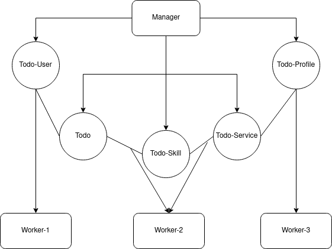<br>

### **Buat instance di multipass**<br>
**Buka terminal dan buat instance sebagai berikut:**<br>
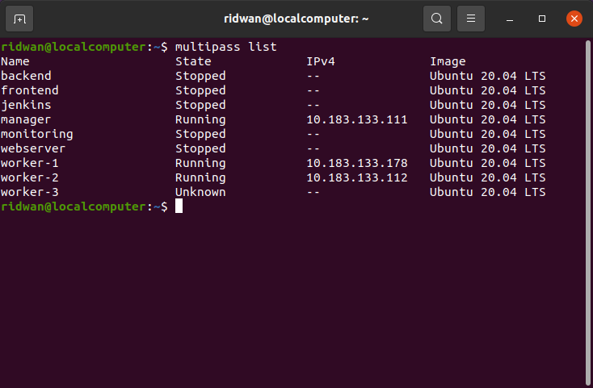<br>

### **Install docker menggunakan ansible**<br>
**1. Setup ansible config.**<br>
```
[defaults]
inventory = hosts.yml
private_key_file = sshkey.pem
host_key_checking = false
timeout = 60
```
<br>

**2. Setup host, buat file `hosts.yml`.**<br>
```
docker:
  hosts:
    10.183.133.111:
    10.183.133.178:
    10.183.133.112:
    10.183.133.23:
  vars:
    ansible_user: ubuntu
worker:
  hosts:
    10.183.133.178:
    10.183.133.112:
    10.183.133.23:
  vars:
    ansible_user: ubuntu 
```
<br>

**2. Buat task ansible untuk install docker.**<br>
**3. Run ansible-playbook.**<br>
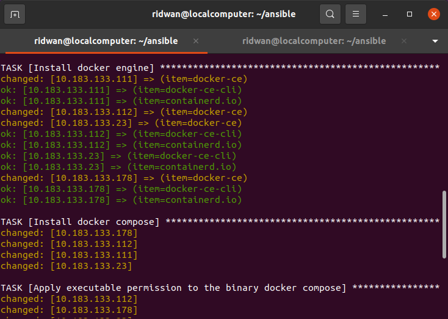<br>

### **Setup docker swarm di manager**<br>
**1. Login ke manager.**<br>
**2. Jalankan perintah `docker swarm init --advertise-addr 10.183.133.111` (ip address manager).**<br>
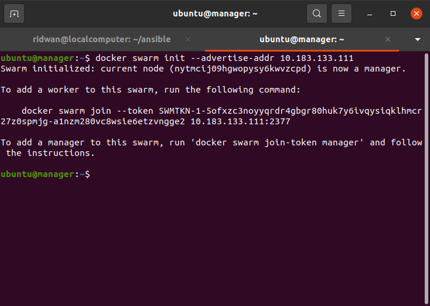<br>

**3. Copy docker swarm join token.**<br>

### **Join worker ke docker swarm**<br>
**1. Buat ansible file.**<br>
**2. Buat task untuk melakukan join worker ke docker swarm.**<br>
```
   ---
- name: Join Worker
  hosts: worker
  become: true
  tasks:
    - name: Docker swarm joining
      shell: "docker swarm join --token SWMTKN-1-5ofxzc3noyyqrdr4gbgr80huk7y6ivqysiqklhmcr27z0spmjg-a1nzm280vc8wsie6etzvngge2 10.183.133.111:2377"
      args:
        executable: /bin/bash
```
<br>

**3. Jalankan ansible-playbook.**<br>
<br>

**4. Login ke manager.**<br>
**5. Check docker node untuk memastikan server worker telah terdaftar di docker swarm `docker node ls`.**<br>
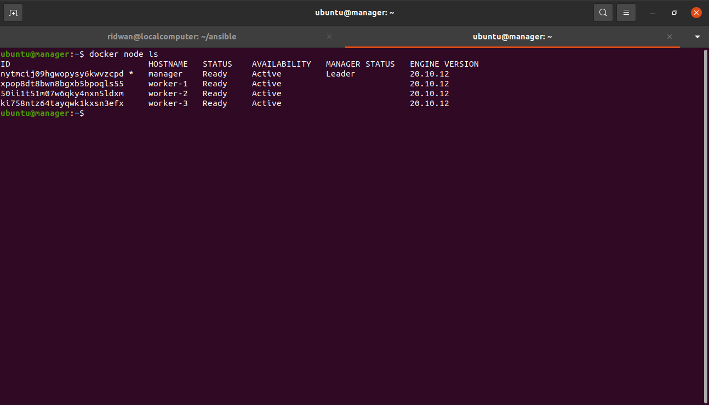<br>

### **Buat repository di docker hub**<br>
**1. Login akun docker hub.**<br>
**2. Buat repository untuk menyimpan image todo-app di docker hub.**<br>
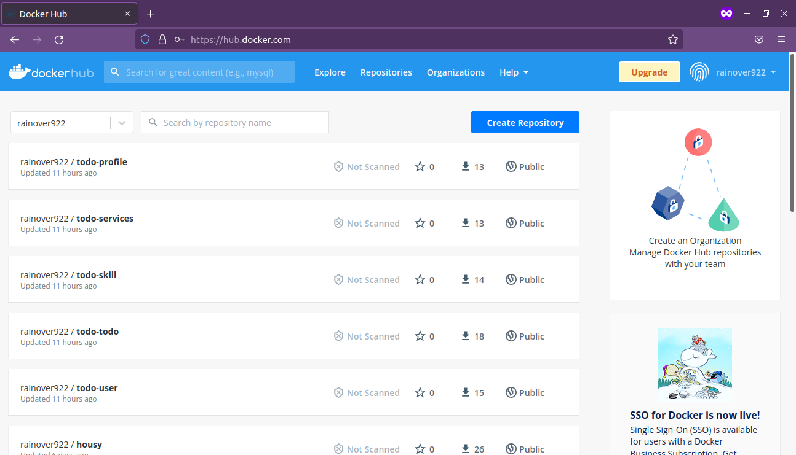<br>

**3. Login manager kemudian login terminal akun docker.**<br>
**4. Git clone aplikasi todo-app `https://github.com/ridwan094/dumbways-microservices.git`.**<br>
**5. Buat images `docker-compose build`.**<br>
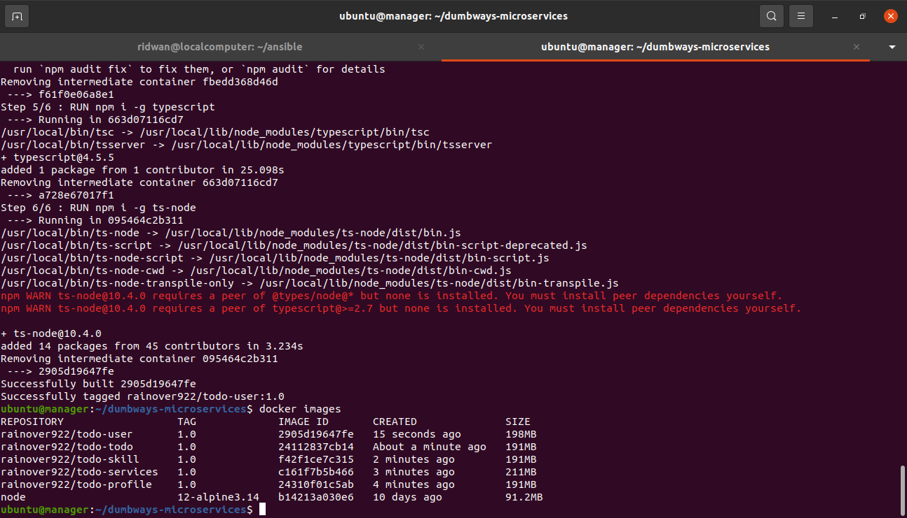<br>

**6. Push image ke docker hub.**<br>
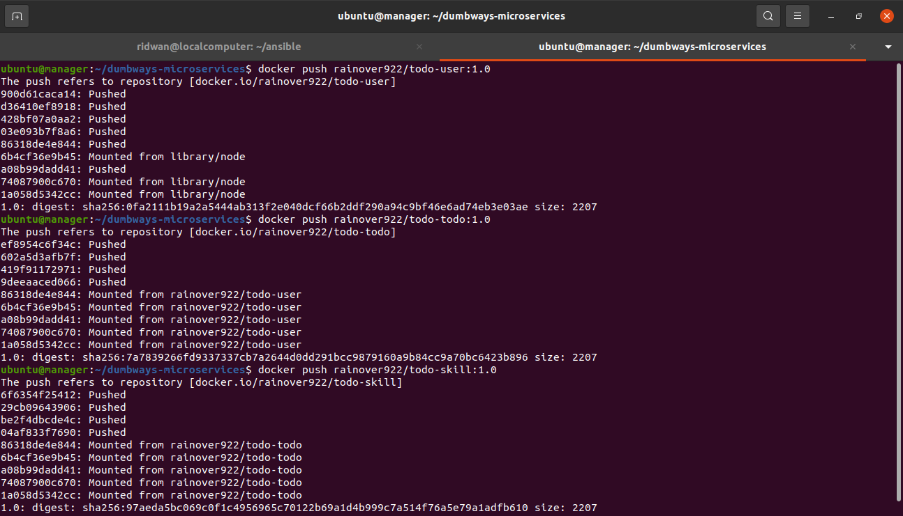<br>

### **Stack deploy app**<br>
**1. Pastikan server worker telah login terminal akun docker hub, berguna untuk melakukan pull image.**<br>
**2. Login ke manager.**<br>
**3. Masuk ke folder app.**<br>
**4. Jalankan perintah `docker stack deploy --compose-file docker-compose.yml stack-apps`.**<br>
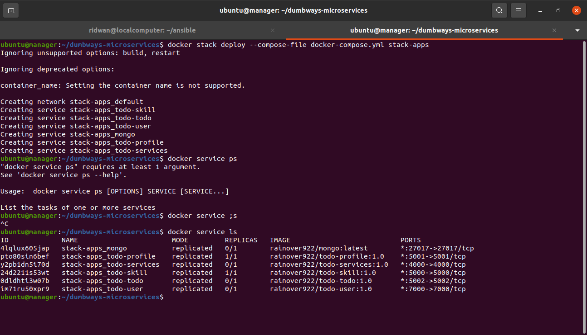<br>

**5. Replicate salah satu container.**<br>
**6. Jalankan perintah `docker service scale Nama_Container=jumlah_replica`.**<br>
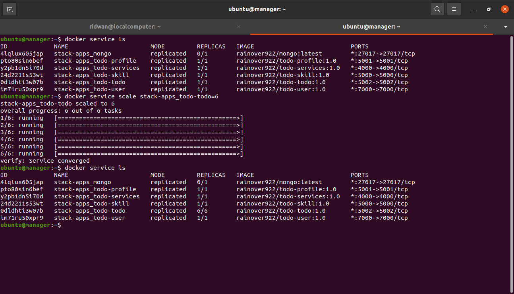<br>

**7. Cek container `docker service ls`.**<br>
**8. Buka browser arahkan ke salah satu ip server worker dan portnya.**<br>
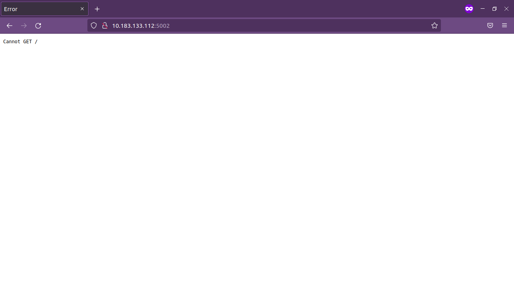<br>