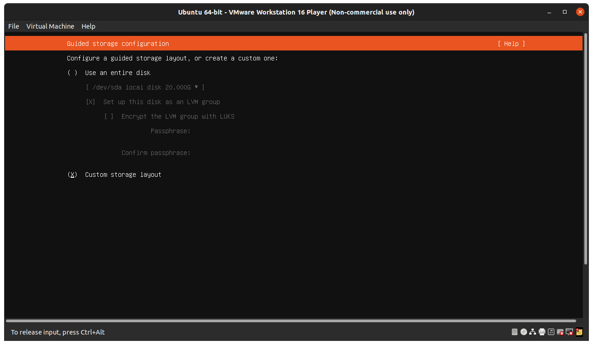

# VMware-Install-Ubuntu
**Install Ubuntu Server 20.x with VMware**  

**1. Download VMware, dan juga Ubuntu server iso**  
**2. Install VMWare, kemudian jalankan VMware** 
**3. Create virtual machine baru** 
 

**4. Pilih "Use ISO Image" Browse ubuntu server iso yang telah di download pada step 1, kemudian Next.** 
 

**5. Pada "Personalize Linux" input nama,username, dan password. kemudian Next** 
**6. Pada "Guest Operating System" pilih Linux. kemudian Next** 
 

**7. Kemudian beri nama pada virtual machine serta tentukan lokasi filenya. klik Next.** 
 

**8. Pada "Disk Size" beri sebesar 20GB (recommended size untuk ubuntu) kemudian pilih "Split virtual disk into multiple files"** 
 

**9. Selanjutnya Custom spec virtual machine sesuai kebutuhan, misal 2 CPU cores, memory 2048 Mb, network adapter Bridge. Klik Finish** 
 

**10. Masuk pada proses instalasi os ubuntu** 
**11. Pilih bahasa "English"** 
 

**12. Konfigurasi keyboard set default** 
 

**13. Setting network connections bisa DHCP (ip dinamis) ataupun manual (ip static), sesuai kebutuhan. Untuk sementara bisa menggunakan DHCP.** 
 

**14. Configure Proxy, jika ingin menggunakan proxy address bisa diisi maupun dikosongkan saja.** 
 

**15. Ubuntu archive mirror menggunakan yang default saja.** 
  

**Create swap memory and root partition** 
**Proses pembuatan swap dan root partition dilakukan saat proses instalasi ubuntu server di vmware** 
**1. Selanjutnya, atur storage configuration, pilih "Custom storage layout". kemudian "Done"** 
 

**2. Pilih device /dev/sda, kemudian Add GPT partition** 
 

**3. Misal akan dibuat 1GB swap, pada field Size input 1G.** 
**4. Pada format ubah menjadi swap, kemudian Create** 
 

**5. Swap sudah dibuat.** 
**6. Pilih /dev/sda, kemudian Add GPT partition** 
**7. Pada field "Size" input sisa disk yaitu 18.997G** 
**8. Pilih format ext4** 
**9. Untuk Mount pilih "/" untuk root, kemudian Create** 
 

 

**10. Kemudian konfirmasi pilih Continue** 
 

**11. Isi User profile seperti nama, nama server, username, dan password untuk sebagai informasi login ke ubuntu nanti.** 
 

**12. Selanjutnya install ssh, pilih atau centang install OpenSSH server.**
 

**13. Featured Server bisa dipilih sesuai kebutuhan, jika tidak ada kosongkan saja. Next** 
 

**14. Tunggu proses instalasi ubuntu server selesai.** 
 

**15. Setelah proses instalasi selesai reboot vm kemudian login menggunakan akun yang telah dibuat pada step 11.** 
 

**16. Ubuntu di vmware sudah dapat di operasikan.** 
  

**Local server can connect to the internet** 
**1. Setelah proses instalasi ubuntu di vm selesai.** 
**2. Login ke vm di ubuntu server** 
**3. Untuk mengecek apakah vm ada koneksi internet bisa dilakukan perintah ping, misal ping `www.google.com`**
 
