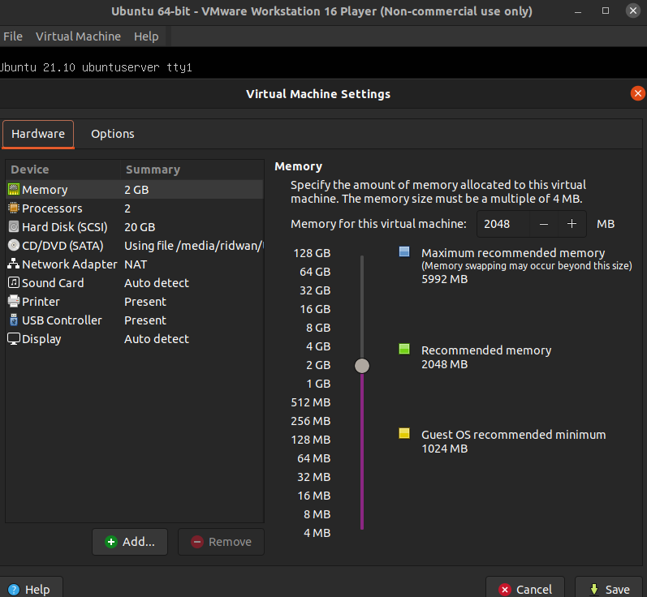
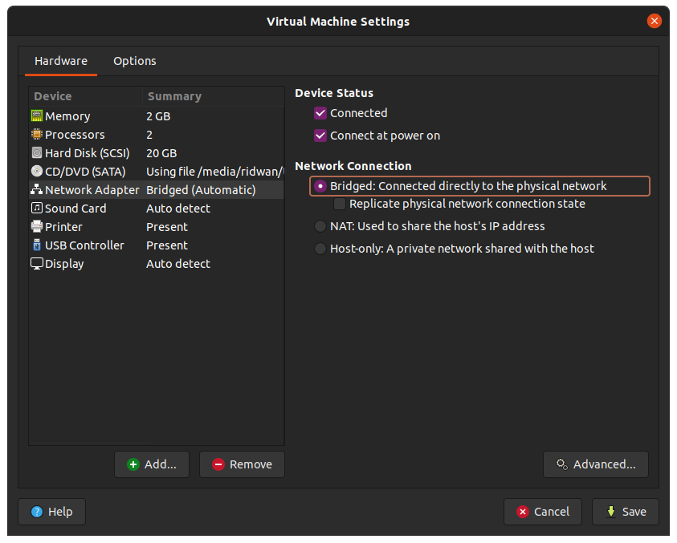
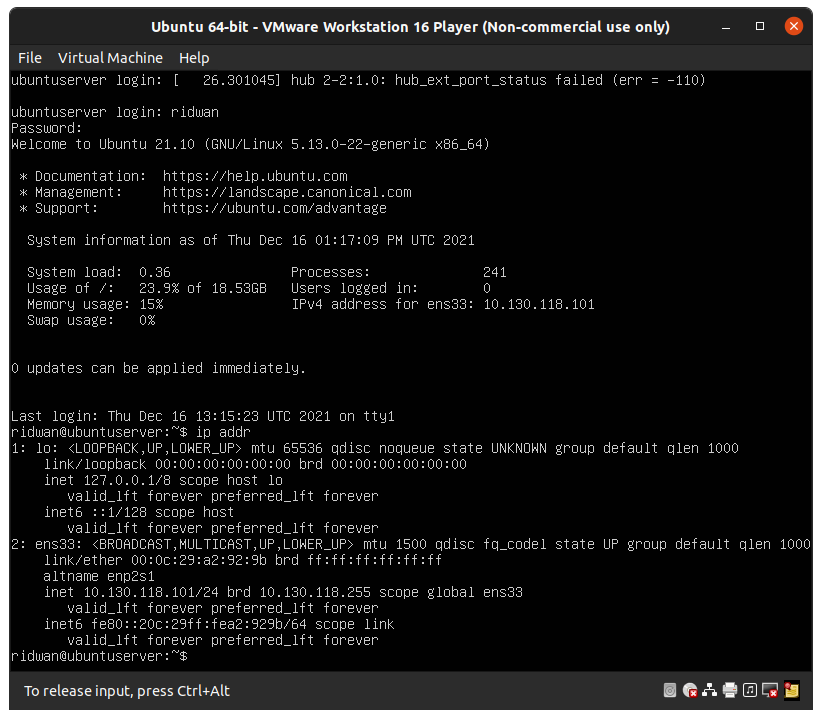
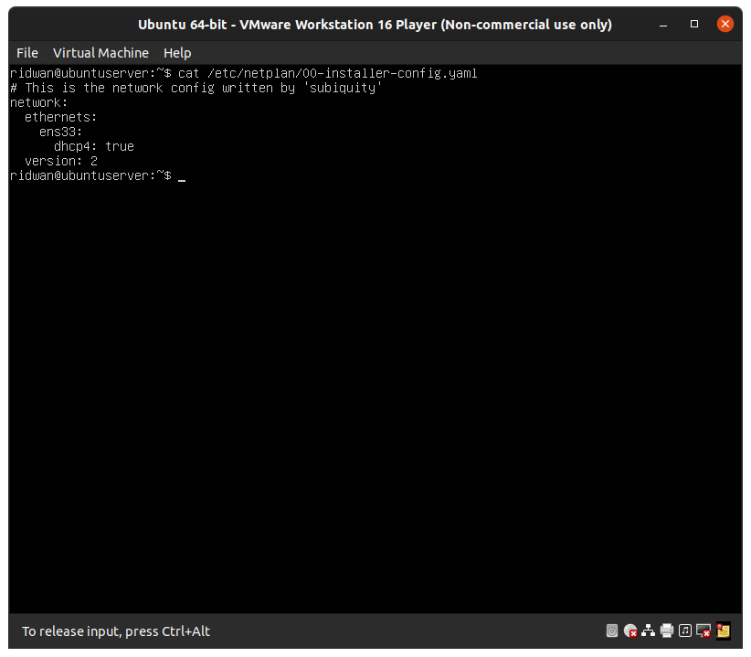
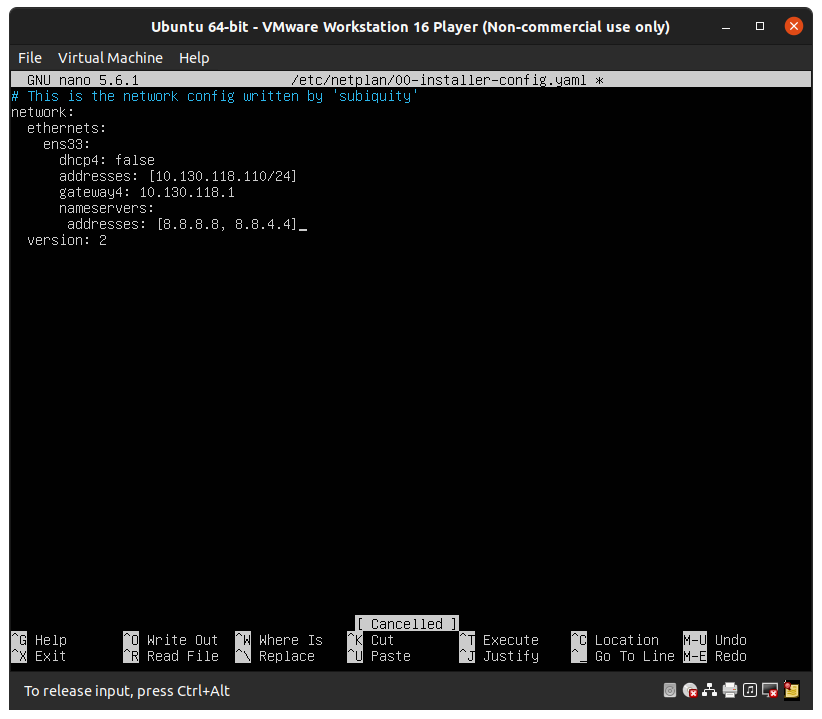
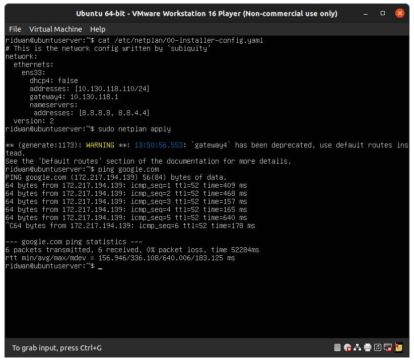

# VMware-Setup-Network
**Change network from NAT to Bridge**<br>
**1. Buat virtual machine atau jika sudah ada buka virtual machine**<br>
**2. Buka virtual machine settings pada menu bar, atau CTRL + D**<br>
<br>
**3. Klik pada "Network Adapter"**<br>
**4. Pilih "Bridge: Connected directly to the phsical network" kemudian Save.**<br>
<br>

**5. Kemudian pada vm ubuntu, check ip address masukkan perintah `ip addr`**<br>
<br><br>

**Setup static IP for Ubuntu Server**<br>
**1. Check ip address ubuntu server masukkan perintah `ifconfig` atau `ip addr`**<br>
<br>
**2. Check konfigurasi netplan ketikan perintah `cat /etc/netplan/00-installer-config.yaml`**<br>
<br>
**3. Setup statik ip pada `00-installer-config.yaml`.**<br>
**4. Ketikkan perintah `sudo nano /etc/netplan/00-installer-config.yaml`**<br>
**5. Ubah `dhcp:false`, kemudian tambahkan baris berikut pada ens33(nama interface, berbeda-beda tiap komputer):**
```..
dhcp: false
adresses:
   - 10.130.118.110/24
   gateway4: 10.130.118.1
   nameservers:
     addresses:
     - 8.8.8.8
     - 8.8.4.4
 ...

```
<br>

<br>

**6. Kemudian Save.**<br>
**7. Apply konfigurasi netplan `sudo netplan apply`**<br>
**8. Check koneksi internet ketikkan perintah `ping www.google.com -t` .**<br>
<br>