# VMware-Install-Application
**Update and Upgrade the system operation**<br>
**1. Jalankan VMware yang telah terinstall OS Ubuntu Server**<br>
**2. Buka terminal dan login ke server menggunakan SSH**<br>
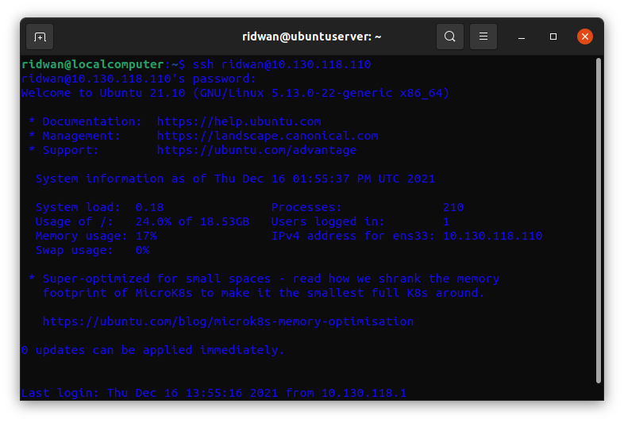<br>

**3. Update dan upgrade sistem operasi, ketikkan perintah `sudo apt update` kemudian `sudo apt upgrade`**<br>
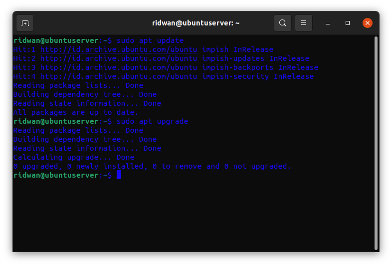<br>
**4. Tunggu hingga selesai**<br><br>

**Install node.js 10.x**<br>
**1. Lakukan update & upgrade sistem.**<br>
**2. Install node.js menggunakan NVM metode agar mudah dalam memanajemen version node.js**<br>
**3. Buka browser dan arahkan ke link NVM github `https://github.com/nvm-sh/nvm#installing-and-updating`**<br>
**4. Pada bagian "Install & update" script, copy script wget atau curl `https://github.com/nvm-sh/nvm#installing-and-updating`.**<br>
**5. Tunggu selesai download.**<br>
**6. Ketikkan perintah `nvm -v` untuk cek versi dan memastikan nvm sudah terinstall, jika tidak bisa ketik perintah `exec bash`**<br>
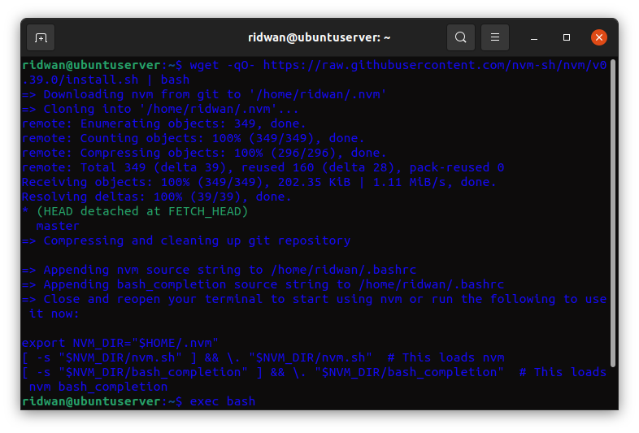<br>

**7. Install node versi 10.x.x ketikkan perintah `nvm install 10`**<br>
**8. Kemudian setelah selesai ketik `nvm use 10`**<br>
**9. Node js sudah terinstall**<br>
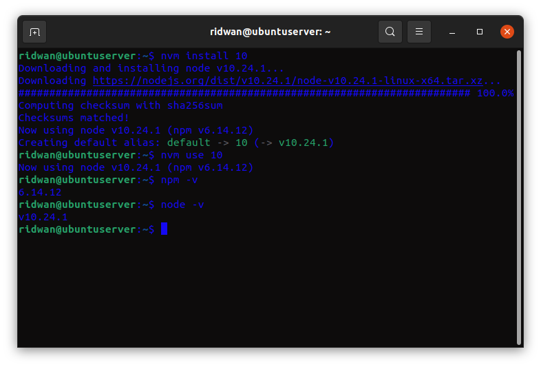<br><br>

**Clone application**<br>
**1.Setelah instalasi nodejs berhasil proses berikutnya melakukan deploy application**<br>
**2. Clone apps yang sudah ready `https://github.com/sgnd/dumbflix-frontend`**<br>
**3. Ketikkan perintah `git clone https://github.com/sgnd/dumbflix-frontend`**<br>
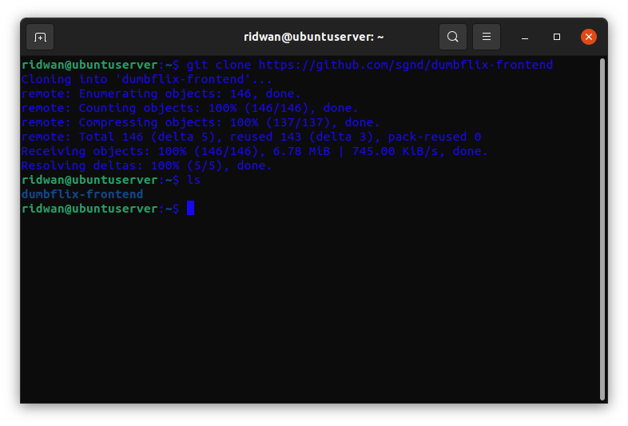<br><br>

**Change directory to frontend and deploy the application** <br>
**1. Masuk ke directory apps, ketik perintah `cd dumbflix-frontend`**<br>
**2. Kemudian perintah selanjutnya `npm install` untuk menginstall dependency yang dibutuhkan oleh apps.**<br>
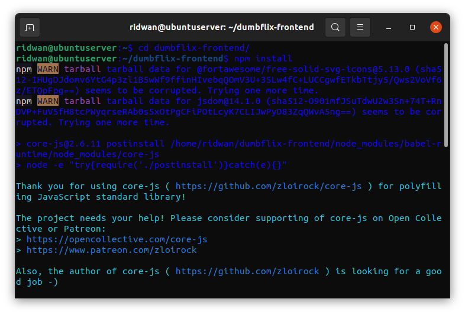<br>
**3. Setelah selesai, run apps dengan perintah `npm run start`**<br>
**4. Apps sudah berjalan, kemudian buka browser arahkan ke alamat server dengan port 3000 `10.130.118.110:3000`**
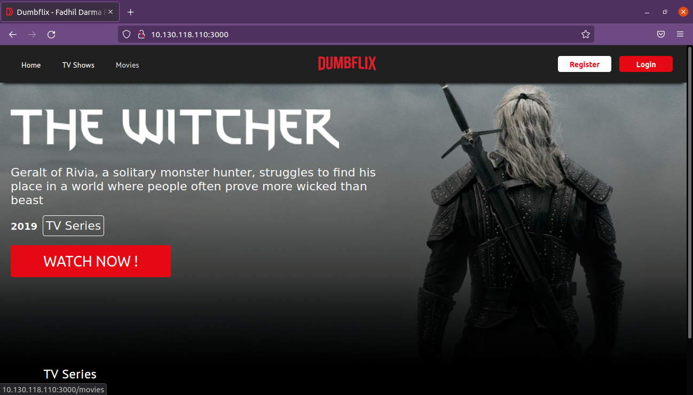<br><br>

**Deploy apps menggunakan nginx dan reverse proxy**<br>
**1. Install nginx ketikkan perintah `sudo apt install nginx`**<br>
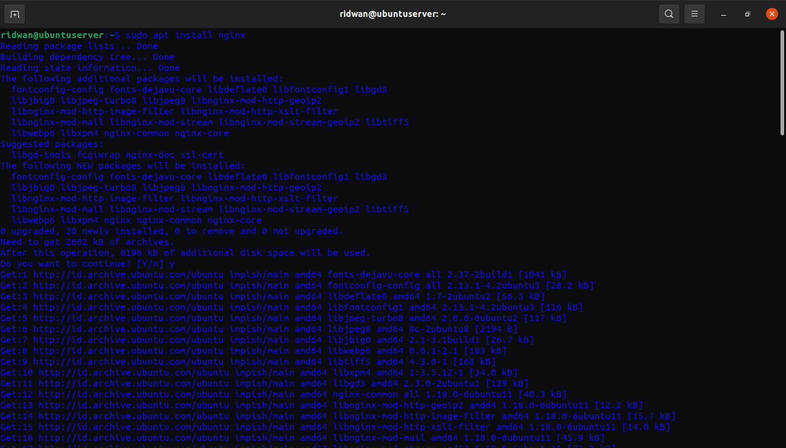<br>
**2. Cek status nginx ketikkan perintah `systemctl status nginx`**<br>
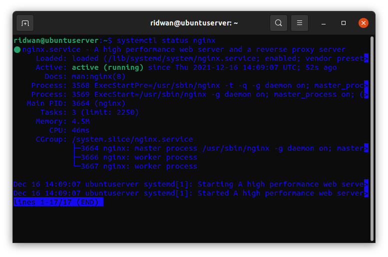<br>
**3. Kemudian masuk ke directory nginx `cd /etc/nginx`**<br>
**4. Buat folder untuk konfigurasi website `sudo mkdir dumbflix`**<br>
**5. Ubah owner folder `sudo chown ridwan:ridwan dumbflix`, sehingga tidak perlu lagi menggunakan sudo untuk merubah isi folder.**<br>
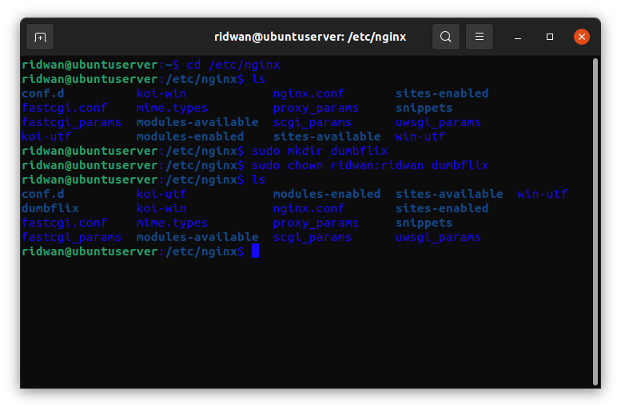<br>
**6. Masuk ke folder `dumbflix` kemudian buat sebuah file konfigurasi**<br>
**7. Ketikkan perintah `nano dumbflix.xyz` (nama konfigurasi file sesuaikan dengan kebutuhan)**<br>
**8. Masukkan kode berikut.**<br>
```
server {
      listen 80;
      server_name dumbflix.xyz;

      location / {
            proxy_pass http://localhost:3000;
      }
    }
```
<br>

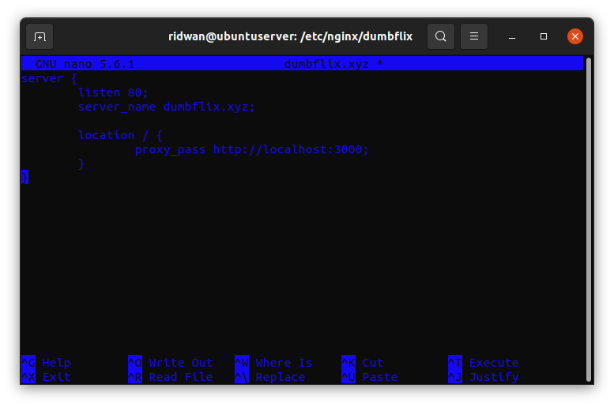<br>

**9. Menggunakan port `80`, kemudian server_name `dumbflix.xyz`, dan juga lokasi untuk mengarahkan ke apps `proxy_pass http://localhost:3000;`**<br>
**10. Save konfigurasi**<br>
**11. Selanjutnya masuk ke folder nginx, edit file `nginx.conf` ketikkan perintah `sudo nano nginx.conf`**<br>
**12. Include konfigurasi dumbflix tadi ke dalam nginx.conf `include /etc/nginx/dumbflix/*;`**<br>
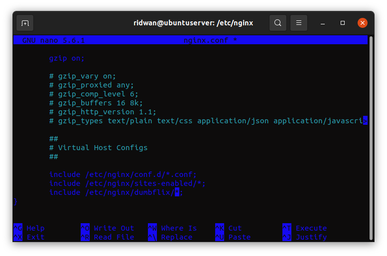<br>
**13. Save**<br>
**14. Check konfigurasi dengan perintah `sudo nginx -t` untuk memastukan syntax konfigurasi tidak ada error.**<br>
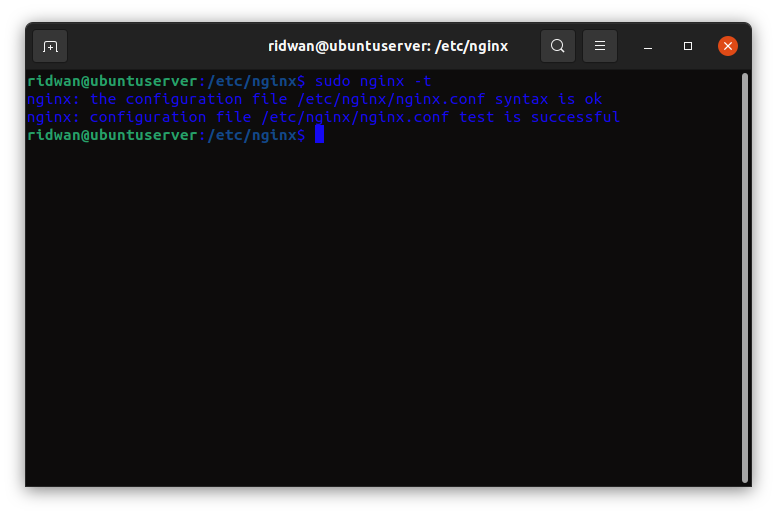<br>
**15. Reload nginx `sudo systemctl reload nginx`**<br>
**16. Masuk ke folder aplikasi `dumbflix-frontend` kemudian run apps `npm run start`**<br>
**17. Agar bisa mengakses `dumbflix.xyz`, tambahkan ip server virtual machine dan web url nya ke komputer kita.**<br>
**18. Buka terminal baru (bukan di virtual machine), ketik perintah `sudo nano /etc/hosts`**<br>
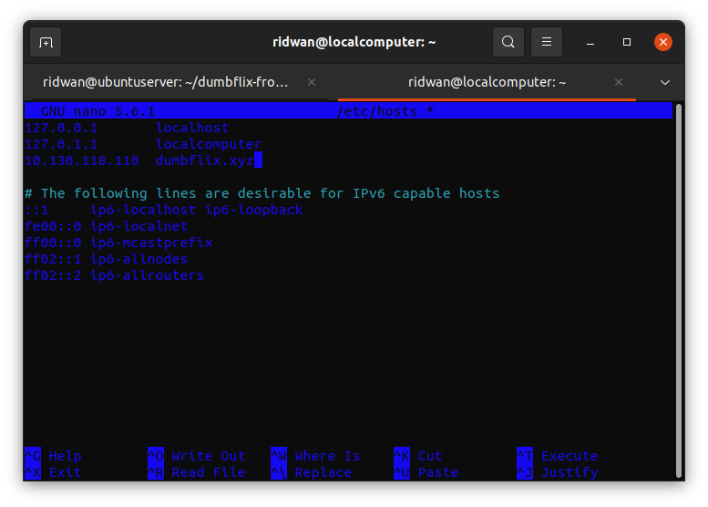<br>
**19. Save.**<br>
**20. Buka browser kemudian arahkan ke `dumbflix.xyz`**<br>
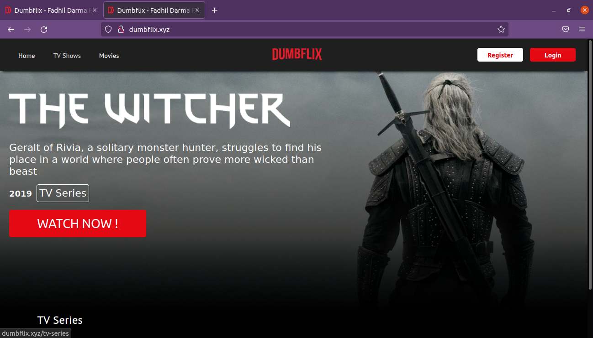<br><br>

**Install PM2 untuk apps bisa run di background**<br>
**1. Masuk ke terminal server install pm2 `npm install pm2 -g`**<br>
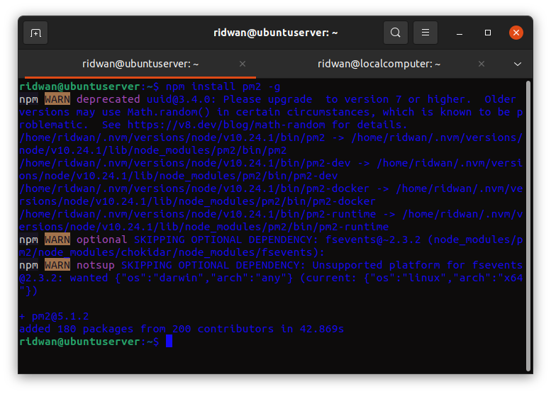<br>
**2. Masuk ke dalam folder `dumbflix-frontend`**<br>
**3. Jalankan ecosystem file yang ada dalam folder**<br>
**4. Ketikkan perintah `pm2 start ecosystem.config.js`**<br>
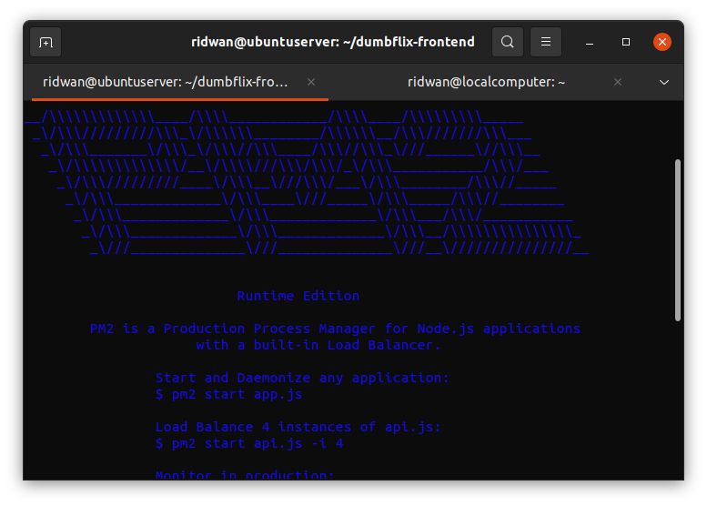<br>
**5. Apps telah berjalan di background.**<br>