# Create and Setup Server
**Requirements:** 
* Create a server with ubuntu 20.x OS. 
* Create two servers for reverse proxy and application with AWS. 
* Server for reverse proxy need a public ip address. 
* Setup security group and open ports 22, 80, and 443 for reverse proxy.  
* Setup security group and open all trafic for the application.   

**Server untuk Reverse Proxy** 
**1. Login ke AWS Console** 
**2. Masuk ke halaman dashboard atau AWS management console.** 
**3. Klik Launch a virtual machine EC2**
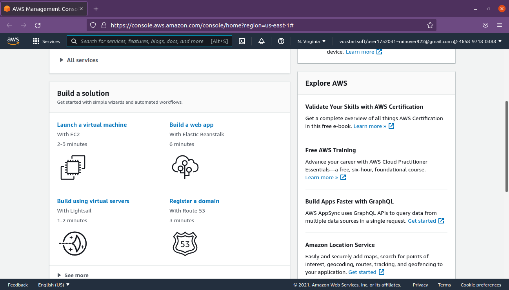 

**4. Pada step 1 Choose AMI cari ubuntu, kemudian pilih ubuntu versi 20.** 
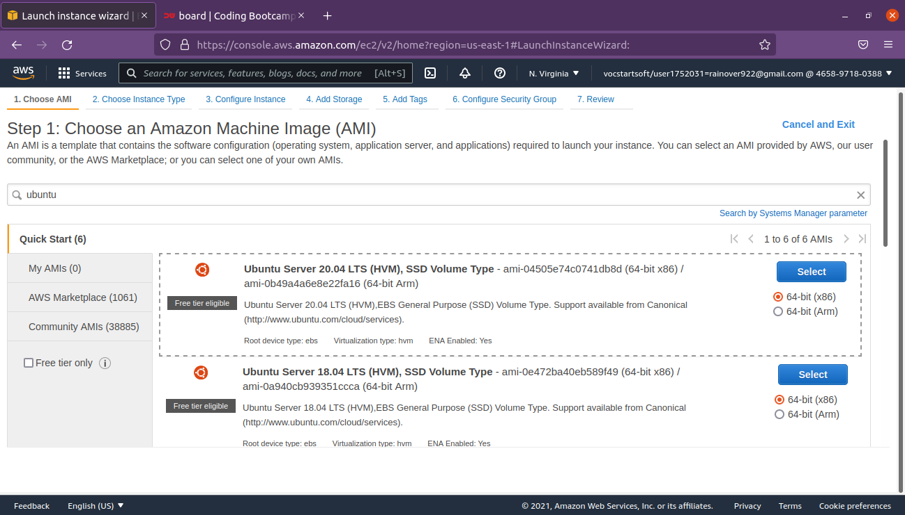 

**5. Step 2 pilih instance type sesuai kebutuhan.** 
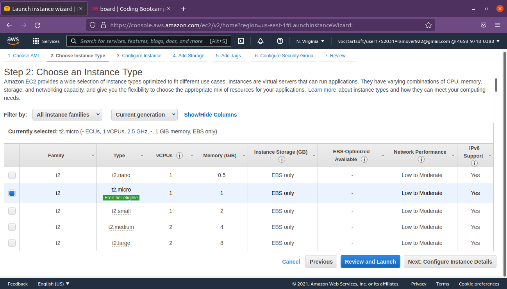 

**6. Step 3 Configure instance pilih Auto-assign public ip menjadi disable.** 
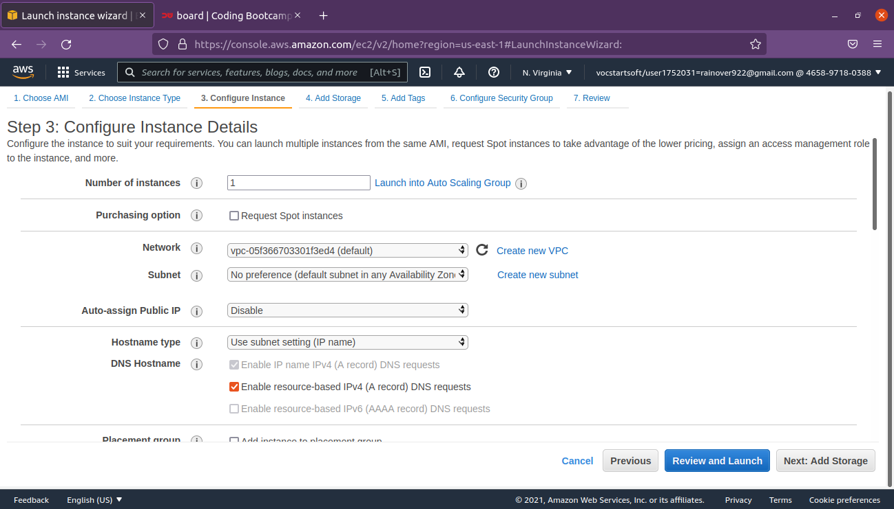 

**7. Step 4 Add storage. atur storage server yang dibutuhkan.** 
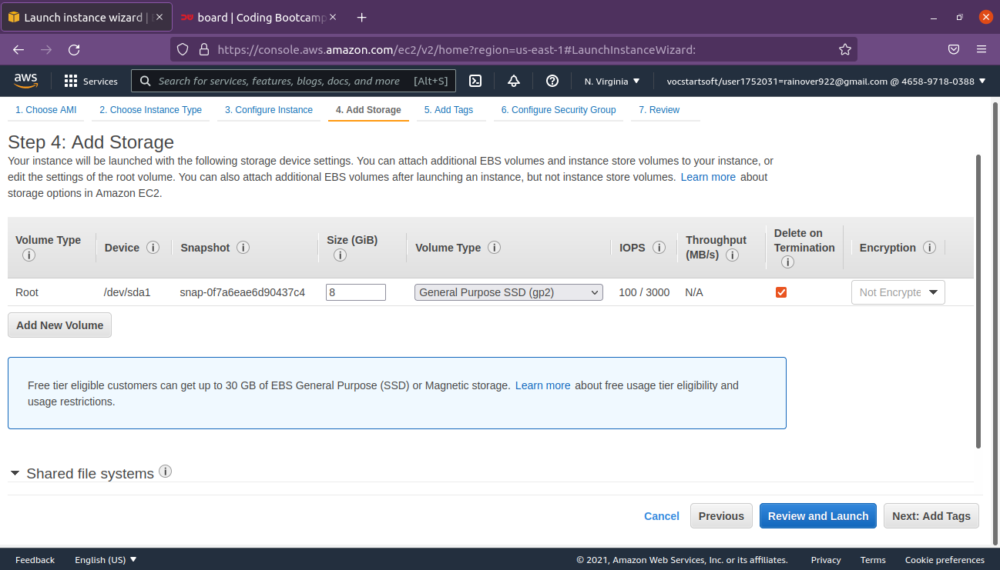 
**8. Step 5 Add Tags, Biarkan default** 
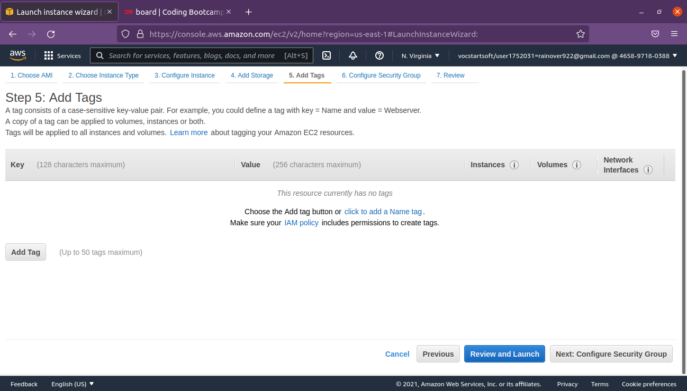 
**9. Step 6 Setup Security Group** 
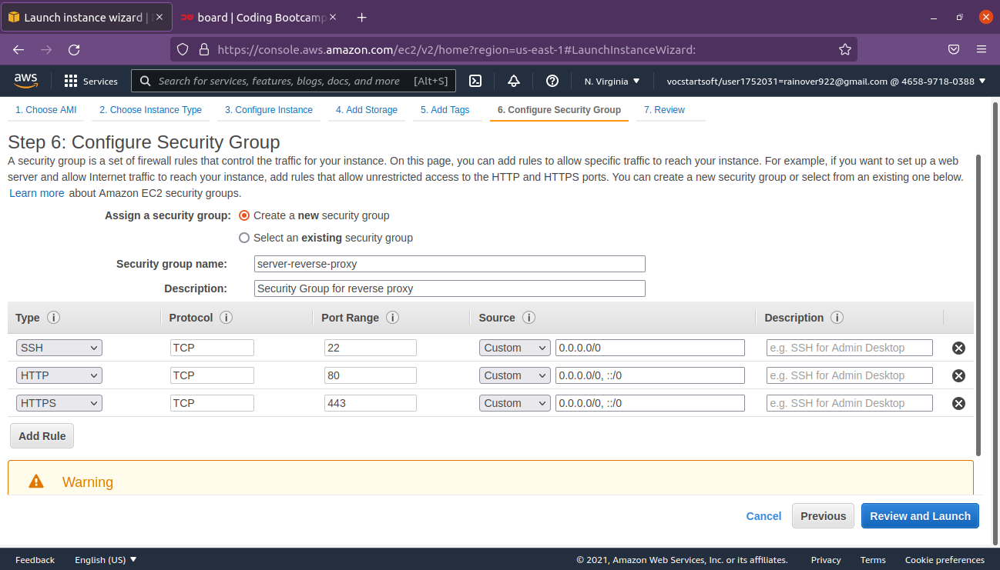 
**10. Download key pair untuk digunakan pada saat login ke server nanti.** 
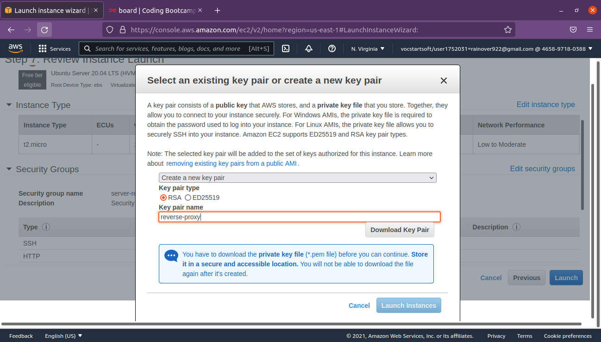 
**11. Launch Instance**  

**Allocate Elastic IP** 
**1. Masuk ke Elastic IPs yang terletak pada sidebar console bagian Network & Security.** 
**2. Kemudian Allocated Elastic IP address, AWS akan mengalokasikan sebuah IP yang dapat digunakan.** 
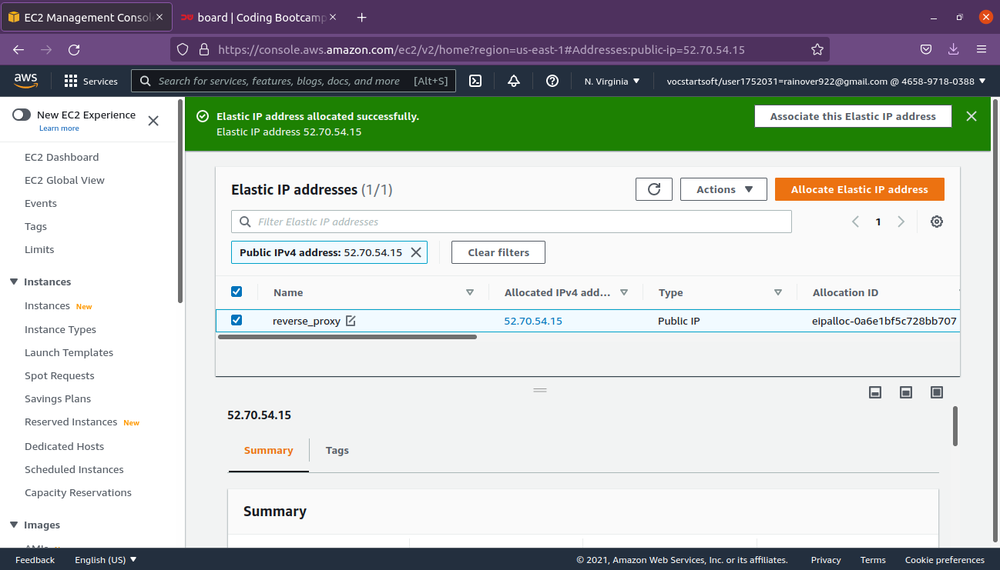 
**3. Beri nama kemudian associate elastic ip address dengan server yang dituju.** 
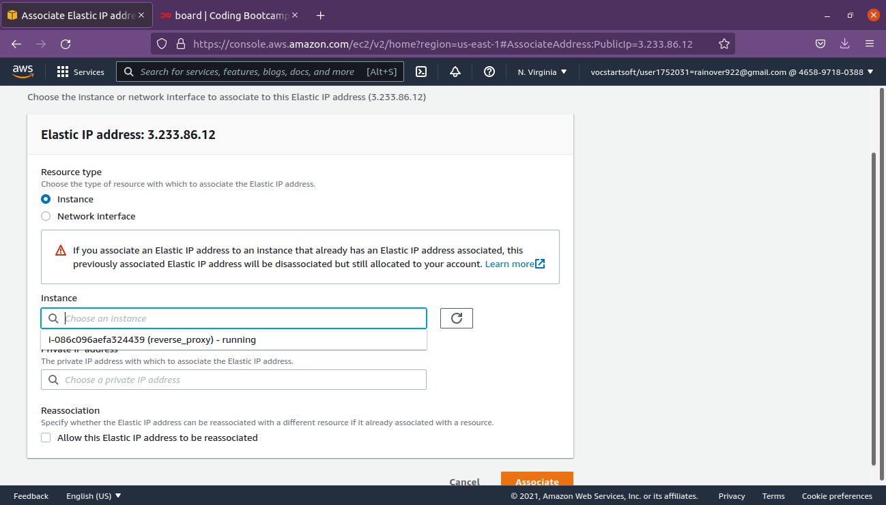 
**4. Masuk ke instance kemudian refresh instances.** 
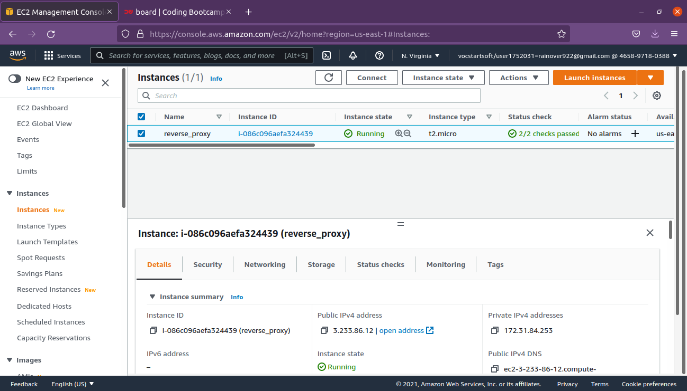 
**5. Reverse proxy server yang dibuat sudah memiliki ip public.** 
**6. Server bisa diakses melalui SSH menggunakan ip public-nya** 
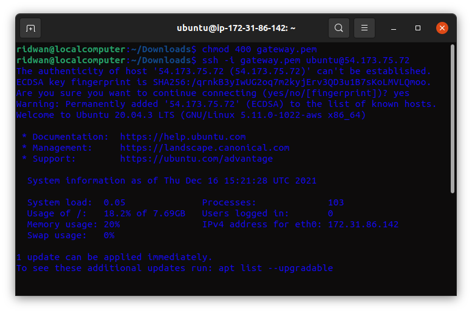  

**Server untuk Apps** 
**1. Login ke AWS Console** 
**2. Masuk ke halaman dashboard atau AWS management console** 

**3. Klik Launch a virtual machine EC2.** 
 

**4. Pada step 1 choose AMI cari ubuntu, kemudian pilih ubuntu server versi 20.** 
 

**5. Step 2 pilih instance type sesuai kebutuhan.** 
 

**6. Step 3 Configure Instance pilih Auto-assign public ip menjadi disable.** 
 

**7. Step 4 Add Storage.** 
 

**8. Step 5 Tags biarkan default** 
 

**9. Step 6 Setup security group** 
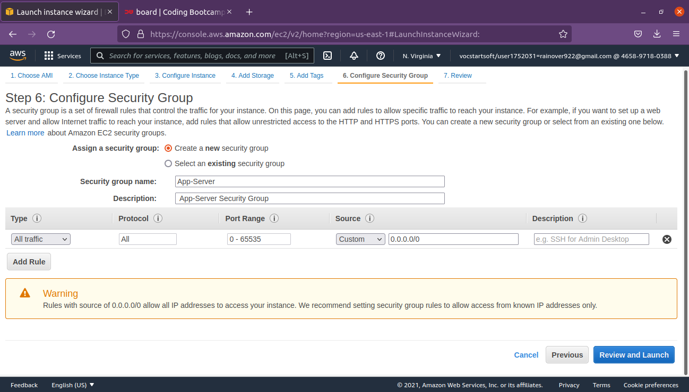 

**10. Gunakan key pair yang sama pada server reverse proxy.** 
**11. Launch instance.** 
**12. Allocate Elastic IP untuk server Apps.**
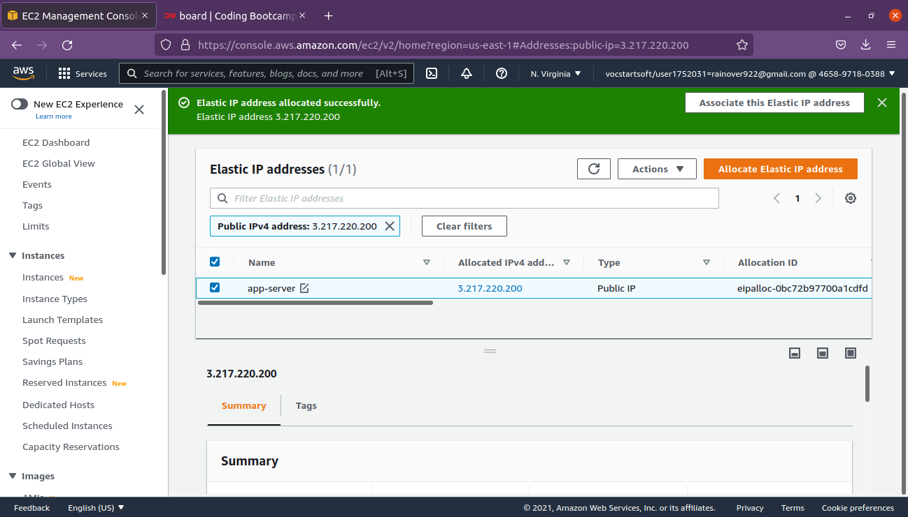 
**13. Akses server** 
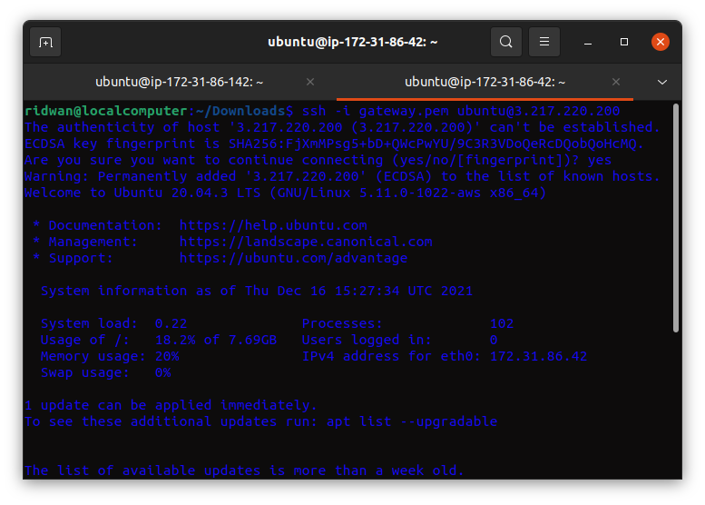 