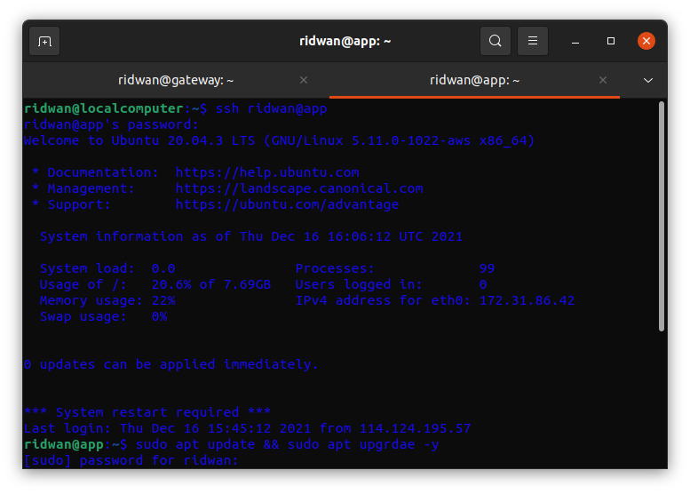
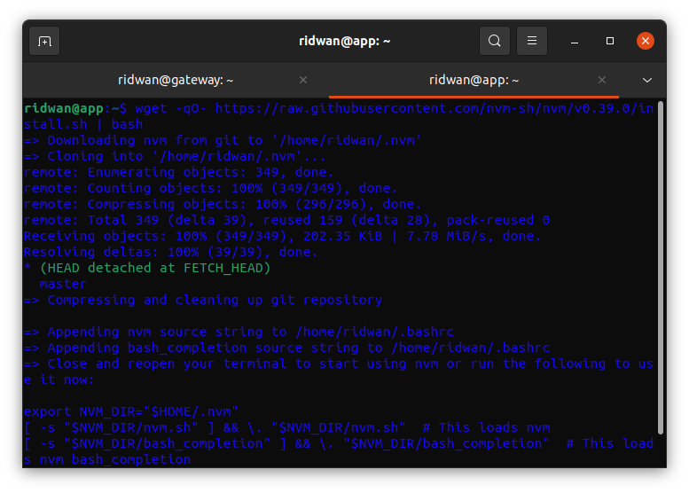
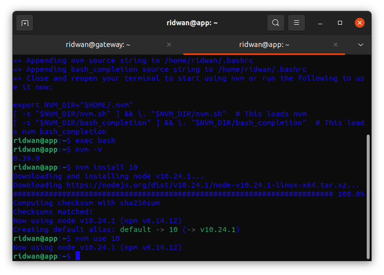
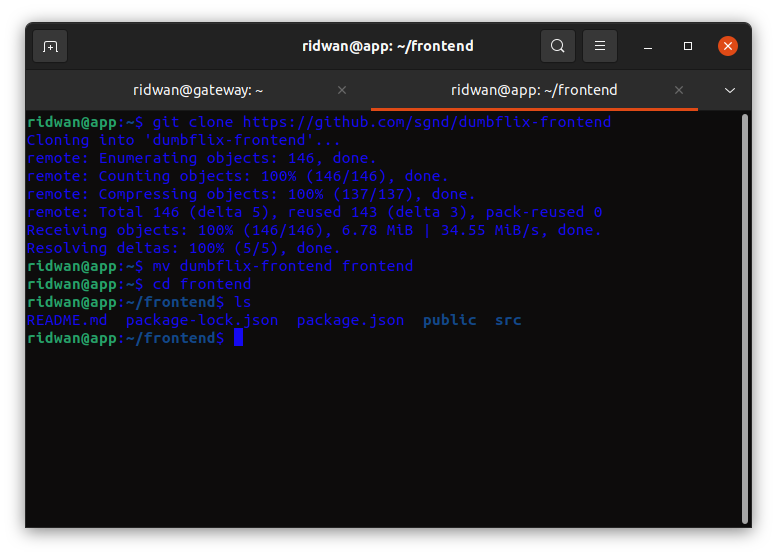
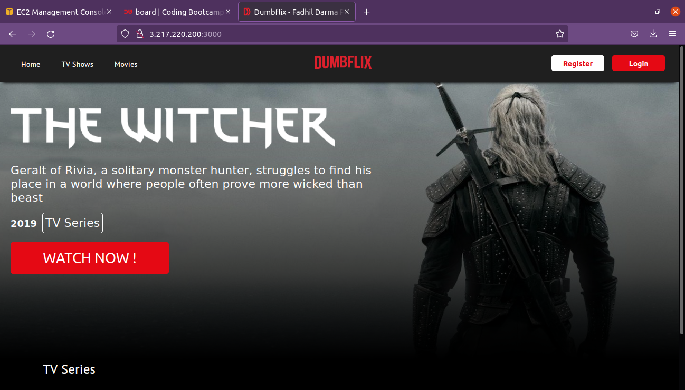

# AWS - Server for Application
**Requirements** 
* Update and upgrade the system operation.  
* Install node 10.x  
* Clone application in here `https://github.com/sgnd/dumbflix-frontend`.  
* Change directory to `frontend` and deploy the application.   

**Update and upgrade sistem operasi** 
**1. Login ke App-server** 
**2. Update dan upgrade system `sudo apt update && sudo apt upgrade -y`.** 
  

**Install Node JS versi 10.x** 
**1. Install NVM untuk management NodeJS version `wget -qO- https://raw.githubusercontent.com/nvm-sh/nvm/v0.39.0/install.sh | bash`** 
 
**2. Install nodejs versi 10.xx `nvm install 10` kemudian `nvm use 10`** 
 
**3. NodeJS telah terinstall**  

**Clone Application** 
**1. Clone apps `git clone https://github.com/sgnd/dumbflix-frontend`** 
**2. Pindahkan/rename folder dumbflix-frontend ke folder frontend `mv dumbflix-frontend frontend`** 
**3. Change directory ke frontend `cd frontend`** 
  

**Deploy Application** 
**1. Masuk ke directory frontend.** 
**2. Ketik `npm install` untuk menginstall node_modules dan dependency apps.** 
**3. Deploy apps, `npm run start`** 
**4. Buka browser, arahkan url ke `3.217.220.200:3000`** 
  