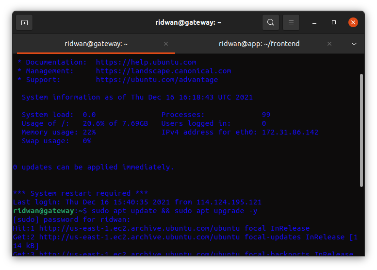
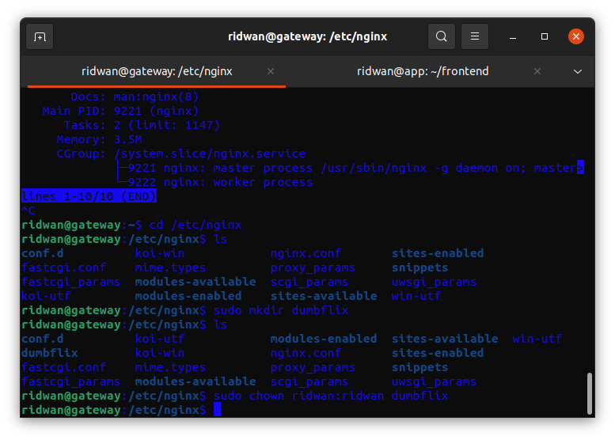
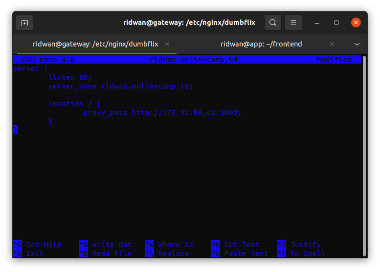
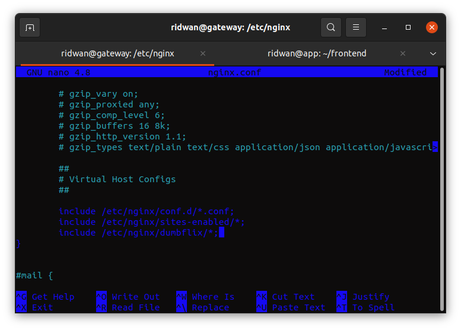
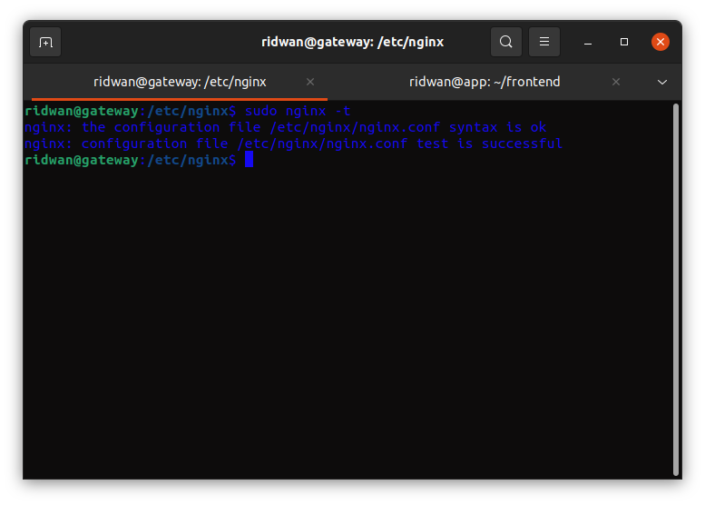
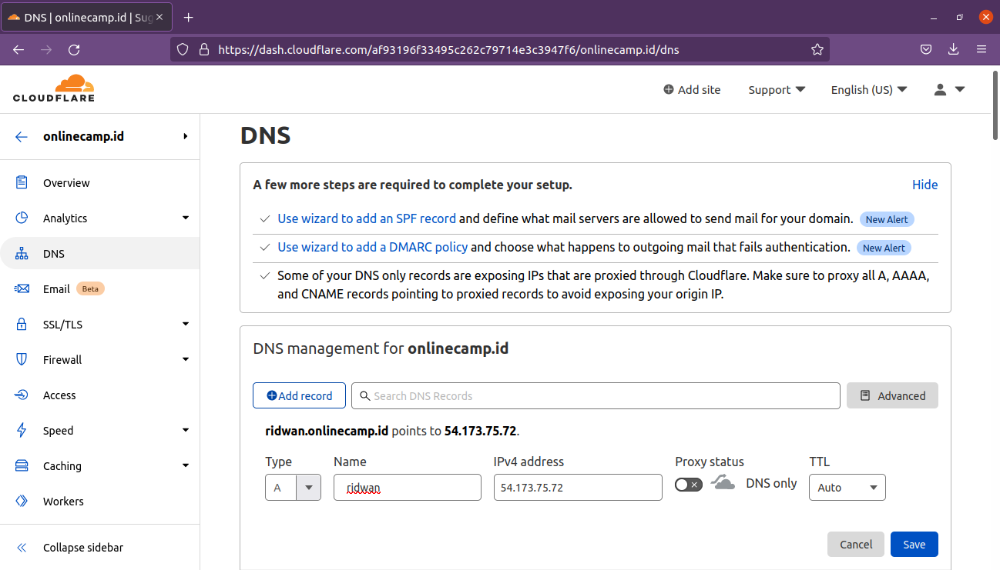
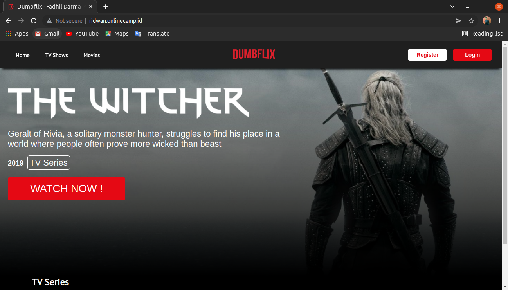

# AWS - Reverse Proxy
**Requirements** 
* Update and Upgrade the operating system/ 
* Install webserver for reverse proxy. 
* Create reverse proxy from the application with port 3000 to port 80.  

**1. Login ke server reverse proxy.** 
**2. Update dan upgrade sistem.**
 

**3. Install nginx `sudo apt install nginx`** 
**4. Masuk ke dalam folder nginx `/etc/nginx`** 
**5. Buat folder `dumbflix` untuk menyimpan file konfigurasi.** 
 

**6. Masuk ke dalam folder `dumbflix`** 
**7. Buat file konfigurasi `nano ridwan.onlinecamp.id` kemudian buat aplikasi mengarah ke port 80.** 
 
**8. Kemudian include konfigurasi dumbflix tadi ke `nginx.conf`, Save perubahan.** 
 
**9. Test konfigurasi file, `sudo nginx -t`, untuk mengecek syntax pada konfigurasi apakah sudah ok.** 
 
**10. Restart nginx `sudo systemctl restart nginx`** 
**11. Selanjutnya arahkan domain name ke public ip reverse-proxy-server, untuk dapat berjalan di port 80, uncheck proxy status.** 
 
**12. Buka browser kemudian arahkan url ke `ridwan.onlinecamp.id` untuk mengakses site.** 
 