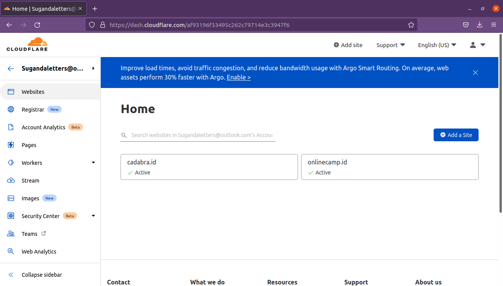
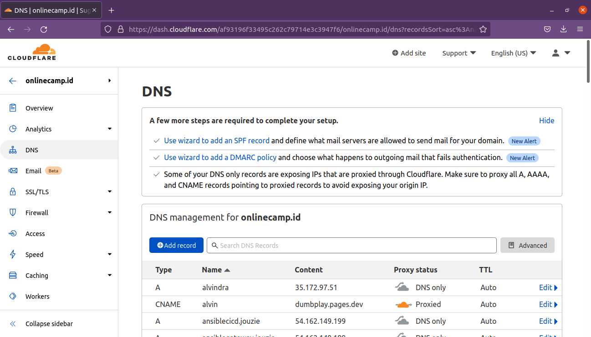
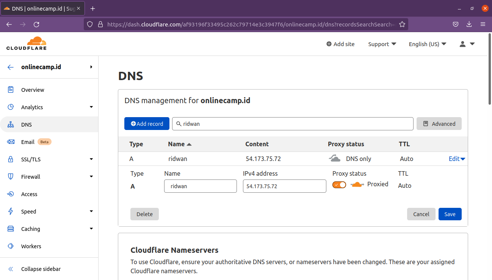

# AWS - Custom Domain
**Create sub-domain** 
**1. Login ke penyedia nama domain, contoh yang digunakan disini yaitu cloudflare.** 
**2. Pilih domain yang akan ditambahkan sub-domain, misal `onlinecamp.id`** 
 
**3. Masuk ke menu DNS.** 
 
**4. Untuk menambahkan sub-domain, klik Add Record, pastikan jika sub-domain yang diinginkan tersedia.** 
**5. Set type A, masukkan ip public server reverse proxy atau gateway-nya, check proxy jika ingin menggunakan proxy.** 
 
