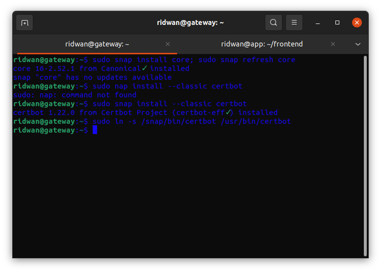

# AWS - SSL Configuration
**Generate API Key** 
**1. Login dan masuk ke dashboard cloudflare.** 
**2. Pada bagian account klik my profile.** 
**3. Masuk ke halaman API tokens.** 
 
**4. Pada bagian Global API Key, klik view, muncul kotak dialog.** 
 
**5. Masukkan password untuk mendapatkan key.** 
**6. Copy dan simpan api key.** 
**7. Login ke server.** 
**8. Buat folder kemudian di dalamnya buat file untuk menyimpan api key cloudflare.** 
**9. Di dalam file masukkan email dan api key.** 
 
**10. Setelah itu ubah hak akses folder ke 700 dan file ke 400.** 
  

**Install Certbot and the CloudFlare DNS authenticator plugin** 
**1. Update snapd `sudo snap install core; sudo snap refresh core`.** 
**2. Install certbot `sudo snap install --classic certbot`.** 
**3. Link certbot dari /snap/bin/certbot ke /usr/bin/certbot `sudo ln -s /snap/bin/certbot /usr/bin/certbot`** 
 
**4. Generate SSL `sudo certbot`** 
**5. masukkan email address.** 
**6. Kemudian Agree Terms of Service.** 
**7. Pilih nama website yang akan dipakaikan HTTPS.** 
**8. Tunggu request certificate untuk website berhasil di generate.** 
 
**9. Masuk ke folder config nginx untuk website `/etc/nginx/dumbflix`** 
**10. Ketikkan perintah `cat ridwan.onlinecamp.id` untuk melihat perubahannya.** 
**11. Kemudian test config `sudo nginx -t`** 
 
**12. Reload nginx `sudo systemctl reload nginx`** 
**13. Buka browser arahkan ke alamat url `ridwan.onlinecamp.id`.** 
 