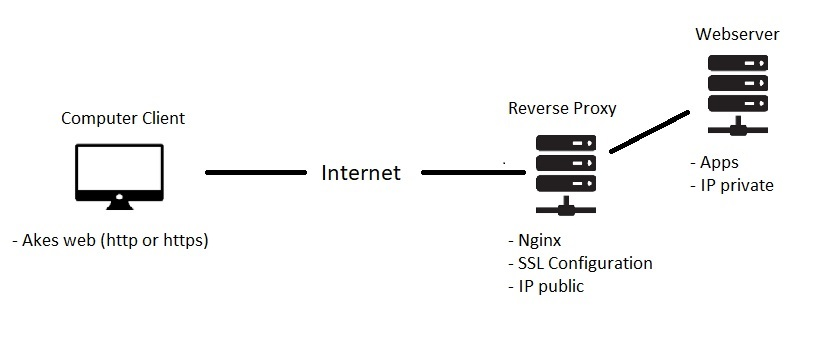

# Task Description
**Task DevOps week 1 Fundamental DevOps dan Cloud Computing**  
1. DevOps  
 adalah sebuah budaya kolaborasi antara developer dan operation yang melahirkan serangkaian praktik yang mempercepat proses development dan operasi secara otomatis, kontinyu dan terintegrasi.  
 Dalam budaya DevOps pastinya perlu pemahaman atau familiar dengan Linux, karena kebanyakan server berjalan menggunakan sistem operasi linux dengan berbagai macam distro.  
 Pada task week ini akan dijelaskan step by step mengenai:  
* Setup virtual machine sebagai server lokal dengan OS ubuntu Server.  
* Setup network dalam virtual machine.  
* Setup dan deploy app nodejs.  
* Mengaplikasikan metode reverse proxy.  
 

2.Cloud Computing  
Adalah komputer server yang dapat diakses secara online, selain itu spesifikasi seperti CPU, RAM, ruang penyimpanan dapat diupgrade sesuai kebutuhan serta banyak fitur-fitur lainnya. Beberapa penyedia layanan Cloud Computing seperti Google Cloud Platform (GCP),  
Amazon Web Service (AWS), Alibaba, OpenShfit dan lain-lain.  
Pada task 1 ini akan mempraktikkan penggunaan cloud computing AWS EC2 serta serta konfigurasinya step by step:  
* Setup server AWS.  
* Setup server untuk Apps.  
* Setup server untuk Reverse Proxy.  
* Setup Custom Domain.  
* Setup SSL Configuration.  
 