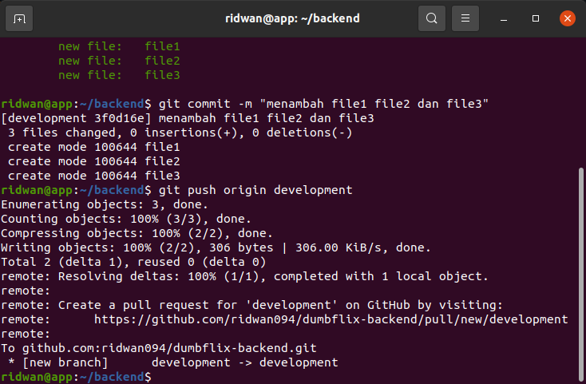

# Install Git dan SSH Key
========================================== 
## Fork repository backend apps  
**1. Login ke akun Github.** 
**2. Buka repository backend apps yang akan di fork `https://github.com/sgnd/dumbflix-backend`.** 
**3. Pada halaman repository backend apps, klik fork, maka akan otomatis masuk ke repository akun github kita.** 
 

## Buat SSH Key untuk Git  
**1. Buat sebuah server/instance di AWS.** 
**2. Install Git `sudo apt install git`.** 
**3. Install SSH `sudo apt install openssh-server`.** 
 

**4. Tambahkan user ke dalam config git.** 
**5. `git config --global user.name "username"`. kemudian ``git config --global user.email "email"``** 
 

**6. Buat folder untuk menyimpan ssh key.** 
**7. Generate ssh key dalam folder yang telah dibuat.** 
**8. `ssh-keygen -t rsa -b 4096 -C "email"`.** 
**9. Masukkan nama file kemudian passphrase.** 
 
**10. Akan menghasilkan 2 key dan yang satunya berekstensi `.pub`** 
 
**11. Tambahkan ssh key yang telah di- generate tadi.** 
**12. Ketikkan perintah `eval "$(ssh-agent -s)"` kemudian `ssh-add .git-ssh/git-ssh`.** 
 
**13. Selanjutnya masuk ke github account.** 
**14. Masuk ke settings, pada bagian Account settings buka SSH dan GPG keys.** 
**15. Buat SSH key, beri title kemudian copy-paste generated SSH key yang berekstensi `.pub` tadi.** 
**16. Simpan kemudian masukka password akun github.** 
 
**17. Kemudian test koneksi ke github.** 
**18. Perintahnya `ssh -T git@github.com`** 
 

## Git pull, push, dan merge pada server  
**1. Git clone repository backend apps `git@github.com:ridwan094/dumbflix-backend.git`.** 
 
**2. Buat sebuah branch `git branch development`** 
**3. Kemudian arahkan ke branch development `git checkout development`.** 
**4. Ubah backend apps misal menambah atau menghapus file.** 
 
**5. Kemudian `git add .`.** 
**6. Commit perubahan `git commit -m "menambah file1 file2"`.** 
 
**7. Kemudian push `git push origin development`,** 
 
**8. Update branch dengan pull `git pull origin development`** 
 
**9. Merge branch `git merge development production`** 
 