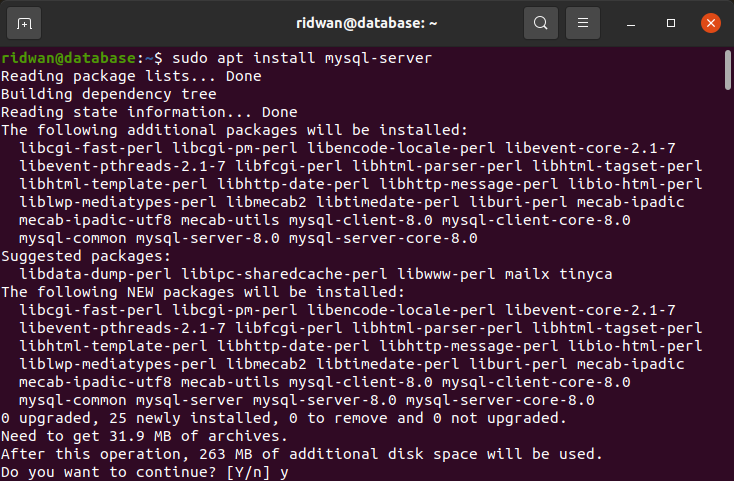
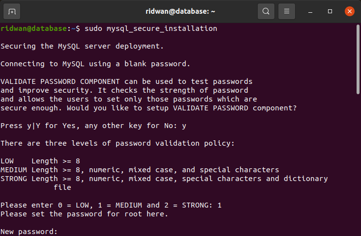
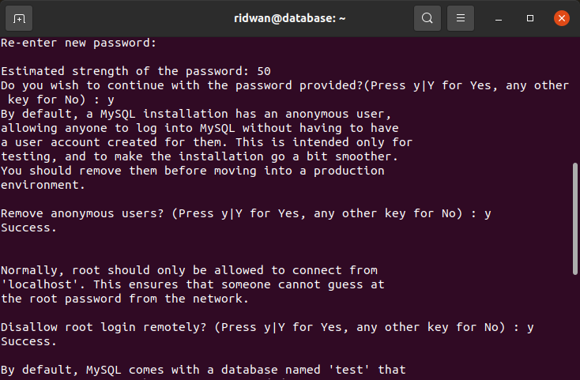
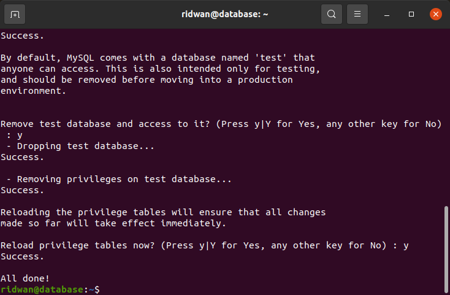
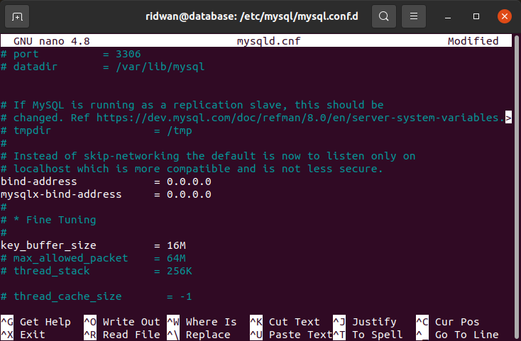
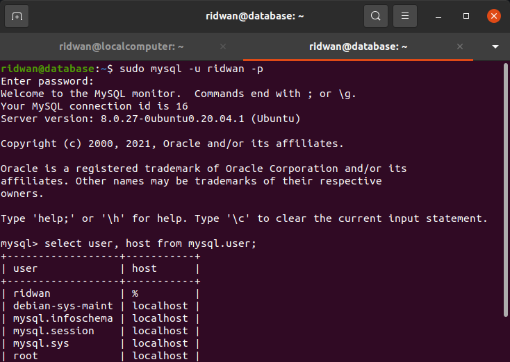

# Setup Database
## Buat instance baru untuk Backend  
* **1. Login ke AWS Console.** 
* **2. Launch new instance.** 
* **3. Buat instance dengan spec berikut:** 
* * **t2.micro** 
* * **8Gb SSD** 
* * **Security group All trafic.** 
* * **Private IP** 

## Install database  
**1. Login ke instance.** 
**2. Update dan upgrade sistem.** 
**3. Install mysql `sudo apt install mysql-server`.** 
 

**4. Konfigurasi keamanan database `sudo mysql_secure_installation`.** 
**5. Input password dan pertanyaan keamanan.** 
 
 
 

## Database dapat terkoneksi dengan klien  
**1. Buka folder `/etc/mysql/mysql.conf.d`. edit file `mysqld.cnf`** 
**2. Ubah ip address `bind address` ke ip address yang dituju/yang dibolehkan.** 
**3. Disini saya mencoba ubah ke `0.0.0.0` publik.** 
 
**Note: mysqlx-bind-address tidak perlu ditambahkan jika memang tidak ada, jika ditambahkan manual akan menyebabkan crash pada mysql service.** 
**4. Save.** 
**5. Restart mysql service `sudo service mysql restart`.** 
**6. Selanjutnya adalah grant akses host.** 
**7. Login ke mysql server `mysql -u ridwan -p`.** 
**8. Ketik command berikut `GRANT ALL PRIVILEGES ON *.* TO 'ridwan'@'%' IDENTIFIED BY 'password-user';`** 
 