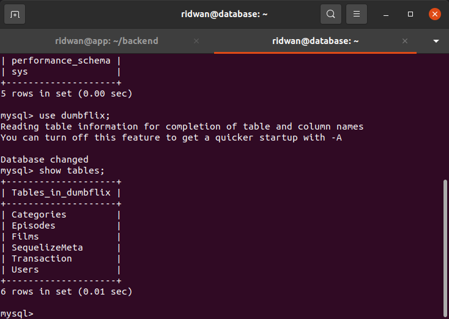

# Deployment Backend App
**1. Clone backend app `git@github.com:ridwan094/dumbflix-backend.git`**
 

**2. Buka Readme file dalam backend app.** 
 
**3. Kemudian jalankan requirementnya.** 
* Install nodejs  
* copy .env.example .env  
* Import database dengan sequelize.  

 

 

* Edit Config.json file sesuaikan database username, password, nama database, dan host addressnya.  

 

**4. Login ke database instance untuk membuat databasenya dulu.** 
**5. Login mysql `sudo mysql -u root -p`.** 
**6. Masukkan password mysql.** 
**7. Buat database `mysql > create database dumbflix`.** 
 

## Import Database dengan Sequelize  
**1. Install sequelize-cli `npm install --save-dev  -g sequelize-cli`.** 
 

**2. Migrate database `sequelize db:migrate`** 

 

**3. Run backend apps dengan pm2 `pm2 start ecosystem.config.js`** 

 

