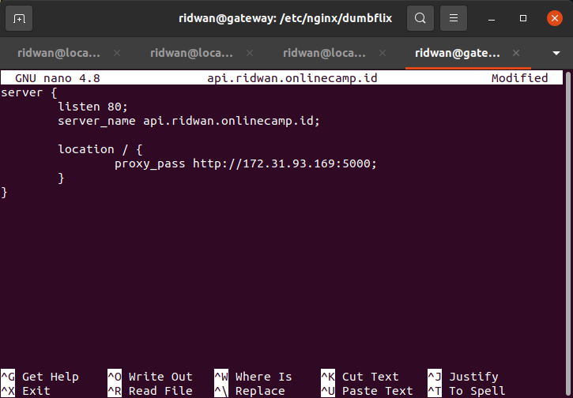

# Reverse Proxy for Backend App

**1. Login ke gateway instance** 
**2. Update dan upgrade sistem.** 
**3. Install nginx** 
**4. Masuk ke folder `/etc/nginx/dumbflix`.** 
**5. Kemudian buat file config untuk backend app `api.ridwan.onlinecamp.id`.** 
**6. Edit arahkan proxy_pass ke ip private server backend.** 
 
**7. Save.** 
**8. Test config file `sudo nginx -t` untuk memastikan tidak adanya error.** 
