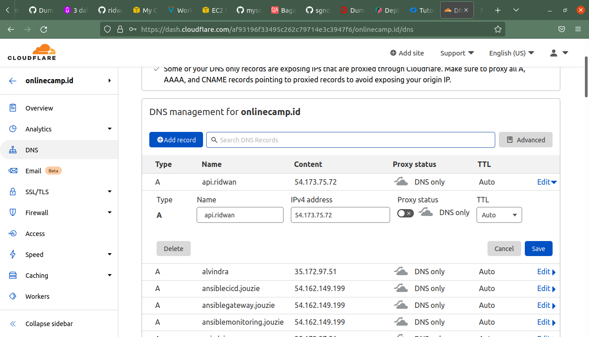

# Custom Domain for Backend
**1. Login cloudflare.** 
**2. Pilih akun `sugandaletters@outlook.com`.** 
**3. Pilih domain `onlinecamp.id`.** 
**4. Masuk ke menu DNS.** 
**5. Add Record `api.ridwan.onlinecamp.id`.** 
**6. Arahkan ke public ip gateway instance.** 
**7. Aktifkan proxy.** 
**8. Save.** 
 