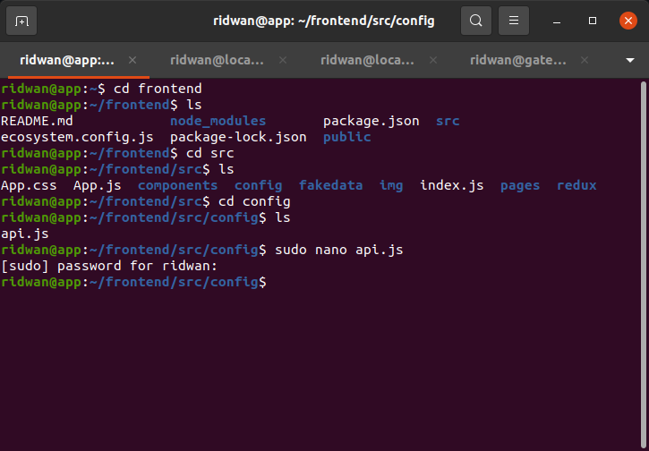
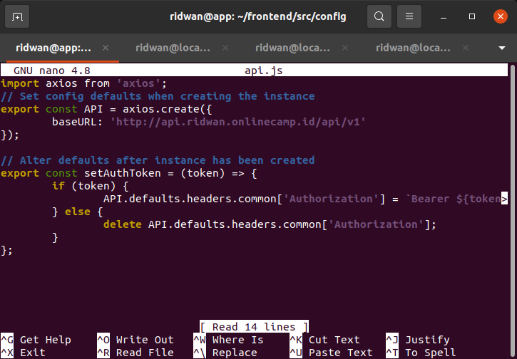
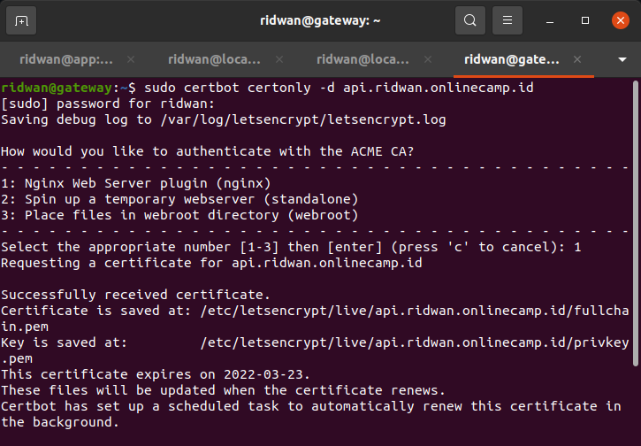
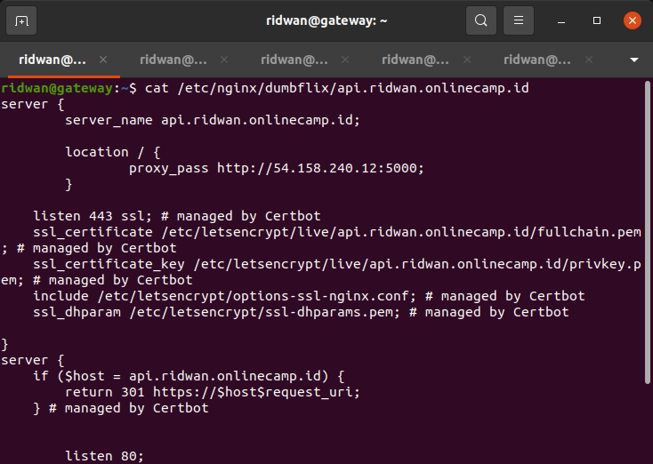
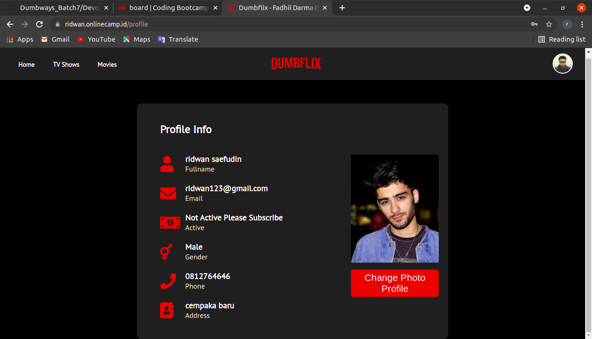

# SSL Configuration for Backend App
## Arahkan frontend api.js ke backend app  
**1. Login ke frontend instance.** 
**2. Masuk ke folder `frontend/config`.** 
 

**3. Edit file `api.js` arahkan `baseURL: 'https://api.ridwan.onlinecamp.id/api/v1`** 
 

**4. Restart App.** 

## SSL Configuration
**1. Login ke instance gateway.** 
**2. Update dan upgrade sistem.** 
**3. Install certbot untuk backend** 
**4. Perintahnya `sudo certbot certonly -d api.ridwan.onlinecamp.id`.** 
 

**5. Syntax penambahan SSL dari certbot.** 
 

**6. Test konfigurasi `sudo nginx -t`** 
**7. Restart nginx `sudo service restart nginx`** 
**8. Buka website `ridwan.onlinecamp.id`** 
**9. Buat akun atau registrasi untuk testing koneksi ke backend.** 
 