# Install Docker
### Install docker di server frontend dan backend <br>
**1. Membuat sebuah server multipass yang di dalamnya akan di install docker, disini saya akan membuat 2 buah server, yang satu untuk frontend dan yang satu untuk server backend, tidak ada perbedaan dalam penginstallan.**<br>
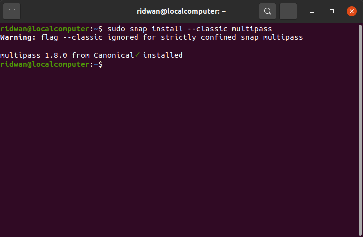<br>

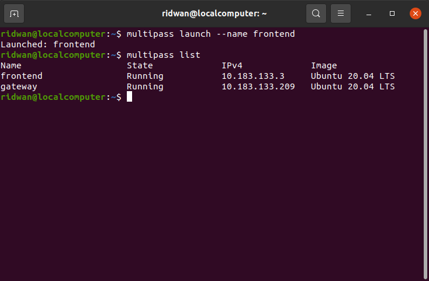<br>

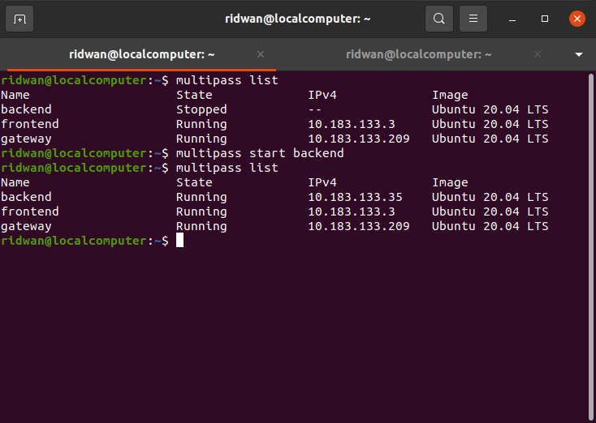<br>

**2. Lalu kita akses server multipass yang kita buat tadi dengan mengetikkan perintah berikut.**<br>
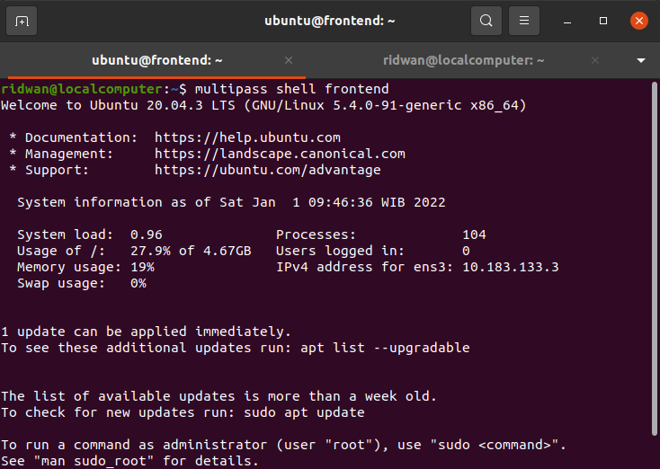<br>

**3. Update dan upgrade sistem.**<br>
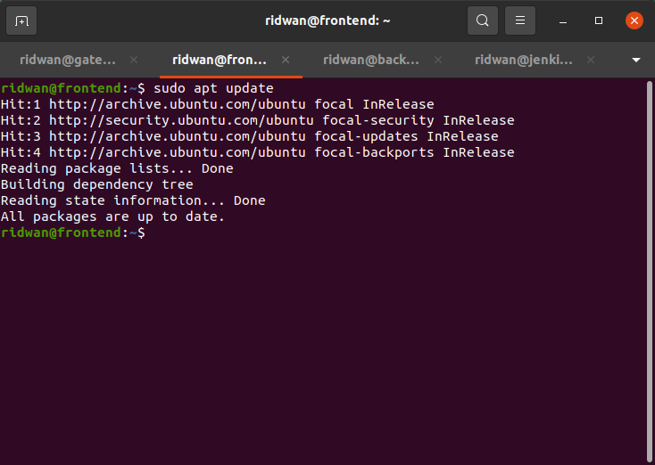<br>

**4. Install Docker:**<br>
```
sudo apt update && sudo apt upgrade -y
``` 

```
sudo apt install apt-transport-https ca-certificates curl software-properties-common
```

```
curl -fsSL https://download.docker.com/linux/ubuntu/gpg | sudo apt-key add -
```

```
sudo add-apt-repository "deb [arch=amd64] https://download.docker.com/linux/ubuntu focal stable"
```

```
sudo apt update
```

```
sudo apt-get install docker-ce docker-ce-cli containerd.io
```
<br>

**5. Jika docker sudah terinstall kita dapat melakukan pengecekan sebagai berikut:**<br>
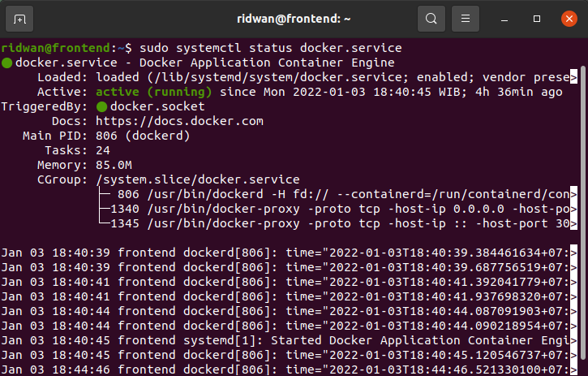<br>

**6. Lalu kita langsung bisa dapat memeriksa container yang aktif.** <br>
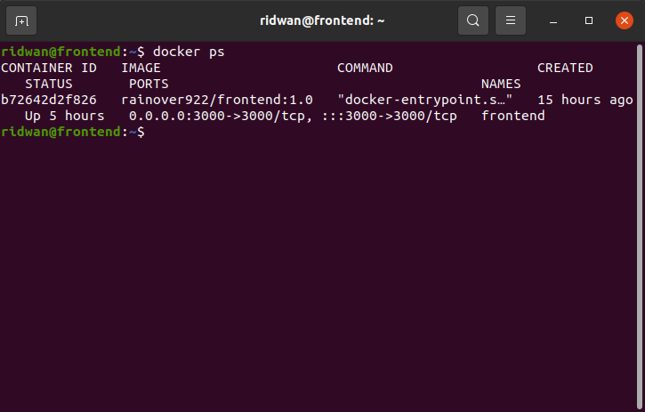<br>

### **Login docker hub**<br>
**1. Buat akun docker di `hub.docker.com`**<br>
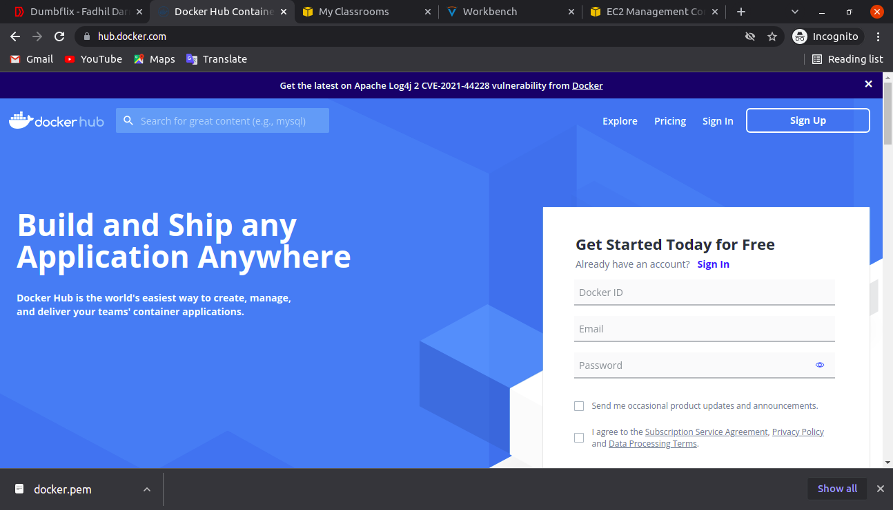<br>

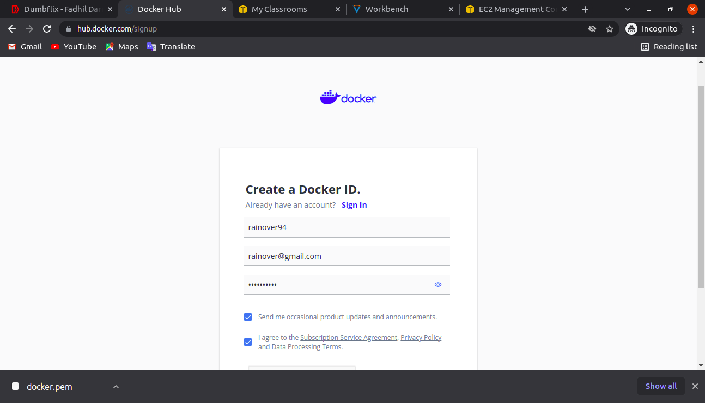<br>

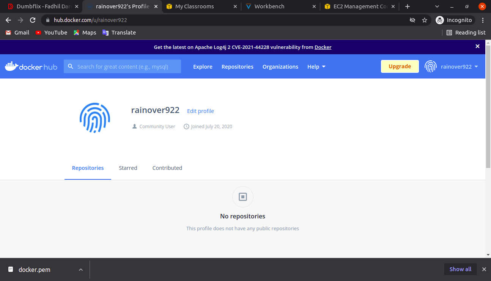<br>

**2. Buka terminal atau masuk ke server, login docker menggunakan akun hub.docker yang telah dibuat tadi.**<br>
**3. `docker login`**<br>
**4. Input username dan password.**<br>
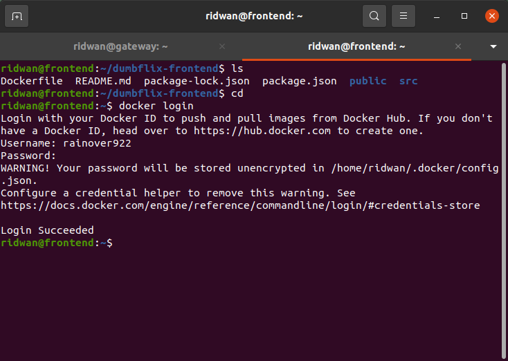<br>