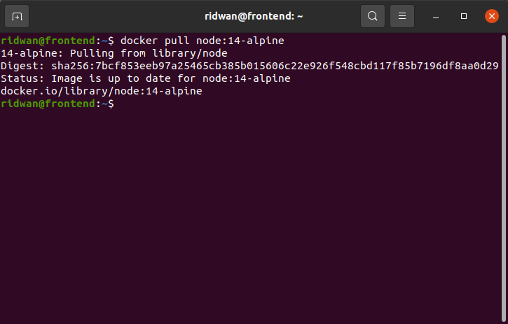
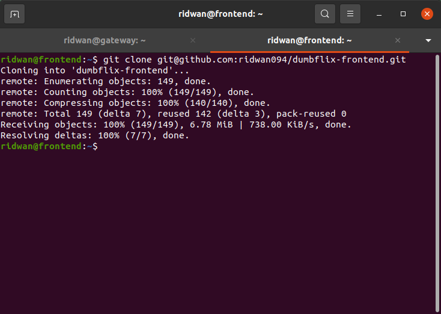
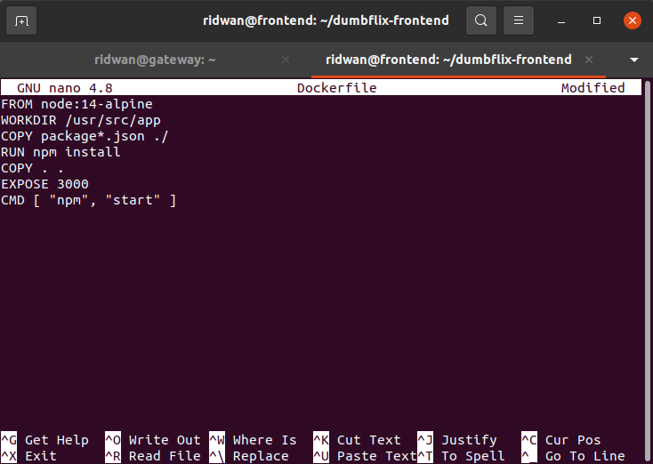
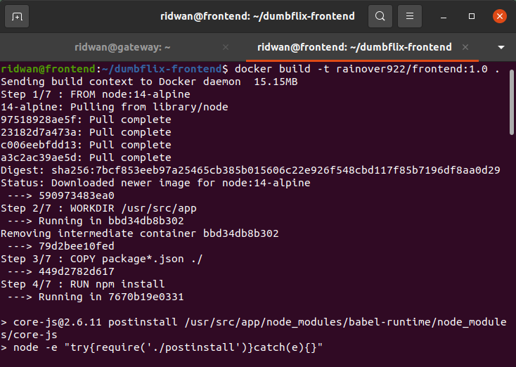
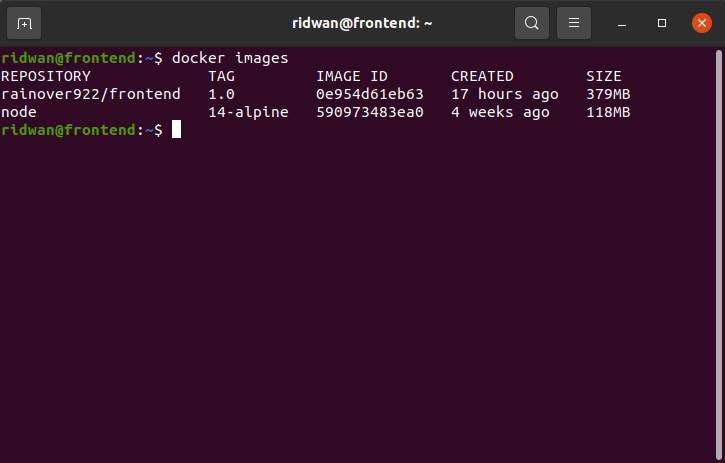
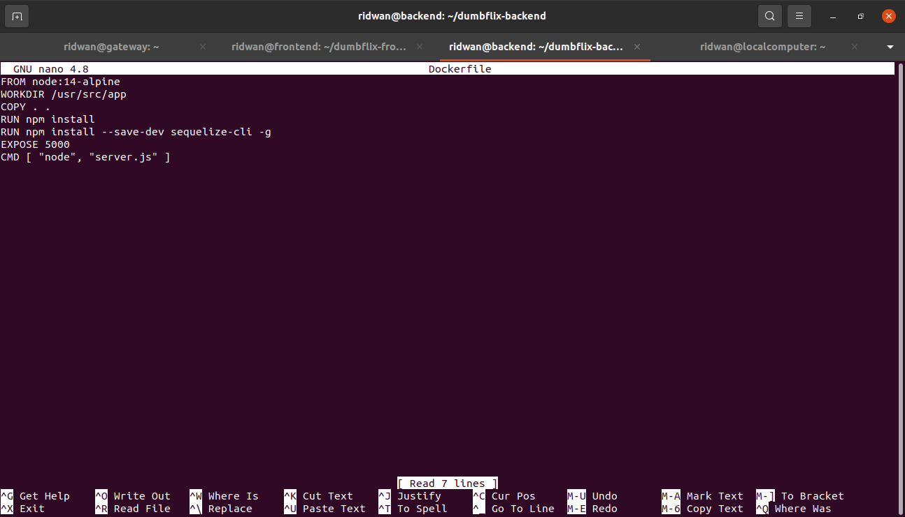
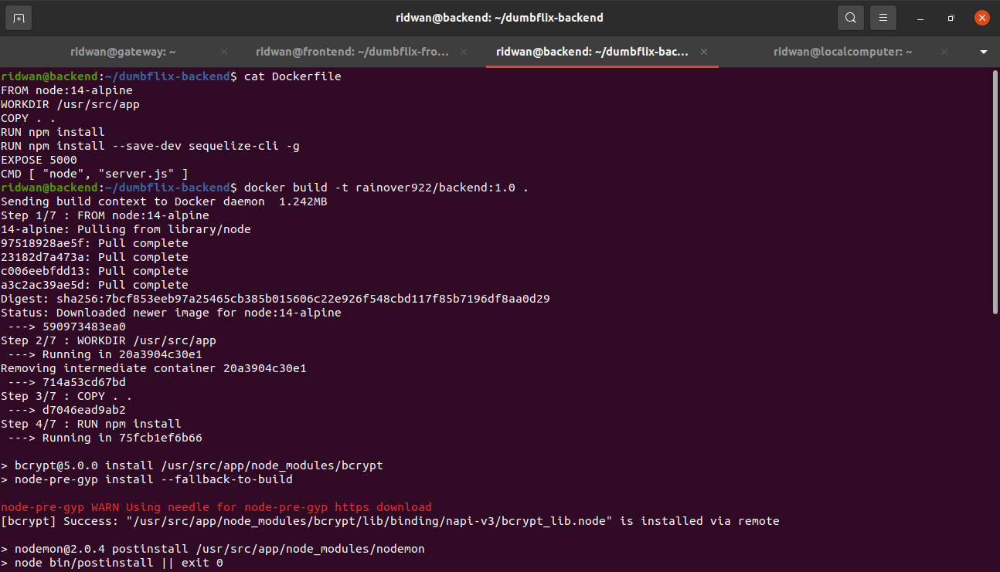
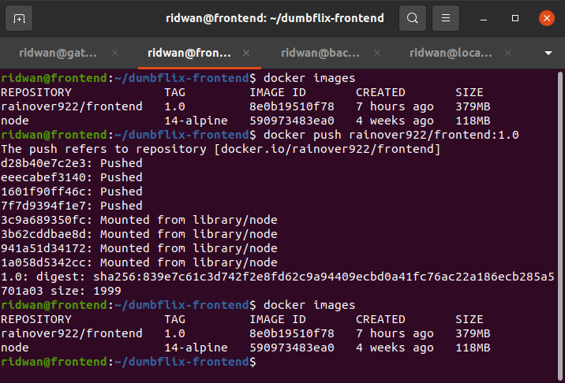
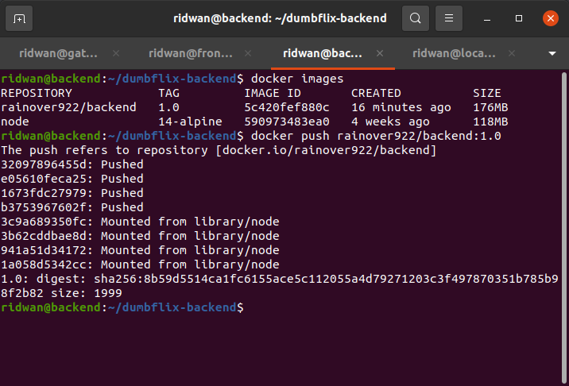
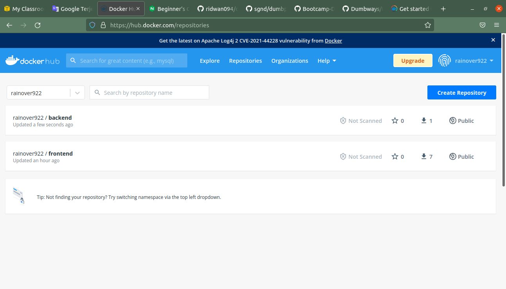

# Buat Docker Images
### **Membuat docker images untuk frontend.** 
**1. Login ke server frontend.** 
**2. Download images node js, `docker pull node:14-alpine`** 
 

**3. Clone app frontend `git clone git@github.com:ridwan094/dumbflix-frontend.git`** 
 

**4. Masuk ke dalam folder dumbflix-frontend.** 
**5. Buat file Dockerfile `nano Dockerflie`** 
 

**6. Simpan.**
**7. Lakukan build image, file `Dockerfile` yang dibuat masing-masing Apps tadi dan dijadikan sebuah image, dengan mengetikkan perintah berikut.** 
 

**8. Kita dapat memeriksa list docker images yang ada, dengan ketikan perintah berikut.** 
 

**9. Buatkan juga file Dockerfile untuk app backend, dan ketikkan perintah berikut di dalamnya.** 
 

**10. Lalu lakukkan build untuk backend, dengan ketikkan perintah berikut.** 
 

**11. Setelah membuat image frontend & backend yang kita buat tadi kita dapat melakukan push image frontend, dengan mengetikkan perintah berikut.** 
 

**12. Lalu push juga untuk yang image backend.** 
 

**13. Kita dapat langsung memeriksa di akun yang kita miliki. apakah image yang kita push masuk atau tidak. disini image yang saya push sudah masuk kedalam repository docker hub saya.** 
 