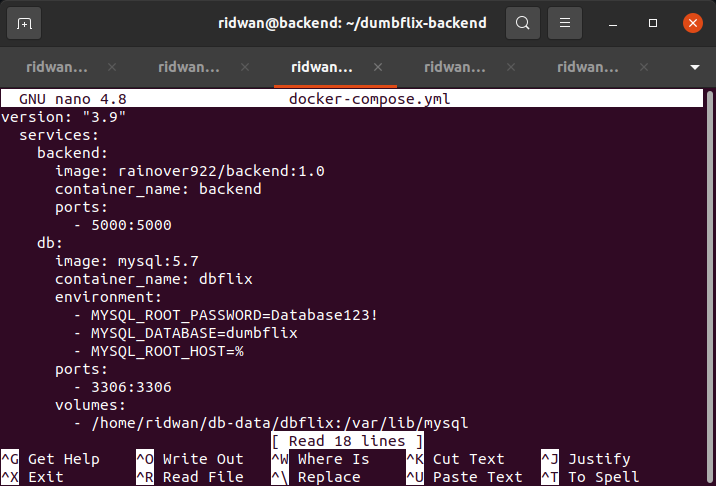

# Install Application
### **App Frontend**  
**1. Disini ktia akan membuat sebuah container dengan docker compose, pertama masuk kedalam server frontend & backend.** 
 
 

**2. Lalu jika image tidak ada kita dapat melakukan pull image dari repo kita. dengan perintah berikut, jika image ada kita dapat memakai yang sudah ada.**
 

**3. Kemudian buat sebuah file docker-compose.yml dan ketikan perintah berikut didalamnya.** 
 

**4. Lalu untuk membuat sebuah container ketikan perintah berikut.** 
 

**5. Kita dapat melihat docker yang sudah berjalan dengan ketikan perintah `docker ps`** 
 

**6. Periksa di browser apakah aplikasi dapat di akses dengan memasukkan `ip:port`** 
 

**7. Lalu masuk ke server backend dan buat file docker-compose.yml dan ketikkan perintah berikut.** 
 

**8. Jika image belum ada kita dapat melaukan pull saja, jika sudah kita bisa langsung saja memakai image tersebut.** 
 

**9. Lalu buat container dengan docker-compose, dengan ketikan perintah berikut.** 
**10. Periksa apakah container sudah berjalan dengan perintah `docker ps`**
 

**11. Periksa di browser apakah apps berjalan dengan baik dengan memasukkan `ip:port`** 
 