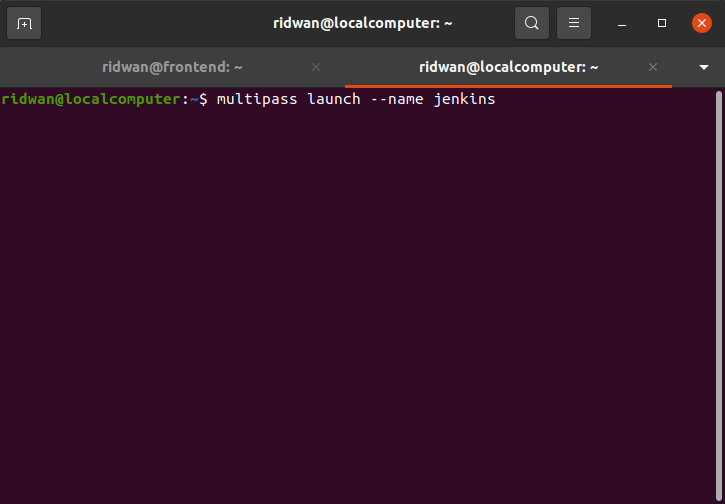
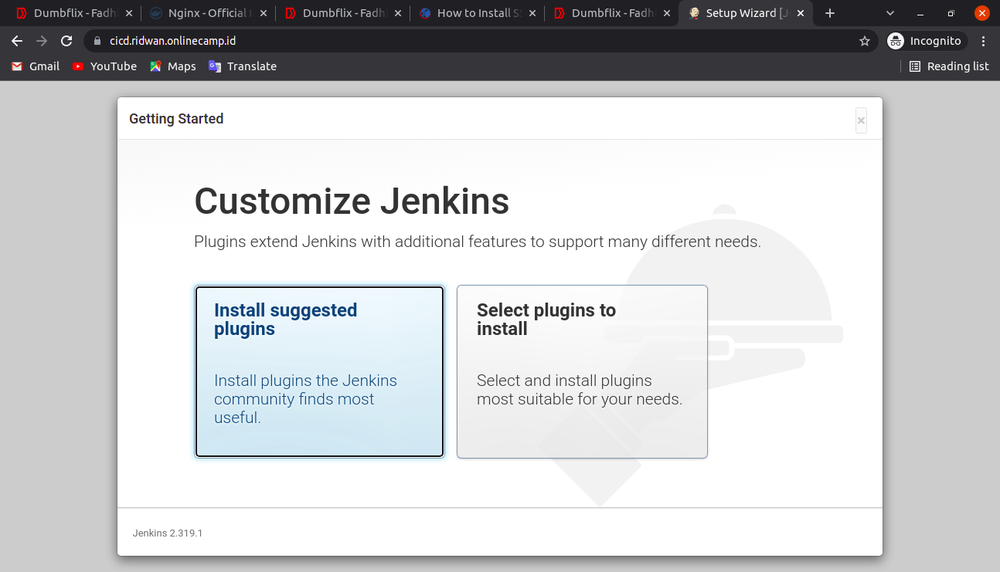

# Install Jenkins
**1. Buat terlebih dahulu server multipass untuk jenkins.**<br>
<br>

<br>

**2. Kemudian install jenkins dari docker dengan menjalankan perintah**<br>
```
docker run --name ci-cd -p 8080:8080 -p 50000:50000 -d -v jenkins_home:/var/jenkins_home jenkins/jenkins
```

**port 8080 untuk akses gui jenkins dan 50000 untuk jenkins master/slave - perintah -v untuk membuat volume jenkins yang ada pada directory jenkins_home - jenkins/jenkins merupakan images dari dockerhub - --name untuk memberikan nama container**<br>
<br>

**3. Kemudian lakukan reverse_proxy untuk jenkins.**<br>
<br>

**4. Akses domain yang sudah terdaftarkan `cicd.ridwan.onlinecamp.id`**<br>
<br>

**5. Lalu copy paste string random tersebut kedalam `unlock jenkins`, kita bisa melihat str random dengan menggunakan logs.**<br>
<br>

**6. Lalu buat user, lalu klik save dan continue.**<br>
<br>

**7. Pilih Customize Jenkins yang `install suggested plugins`**<br>
<br>

**8. Lalu process install plugins -plugins.**<br>
<br>

**9. Lalu klik save dan finish.**<br>
<br>

**10. Jenkins is ready!, kita sudah dapat menggunakan jenkins!**<br>
