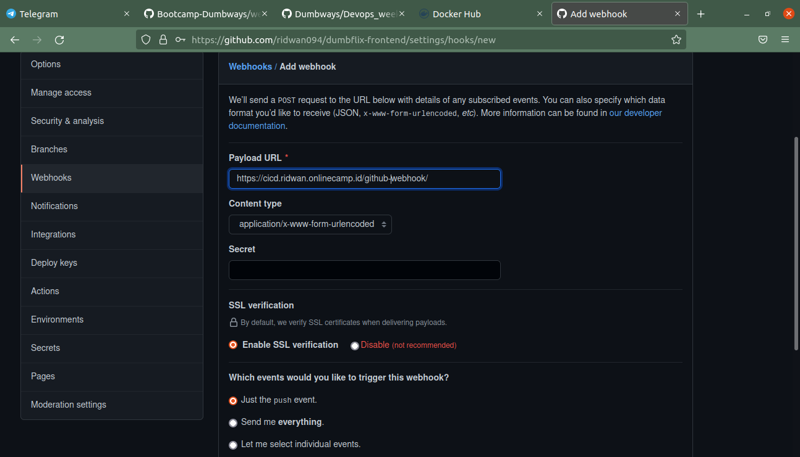

# SETUP JENKINS ONLINE
**1. Berikut tampilan dashboard jenkins saat baru pertama masuk.** 
 

**2. Lalu kita install `Publish over ssh`** 
 

**3. Pilih Create a new job, masukkan name lalu pilih `Freestyle project`** 
 

**4. Lalu pilih `Git` dan masukkan link repo anda, pilih build trigger yang `Github hook trigger for GITscn polling`** 
 
 

**5. Lalu ke masuk kedalam `Configure system` dan pilih `publish over SSH`, masukkan ssh-keygen yang anda miliki.** 
 

**6. Kemudian isikan yang dibutuhkan dan gunakan password jika sudah memiliki nya di server.** 
 
 

**7. Lalu coba lakukan Test config, jika status success maka configure berhasil.** 
 

**8. Lalu kembali lagi ke Configure frontend dan pilih `build` dan server yang ingin digunakan, lalu pilih verbose.** 
 

**9. dan ikuti perintah berikut.** 
 
 

**10. Dan masukkan perintah tersebut untuk melakukan build image dan menjalankan container.** 
 

**11. Lalu klik `build now`** 
 

**12. Dan jenkins sedang memeriksa configure yang telah kita lakukan tadi.** 
 
 

**13. Lalu kita buat `WEBHOOK` di githubm pilih webhook** 
 

**14. Klik `Add Webhook`** 
**15. dan masukkan URL dari jenkins, seperti berikut.** 
 

**16. dan coba kita lakukan editing readme.md, apakah jenkins akan mengtrigger suatu perubahan.** 
 

**17. Maka akan lakukan proses di bawah kiri, dan klik saja untuk melihat.** 
 

**18. Perubahan yang dilakukan berhasil dan akan memunculkan pesan nya juga.** 
 
 
