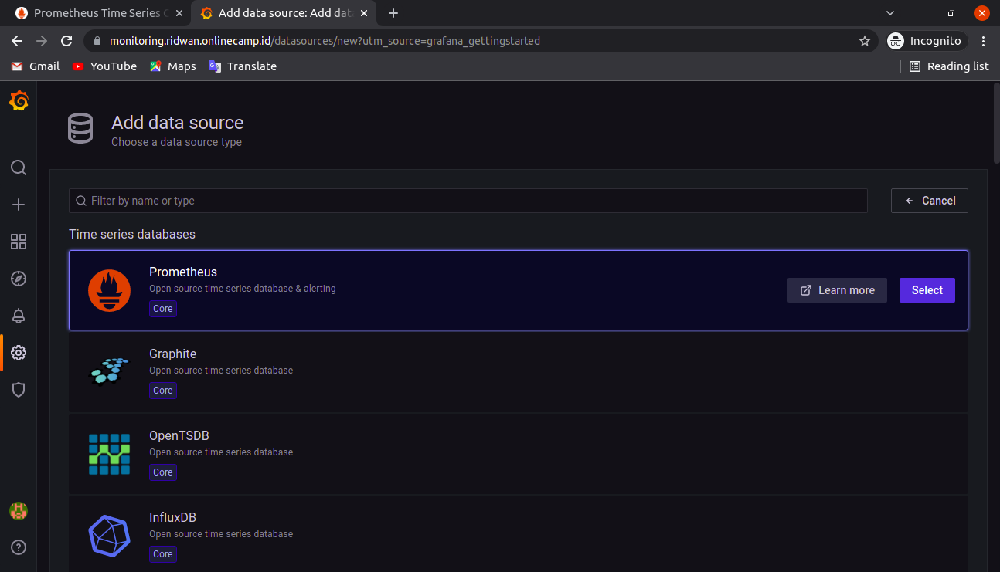

# Connect multiple server to prometheus
## **Install Node Exporter pada server yang akan di monitoring.**<br><br>

**1.Login server frontend dan backend.**<br>
**2. Install Node Exporter**<br>
<br>

**3. Login ke prometheus server yang telah dibuat.**<br>
**4. Tambahkan ip address server yang akan dimonitoring.**<br>
**5. Edit file prometheus.yml `sudo nano prometheus.yml` tambahkan ip address server di bagian target dengan port `9100`**<br>
<br>

**6. Save.**<br>
**7. Restart prometheus service `sudo systemctl restart prometheus.service`**<br>
**8. Masuk ke server prometheus di port 9090**<br>
**9. Pada bagian graph cari metric yang ingin ditampilkan.**<br>
**10. Execute**<br>
<br>

## **Menampilkan CPU dan Memory Process menggunakan Grafana.**<br>
**1. Login ke server monitoring `monitoring.ridwan.onlinecamp.id` dan login ke grafana.**<br>
**2. Pada bagian configuration tambahkan data source dari prometheus.**<br>
<br>

**3. Pada halaman setting grafana prometheus masukkan URL prometheus.**<br>
<br>

**4. save & test. pastikan data source working.**<br>
**5. Buat dashboard baru untuk menyimpan panel-panel monitoring.**<br>
<br><br>

### **Buat panel untuk networking.**<br>
**1. Add new panel kemudian edit.**<br>
**2. Pada bagian Query, cari metric `node_network_receive_bytes_total` di kolom `Metric Browser`**<br>
**3. Tambahkan function rate() `rate(node_network_receive_bytes_total[5m])`**<br>
**4. Add query baru, cari metric `node_network_transmit_bytes_total` di `Metric Browser`**<br>
**5. Tambahkan function rate() `rate(node_network_transmit_bytes_total[5m])`**<br>
**6. Kemudian pilih pada bagian panel option beri nama pada panel.**<br>
**7. Klik Apply**<br>
<br><br>

### **Buat panel untuk cpu usage**<br>
**1. Add new panel**<br>
**2. pada bagian Query, copy rumus berikut untuk menampilkan CPU usage**<br>
```
(1 - avg(irate(node_cpu_seconds_total{mode="idle"}[10m])) by (instance)) * 100
```

**3. Setelah itu graph akan terupdate jika berhasil.**<br>
**4. Beri nama pada panel kemudian simpan.**<br>
<br><br>

### **Buat panel untuk memory usage**<br>
**1. Add new panel**<br>
**2. Pada bagian Query, cari dan set Metric Browser `node_memory_MemFree_bytes`**<br>
**3. Di bagian panel cari standard options. Pilih Unit `bytes(SI)`**<br>
**4. Pilih graph type `gauge`**<br>
<br><br>

### **Buat panel untuk Storage**<br>
**1. Add new panel**<br>
**2. Pada bagian Query, cari dan set Metric Browser untuk menampilkan available storage `node_filesystem_avail_bytes{mountpoint="/",fstype!="rootfs"}`**<br>
**3. Tambahkan query lagi untuk menampilkan size storage `node_filesystem_size_bytes{mountpoint="/",fstype!="rootfs"}`**<br>
**4. Di bagian panel cari standard options. Pilih Unit `bytes(SI)`**<br>
**5. Pilih graph type `Stat`**<br>
<br><br>

### **Tampilan Dashboard**<br>
<br><br>