# Setup Server with Ansible
## **Requirements:** <br>
* **Buat repository di github untuk menyimpan file-file ansible**<br>

## **Install Ansible in Ubuntu**<br>
**1. Konfigurasi PPA**<br>
```
sudo apt update
sudo apt install software-properties-common
sudo add-apt-repository --yes --update ppa:ansible/ansible
```

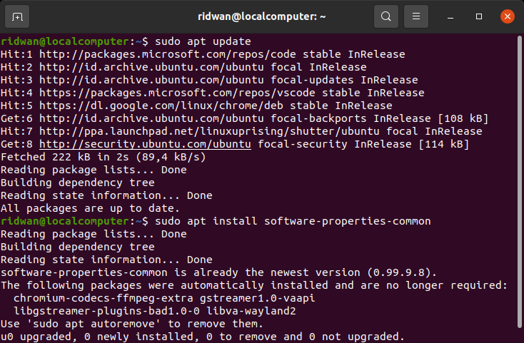<br>

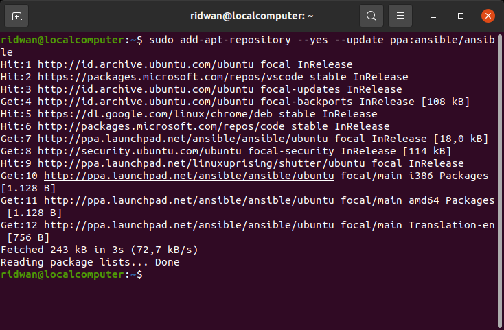<br>

**2. Install Ansible `sudo apt install ansible`**<br>
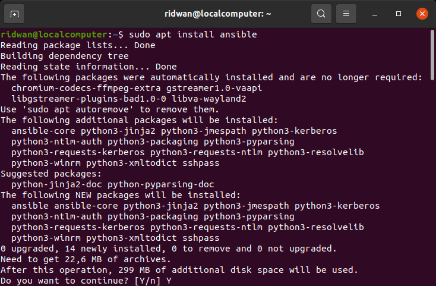<br>

**3. Konfirmasi installasi `ansible all -m ping --ask-pass`**<br>
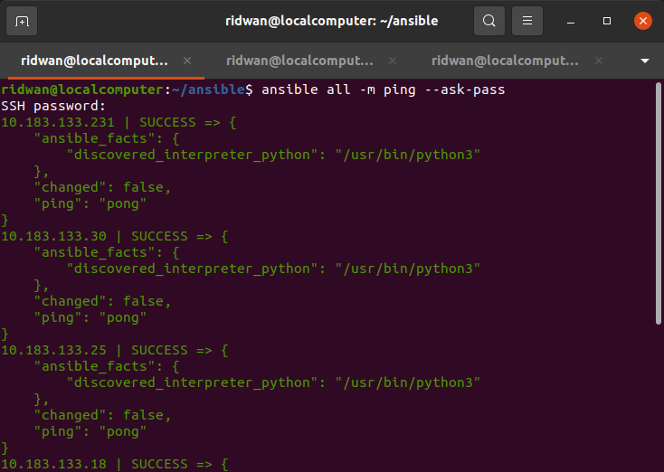<br>

**4. Kita bisa mengechek versi dari ansible `ansible --version`**<br>
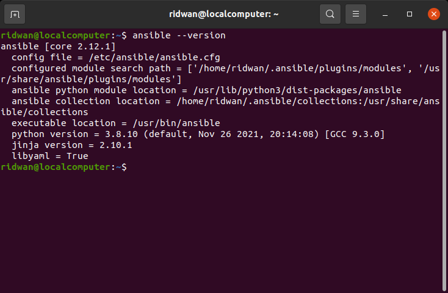<br>

## **Define host server**<br>
**1. Buat directory untuk menyimpan file-file ansible**<br>
**2. Masuk ke dalam folder buat file `hosts` untuk menyimpan hostname server**<br>
```
#webserver
10.183.133.30 ansible_user=ubuntu
#apps
10.183.133.25 ansible_user=ubuntu
#db
10.183.133.18 ansible_user=ubuntu
#CI/CD
10.183.133.86 ansible_user=ubuntu
#Monitoring
10.183.133.231 ansible_user=ubuntu
```

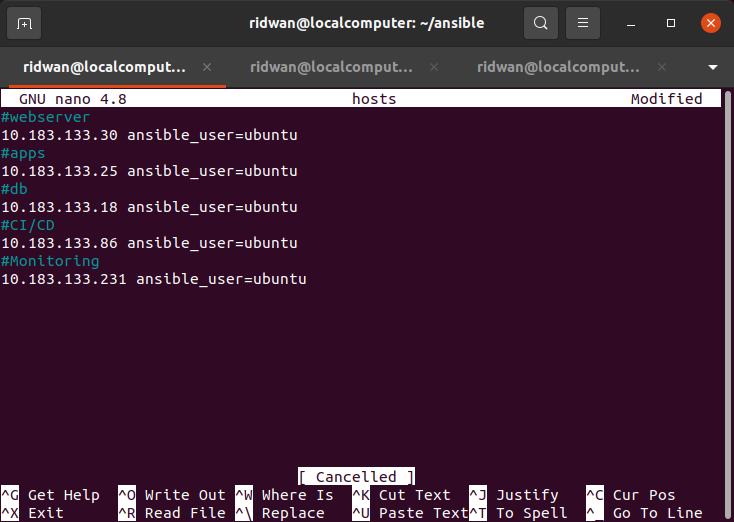<br>

**3. Ping hosts untuk memastikan koneksi ansible dan server berfungsi `ansible all --key-file ~/path-to/sshkey.pem -i hosts -m ping`**<br>
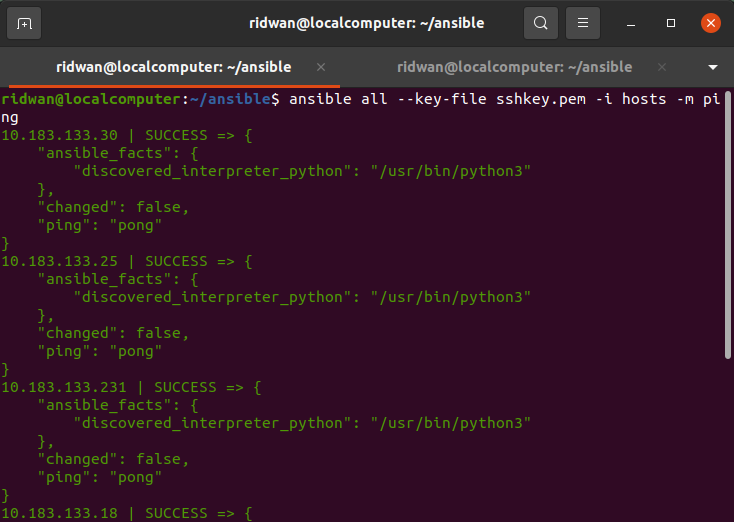<br>

## **Setup Custom ansible.cfg file**<br>
**1. Buat file `ansible.cfg` di work directory**<br>
**2. Masukkan config berikut**<br>
```
[defaults]
inventory = hosts
private_key_file = sshkey.pem
host_key_checking = false
timeout = 60
```

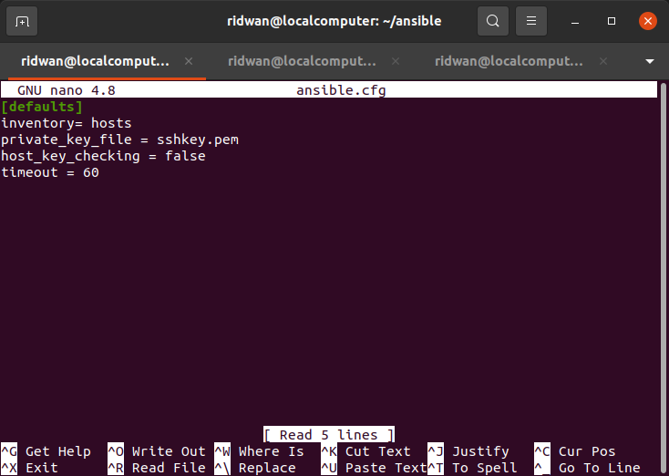<br>

**3. Save config**<br>

## **Ansible-Playbook Setup nginx server**<br>
**1. Buat file yml `setup-nginx.yml`**<br>
**2. Buat task update dan upgrade system.**<br>
**3. Buat task install nginx**<br>
**4. Berikut adalah yml codenya.**<br>
```
---
- name: Setup Nginx
  hosts: 34.192.151.138
  become: true
  tasks:
    - name: Update system
      apt:
        update_cache: yes
    - name: Upgrade system
      apt:
        upgrade: dist

    - name: Install Nginx
      apt:
        name: nginx
        state: present
        update_cache: yes
```

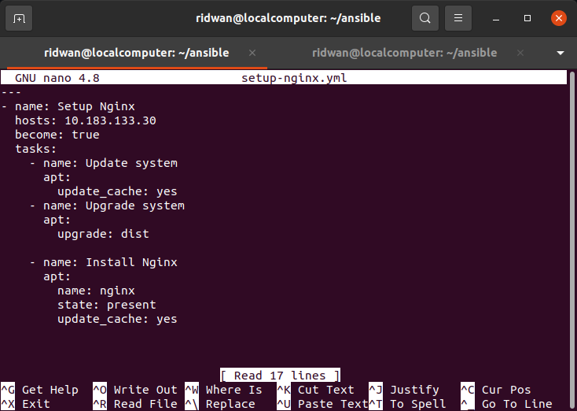<br>

**5. Save**
**6. Execute perintah ansible-playbook `ansible-playbook setup-nginx.yml`**<br>
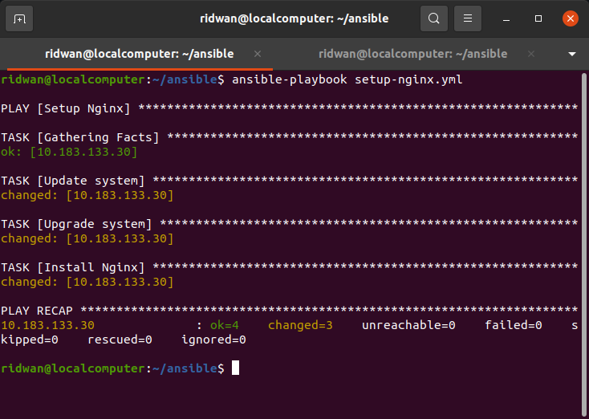<br>

**7. Check nginx dengan URL**<br>
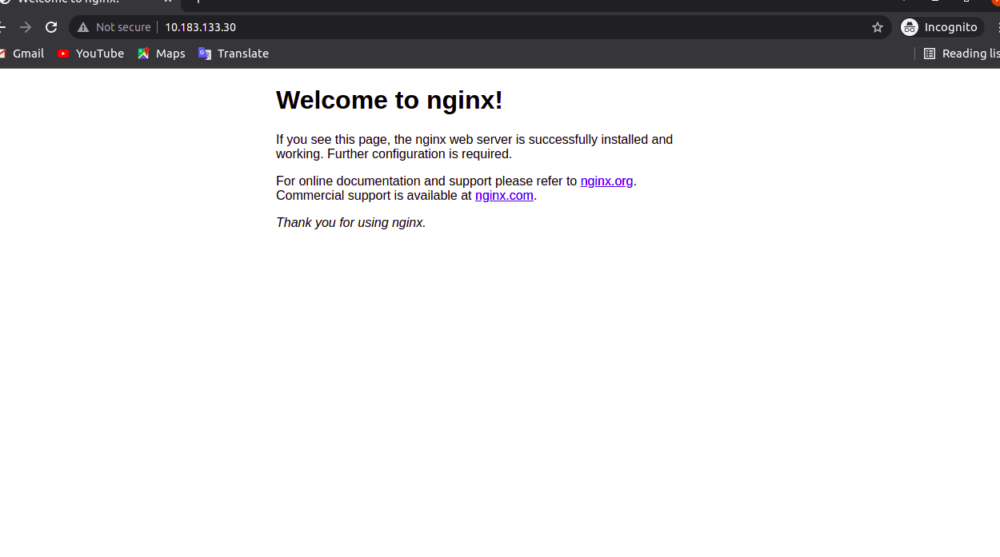<br>

## **Ansible-Playbook Setup database server**<br>
**1. Buat file yml `setup-database.yml`**<br>
**2. Buat task update dan upgrade system.**<br>
**3. Buat task install mysql-server**<br>
**4. Berikut adalah yml codenya:**<br>
```
---
- name: Setup Database
  hosts: 52.207.158.23
  become: true
  tasks:
    - name: Update system
      apt:
        update_cache: yes
    - name: Upgrade system
      apt:
        upgrade: dist

    - name: Install Mysql-Server
      apt:
        name: mysql-server
        state: present

```

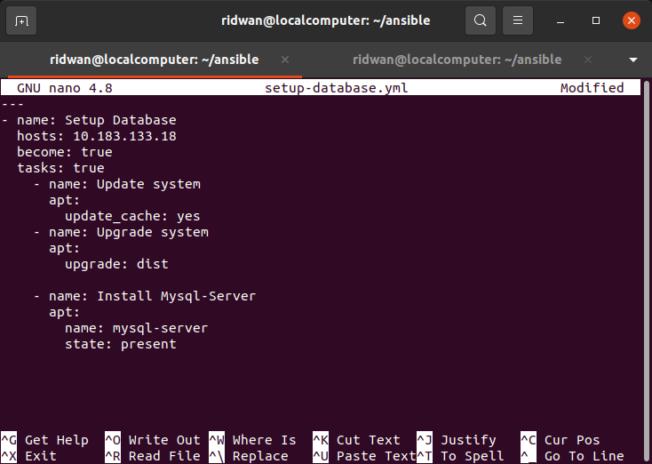<br>

**5. Setup manual untuk secure installation, config database lainnya seperti grant akses user-host dan config mysqld.cnf "bind-address = 0.0.0.0"**<br>

## **Ansible-Playbook Install Docker**<br>
**1. Buat file untuk installasi docker di server `setup-docker.yml`**<br>
**2. Masukkan kode berikut:**<br>
```
---
- name: Setup Docker & Docker Compose
  hosts: all
  become: true
  tasks:
    - name: Update system
      apt:
        update_cache: yes

    - name: Upgrade system
      apt:
        upgrade: dist

    - name: Setup repository
      shell: "sudo apt-get install ca-certificates curl gnupg lsb-release"
      args:
        executable: /bin/bash

    - name: Add docker GPG key
      apt_key:
        url: https://download.docker.com/linux/ubuntu/gpg
        state: present

    - name: Add docker repository
      apt_repository:
        repo: deb https://download.docker.com/linux/ubuntu focal stable
        state: present

    - name: Update system
      apt:
        update_cache: yes

    - name: Install docker engine
      apt:
        name: "{{item}}"
        state: latest
        update_cache: yes
      loop:
        - docker-ce
        - docker-ce-cli
        - containerd.io

    - name: Install stable release docker compose
      shell: sudo curl -L "https://github.com/docker/compose/releases/download/1.29.2/docker-compose-$(uname -s)-$(uname -m)" -o /usr/local/bin/docker-compose
      args:
        executable: /bin/bash

    - name: Apply executable permission to the binary
      shell: "sudo chmod +x /usr/local/bin/docker-compose"
      args:
        executable: /bin/bash

```

**3. Save kemudian execute command `ansible-playbook setup-docker.yml`**<br>
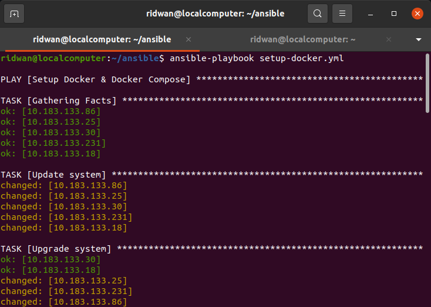<br>

## **Ansible-Playbook install docker jenkins** <br>
**1. Buat file docker-compose.yml untuk running docker container di port 8080.**<br>
**2. Masukkan kode berikut**<br>
```
version: '3.9'
services:
  jenkins:
    image: jenkins/jenkins:lts-jdk11
    ports:
      - 8080:8080
      - 50000:50000
    privileged: true
    user: root
    container_name: jenkins
    volumes:
      - ~/jenkins:/var/jenkins_home
      - /var/run/docker.sock:/var/run/docker.sock
      - /usr/local/bin/docker:/usr/local/bin/docker   
```

**3. Save**<br>
**4. Buat file yml untuk setup jenkinsnya `setup-jenkins.yml`**<br>
**5. Buat task untuk melakukan copy docker-compose.yml yang telah dibuat tadi.**<br>
**6. Buat task untuk eksekusi docker compose dan running daemon/background.**<br>
**7. Masukkan kode berikut:**<br>
```
---
- name: Setup CI/CD Jenkins Docker
  hosts: 54.92.233.212
  become: true
  tasks:
    - name: Copy docker compose
      copy:
        src: docker-jenkins/docker-compose.yml 
        dest: /home/ubuntu/

    - name: Run docker compose
      shell: "docker-compose up -d"
      args:
        executable: /bin/bash
```

**8. Save**<br>
**9. Execute command `ansible-playbook setup-jenkins.yml`**<br>
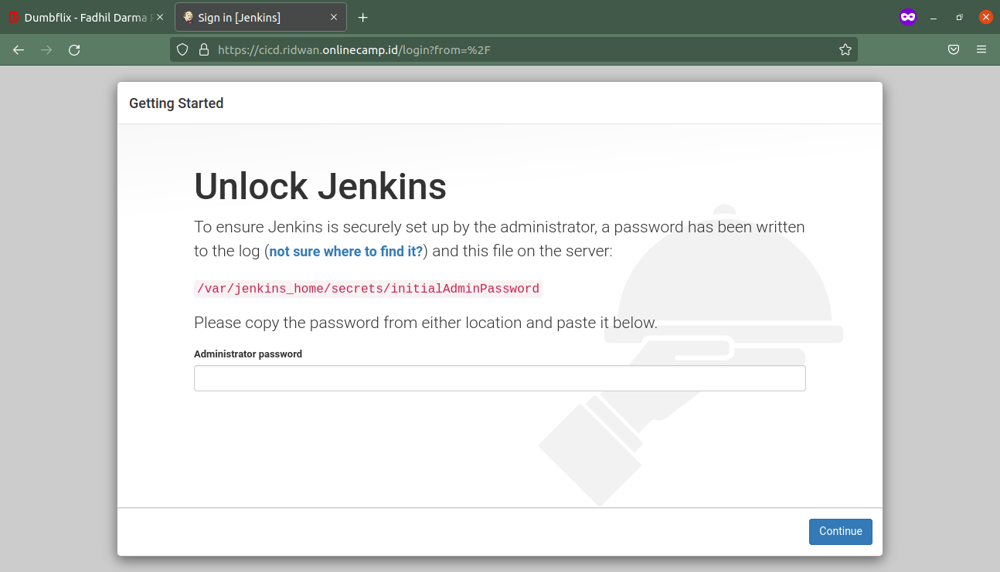<br>

## **Ansible-Playbook setup apps**<br>
**1. Setup app dan backend dari repository**<br>
**2. Buat file yml untuk setup apps `setup-apps.yml`**<br>
**3. Buat task untuk melakukan copy apps (frontend-backend)**<br>
**4. Jalankan task docker compose**<br>
**5. Masukkan kode berikut:**<br>
```
  ---
- name: Setup Frontend & Backend
  hosts: 10.183.133.25
  become: true
  tasks:
    - name: Update system
      apt:
        update_cache: yes

    - name: Upgrade system
      apt:
        upgrade: dist

    - name: Remove current apps
      shell: "sudo rm -r dumbflix-frontend dumbflix-backend"
      args:
        executable: /bin/bash

    - name: Clone Dumplay Apps
      shell: "git clone https://github.com/ogak/dumbflix-frontend.git"
      args:
        executable: /bin/bash

    - name: Clone Backend Apps
      shell: "git clone https://github.com/ogak/dumbflix-backend.git"
      args:
        executable: /bin/bash

    - name: Install python-pip
      apt:
        name: python-pip
        state: present

    - name: Pip install docker
      shell: pip install docker
      args:
        executable: /bin/bash

    - name: Log into DockerHub
      community.docker.docker_login:
        username: docker_username
        password: docker_password

    - name: Docker pull frontend
      shell: docker pull rainover922/frontend:1.0
      args:
        executable: /bin/bash

    - name: Docker pull backend
      shell: docker pull rainover922/backend:1.0
      args:
        executable: /bin/bash

    - name: Install Dumbflix apps (Dumbflix)
      shell:
        cmd: "docker-compose -f docker-compose.yml up -d" 
        chdir: /home/ubuntu/dumbflix/
```

**6. Save.**