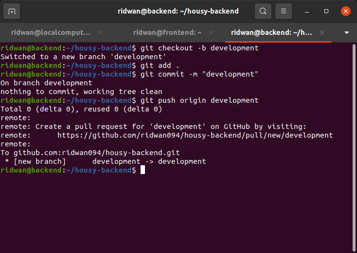

# **Repository**
## **Clone Housy frontend repository** <br>
**1. Clone app Housy frontend dari repository `https://github.com/sgnd/housy-frontend`**<br>
**2. git clone https://github.com/sgnd/housy-frontend**<br>
**3. Buat repository baru untuk housy frontend**<br>
<br>
**4. Set remote url ke repository yang telah dibuat `git remote set-url origin git@github.com:ridwan094/housy-frontend.git`**<br>
**5. Push app housy frontend yang telah di clone pada step 1**<br>
```
git add . 
git commit -m "First commit"
git push -u origin main
```
<br>

<br>

**6. Buat branch `development`**<br>
**7. `git checkout -b development`**<br>
**8. Push app ke branch development**<br>
<br>

**9. Buat branch `production`**<br>
**10. `git checkout -b production`**<br>
**11. Push app ke branch production**<br>
<br>
<br><br>

## **Clone Housy backend repository**<br>
**1. Clone app Housy backend dari repository `https://github.com/sgnd/housy-backend`**<br>
**2. `git clone https://github.com/sgnd/housy-backend`**<br>
**3. Buat repository baru untuk housy backend**<br>
<br>

**4. Set remote url ke repository yang telah dibuat `git remote set-url origin git@github.com:ridwan094/housy-backend.git`**<br>
**5. Push app housy backend yang telah di clone pada step 1**<br>
```
git add .
git commit -m "First commit"
git push -u origin main
```
<br>

<br>

**6. Buat branch `development`**<br>
**7. `git checkout -b development`**<br>
**8. Push app ke branch development**<br>
<br>

**9. Buat branch `production`**<br>
**10. `git checkout -b production`**<br>
**11. Push app ke branch production**<br>
<br>
<br>


