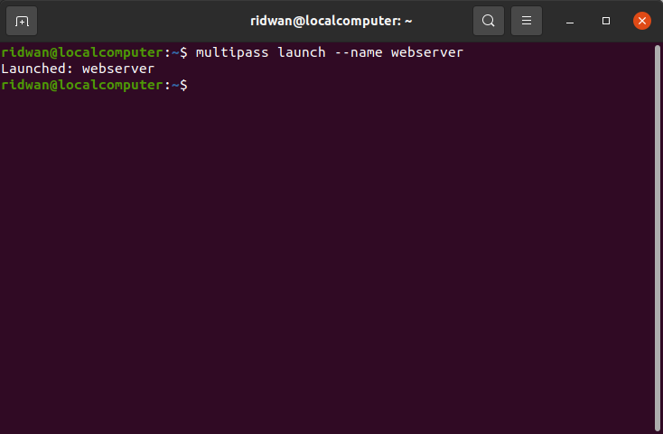
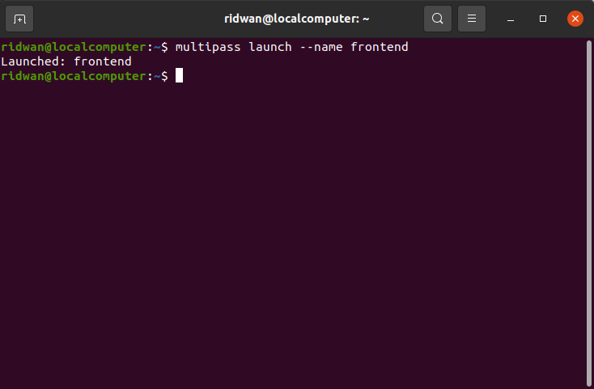
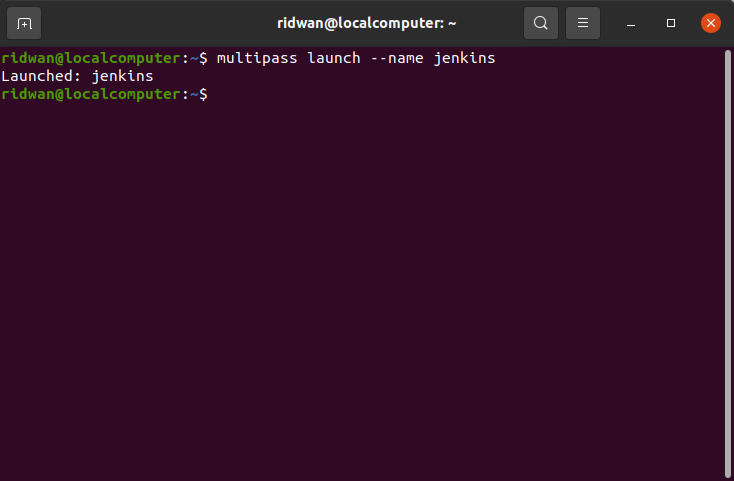
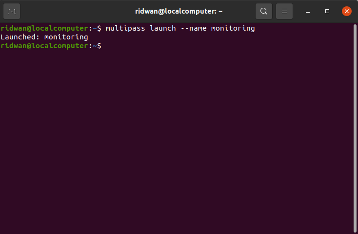
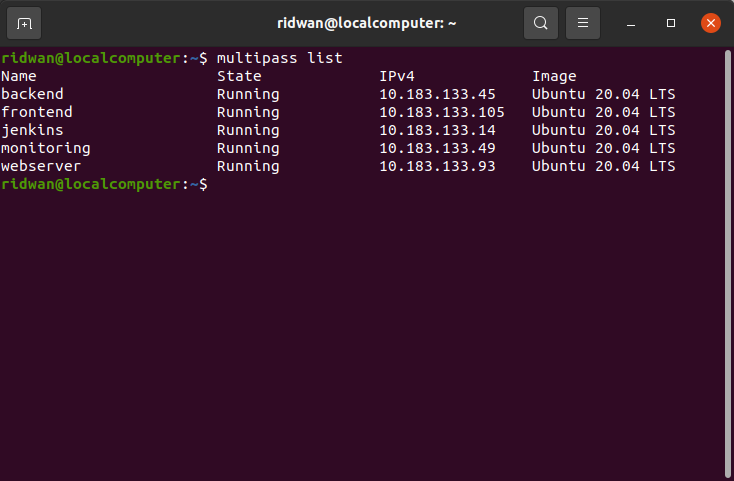
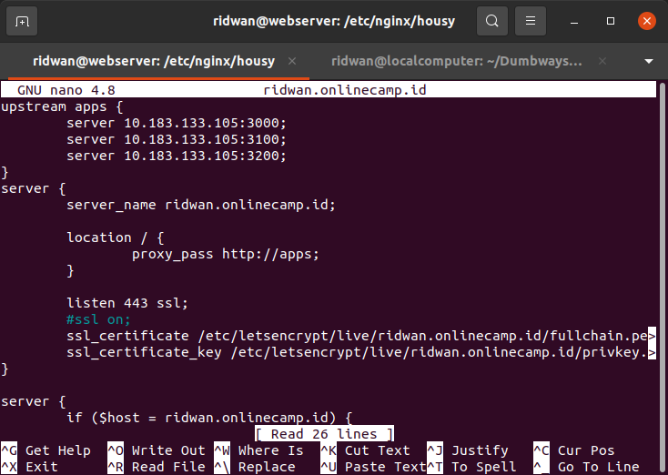
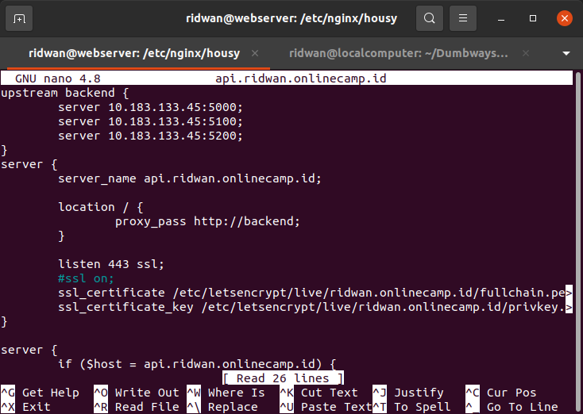

# **Server**
## **Buat instance di multipass** 
**1. Buka Terminal console** 
**2. Setup Server seperti berikut:** 

#### **Server Webserver**  
 

#### **Server Frontend**  
 

#### **Server Backend**  
 

#### **Server Jenkins**  
 

#### **Server Monitoring**  
 
 

## **Setup Load balance untuk apps frontend dan backend** 
**1. Login webserver instance** 
**2. masuk ke /etc/nginx** 
**3. Edit file config app frontend** 
 

**4. Save** 
**5. Edit file config backend** 
 

**6. Save** 
**7. Test config `sudo nginx -t`** 
**8. Restart nginx `sudo systemctl restart nginx`** 