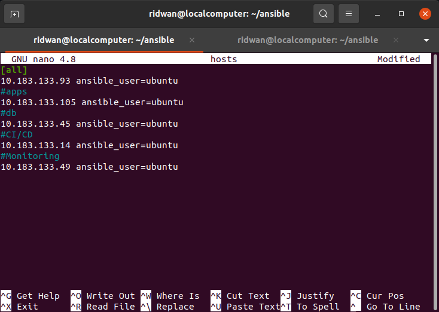
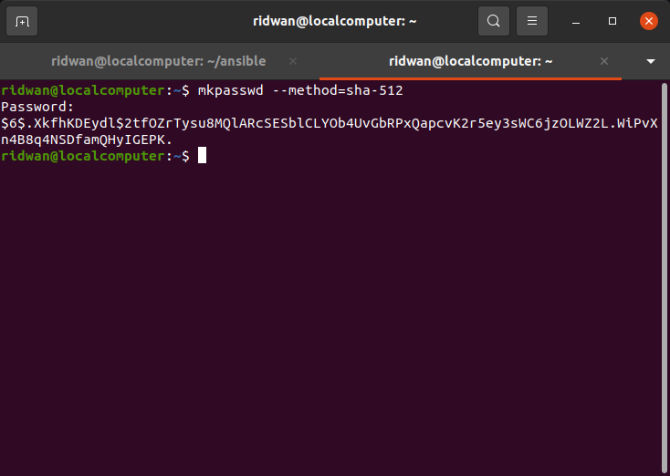
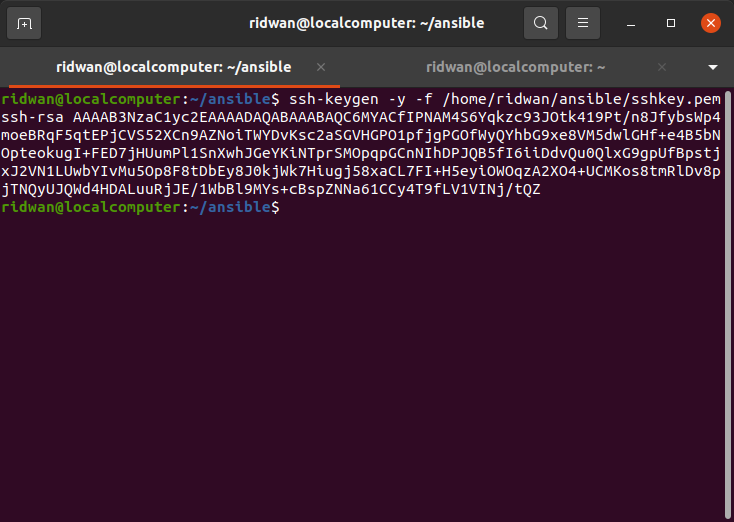
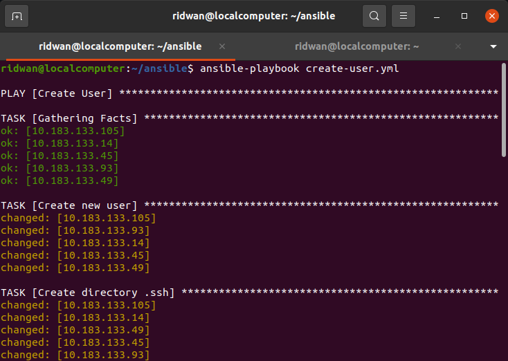
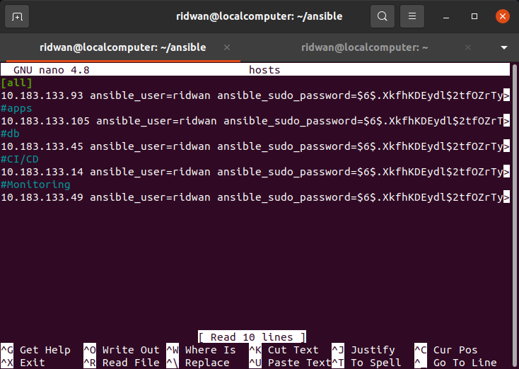
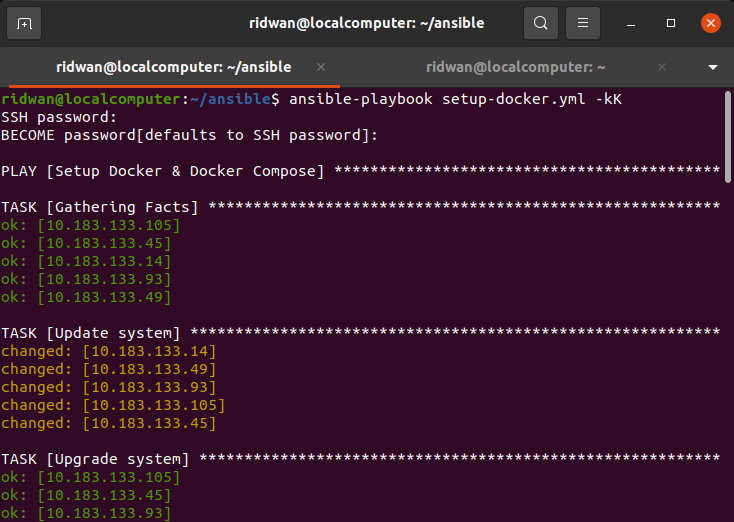

# **Setup User di instance/server**
**1. Buat file hosts untuk menyimpan ip remote hosts**<br>
```
 [all]
 10.183.133.93 ansible_user=ubuntu
 #apps
 10.183.133.105 ansible_user=ubuntu
 #db
 10.183.133.45 ansible_user=ubuntu
 #CI/CD
 10.183.133.14 ansible_user=ubuntu
 #Monitoring
 10.183.133.49 ansible_user=ubuntu
``` 
<br>

<br>

**2. Buat file ansible `create-user.yml`**<br>
**3. Buat task untuk create user di ansible**<br>
```
 - name: Create User
   hosts: all
   become: true
   vars_files:
     - vars/create_user_vars.yml
   tasks:

     - name: Create new user
       user:
         name: "{{username}}"
         password: "{{password}}"
         groups:
           - sudo
           - admin
         state: present
         shell: /bin/bash
         system: no
         createhome: yes
         home: /home/{{username}}

     - name: Create directory .ssh
       file:   
         path: /home/{{username}}/.ssh
         state: directory
         owner: ridwan
         group: ridwan
         mode: 700

     - name: Copy authorized_key
       copy: 
         src: files/authorized_key
         dest: /home/{{username}}/.ssh/

     - name: Change owner authorized_key
       file: 
         path: /home/{{username}}/.ssh/authorized_key
         owner: {{username}}
         group: {{username}}
         mode: 600

     - name: Enable Password Authentication
       lineinfile:
         path: /etc/ssh/sshd_config
         search_string: 'PasswordAuthentication no'
         line: PasswordAuthentication yes

     - name: Enable Password Authentication
       lineinfile:
         path: /etc/ssh/sshd_config
         search_string: '#PubkeyAuthentication yes'
         line: PubkeyAuthentication yes

     - name: Restart SSH Service
       service:
         name: ssh
         state: restarted
```
<br>

**4. Buat file untuk variabel `create_user_vars.yml`**<br>
```
username: ridwan
password: '$6$.XkfhKDEydl$2tfOZrTysu8MQlARcSESblCLYOb4UvGbRPxQapcvK2r5ey3sWC6jzOLWZ2L.WiPvXn4B8q4NSDfamQHyIGEPK.'
```
<br>

**5. Install whoiam**<br>
**6. Gunakan mkpasswd untuk enkripsi passwordnya.**<br>
<br>

**7. Buat authorized file, fungsinya untuk memberi akses login ssh kepada user baru**<br>
**8. Buat authorized key dari ssh key aws server**<br>
**9. `ssh-keygen -y -f /home/ridwan/ansible/sshkey.pem` perintah ini akan mengenerate authorized key**<br>
<br>

**10. jalankan ansible-playbook `ansible-playbook create-user.yml`**<br>
<br>

## **Setup server - Install docker & docker compose di semua server**<br>
**1. Buat file YAML `setup-docker.yml`**<br>
```
 ---
 - name: Setup Docker & Docker Compose
   hosts: all
   become: true
   vars_files:
     - vars/create_user_vars.yml
   tasks:
     - name: Update system
       apt:
         update_cache: yes

     - name: Upgrade system
       apt:
         upgrade: dist

     - name: Setup repository
       shell: "sudo apt-get install ca-certificates curl gnupg lsb-release"
       args:
         executable: /bin/bash

     - name: Add docker GPG key
       apt_key:
         url: https://download.docker.com/linux/ubuntu/gpg
         state: present

     - name: Add docker repository
       apt_repository:
         repo: deb https://download.docker.com/linux/ubuntu focal stable
         state: present

     - name: Update system
       apt:
         update_cache: yes

     - name: Install docker engine
       apt:
         name: "{{item}}"
         state: latest
         update_cache: yes
       loop:
         - docker-ce
         - docker-ce-cli
         - containerd.io

     - name: Install stable release docker compose
       shell: sudo curl -L "https://github.com/docker/compose/releases/download/1.29.2/docker-compose-$(uname -s)-$(uname -m)" -o /usr/local/bin/docker-compose
       args:
         executable: /bin/bash


     - name: Apply executable permission to the binary
       shell: "sudo chmod +x /usr/local/bin/docker-compose"
       args:
         executable: /bin/bash

     - name: Remove sudo on docker command
       shell: sudo usermod -aG docker {{username}}
       args:
         executable: /bin/bash
```
<br>

**2. Save**<br>
**3. Edit `hosts` file, tambahkan:**<br>
```
[all]
 10.183.133.93 ansible_user=ridwan ansible_sudo_password=$6$.XkfhKDEydl$2tfOZrTysu8MQlARcSESblCLYOb4UvGbRPxQapcvK2r5ey3sWC6jzOLWZ2L.WiPvXn4B8q4NSDfamQHyIGEPK.
 #apps
 10.183.133.105 ansible_user=ridwan ansible_sudo_password=$6$.XkfhKDEydl$2tfOZrTysu8MQlARcSESblCLYOb4UvGbRPxQapcvK2r5ey3sWC6jzOLWZ2L.WiPvXn4B8q4NSDfamQHyIGEPK.
 #db
 10.183.133.45 ansible_user=ridwan ansible_sudo_password=$6$.XkfhKDEydl$2tfOZrTysu8MQlARcSESblCLYOb4UvGbRPxQapcvK2r5ey3sWC6jzOLWZ2L.WiPvXn4B8q4NSDfamQHyIGEPK.
 #CI/CD
 10.183.133.14 ansible_user=ridwan ansible_sudo_password=$6$.XkfhKDEydl$2tfOZrTysu8MQlARcSESblCLYOb4UvGbRPxQapcvK2r5ey3sWC6jzOLWZ2L.WiPvXn4B8q4NSDfamQHyIGEPK.
 #Monitoring
 10.183.133.49 ansible_user=ridwan ansible_sudo_password=$6$.XkfhKDEydl$2tfOZrTysu8MQlARcSESblCLYOb4UvGbRPxQapcvK2r5ey3sWC6jzOLWZ2L.WiPvXn4B8q4NSDfamQHyIGEPK.
```
<br>

<br>

**4. Isi ansible_sudo_password dengan password login server yang telah di enkrip menggunakan mkpasswd**<br>
**5. Save**<br>
**6. Run `ansible-playbook setup-docker.yml`**<br>
**7. Masukkan password**<br>
**8. Tunggu proses otomatis ansible selesai**<br>
<br>