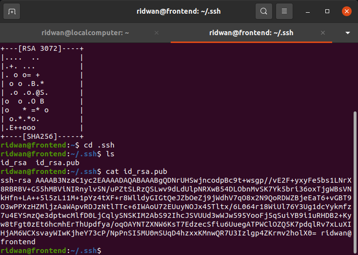
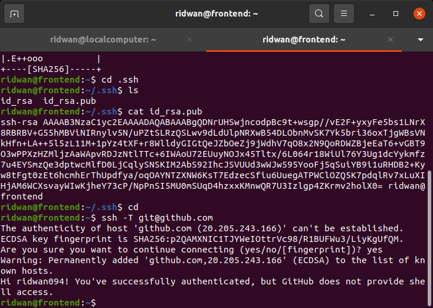

# **SSH**
## **SSH Key for access the git with username & password** 
**1. Generate SSH Key `ssh-keygen`**
 

**2. Login ke github** 
**3. Tambahkan ssh key yang telah dibuat pada step 1** 
 
 

**4. Kemudian test koneksi ke github** 
 