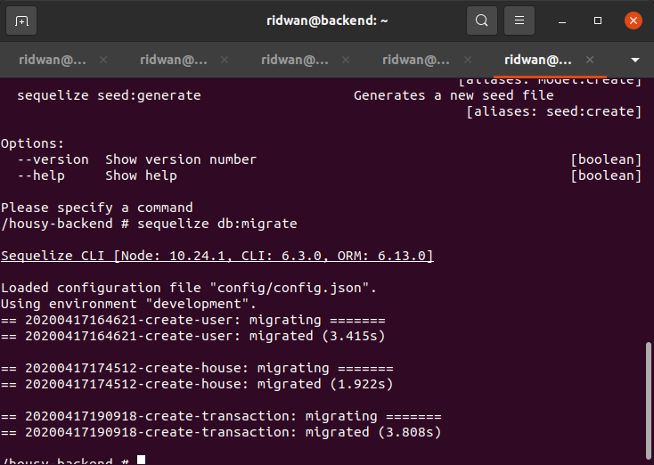

# **Setup Database(Docker)**
**1. Buat file `docker-compose.yml`**<br>
```
 version: '3.9'
 services:
   mysql:
     image: mysql:5.7
     container_name: mysql-database
     environment:
       - MYSQL_ROOT_PASSWORD=root
       - MYSQL_DATABASE=housy
       - MYSQL_ROOT_HOST=%
     ports:
       - 3306:3306
     volumes:
       - /home/ridwan/mysql/data:/var/lib/mysql

   postgresql:
     image: postgres:latest
     container_name: pgsql-database
     environment:
       POSTGRES_USER: root
       POSTGRES_PASSWORD: root
     ports:
       - 5432:5432
     volumes:
       - /home/ridwan/pgsql/data:/var/lib/postgresql/data/
```
<br>

**2. Save. Run `docker-compose up -d`**<br>

## **Setup Mysql**<br>
**1. Database housy otomatis dibuatkan melalui docker-compose.yml**<br>
<br>
<br>
<br>

## **Setup pgsql**<br>
**1. Buat database `housy` di pgsql**<br>
**2. Login menggunakan docker**<br>
**3. Buat database housy**<br>
<br>