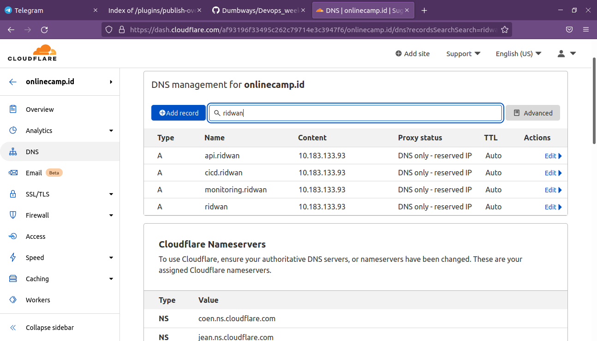
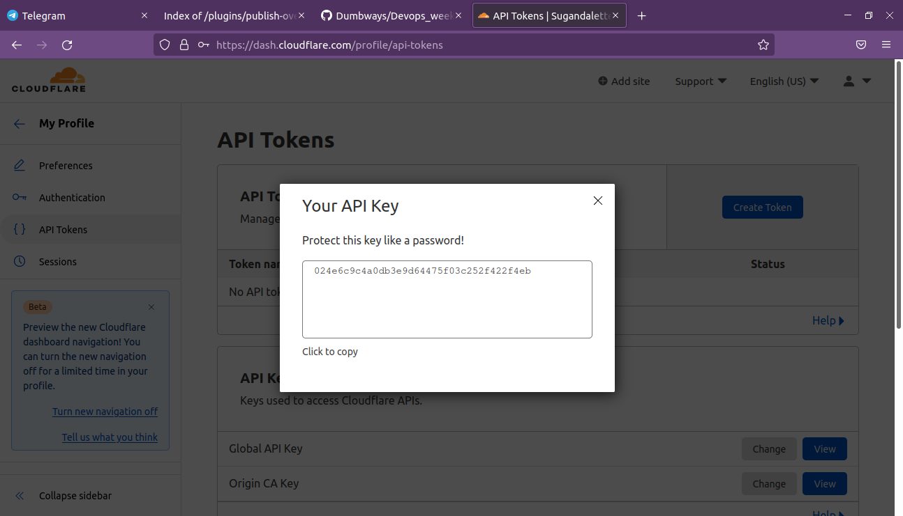
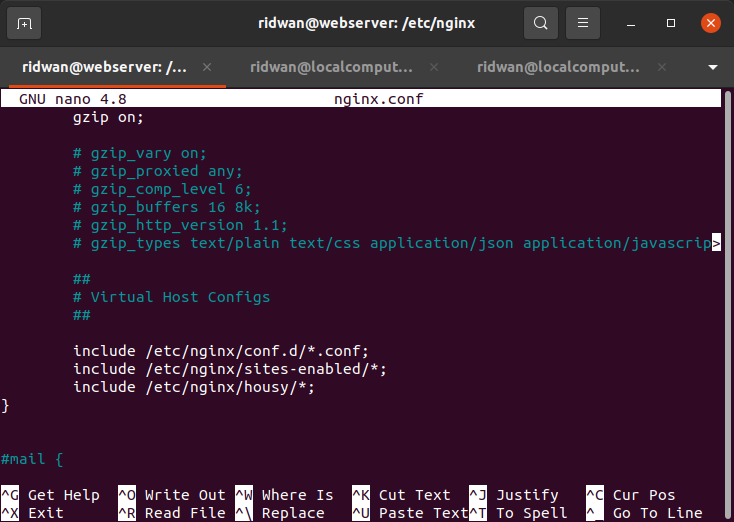

# **Web Server**
## **Setup Cloudflare DNS**<br>
**1. Login cloudflare**<br>
**2. Buat subdomain**<br>
<br>

**3. Copy dan simpan Global API Key akun cloudflare**<br>
<br>

## **Setup Nginx Reverse Proxy**<br>
**1. Login web server, install nginx.**<br>
**2. Buat folder config dan simpan di `/etc/nginx/`**<br>
**3. Masuk ke dalam folder config**<br>
**4. Buat config frontend `ridwan.onlinecamp.id`**<br>
```
 upstream apps {
   server 10.183.133.105:3000;
   server 10.183.133.105:3100;
   server 10.183.133.105:3200;
 }
 server {
   listen 80;
         server_name ridwan.onlinecamp.id;
   location / {
     proxy_pass http://apps;
   }
 }
```
<br>

**5. Simpan**<br>
**6. Buat config backend `api.ridwan.onlinecamp.id`**<br>
```
 upstream backend {
   server 10.183.133.45:5000;
   server 10.183.133.45:5100;
   server 10.183.133.45:5200;
 }
 server {
   listen 80;
   server_name api.ridwan.onlinecamp.id;

   location / {
     proxy_pass http://backend;
   }
 }
```
<br>

**7. Simpan**<br>
**8. Buat config jenkins `cicd.ridwan.onlinecamp.id`**<br>
```
server {
   listen 80;
   server_name cicd.ridwan.onlinecamp.id;

   location / {
      proxy_pass http://10.183.133.14:8080;
   }
 }
```
<br>

**9. Simpan**<br>
**10. Buat config prometheus `prometheus.ridwan.onlinecamp.id`**<br>
```
server {
   listen 80;
   server_name prometheus.ridwan.onlinecamp.id;

   location / {
     proxy_pass http://10.183.133.49:9090;
   }
 }
```
<br>

**11. Simpan**<br>
**12. Buat config monitoring `monitoring.ridwan.onlinecamp.id`**<br>
```
server {
  listen 80;
  server_name monitoring.ridwan.onlinecamp.id;
 location / {
   proxy_pass http://10.183.133.49:3000;
 }

}
```
<br>

**13. Simpan**<br>
**14. Include folder config ke dalam `nginx.conf`**<br>
<br>

**15. Test config `sudo nginx -t`**<br>

## **Setup Cloudflare API Key**<br>
**1. Buat folder dan file .ini untuk menyimpan cloudflare api key**<br>
**2. `mkdir .cloudflare`**<br>
**3. Di dalam folder .cloudflare `touch api-key.ini`**<br>
**4. Masukkan cloudflare global api key ke dalam `api-key.ini`**<br>
```
dns_cloudflare_email = "rainover922@gmail.com"
dns_cloudflare_api_key = "024e6c9c4a0db3e9d64475f03c252f422f4eb"
```
<br>

**5. Simpan**<br>

## **Setup SSL**<br>
**1. Install dan update snapd**<br>
```
 sudo snap install core; sudo snap refresh core
```
<br>

**2. Install certbot `sudo snap install --classic certbot`**<br>
**3. Link certbot ke usr `sudo ln -s /snap/bin/certbot /usr/bin/certbot`**<br>
**4. Confirm plugin containment `sudo snap set certbot trust-plugin-with-root=ok`**<br>
**5. Install DNS cloudflare plugin `sudo snap install certbot-dns-cloudflare`**<br>
**6. Run certbot `sudo certbot -i nginx`**<br>