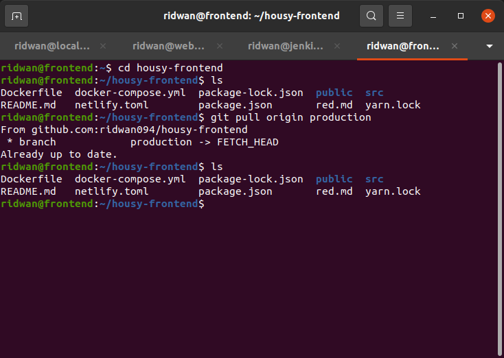
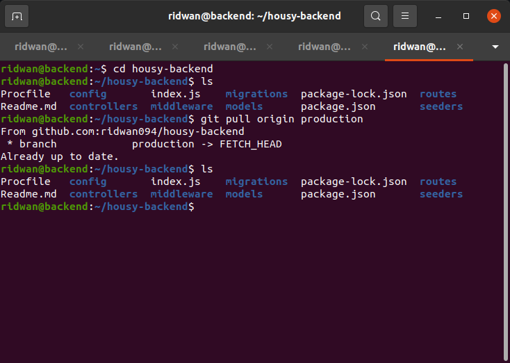
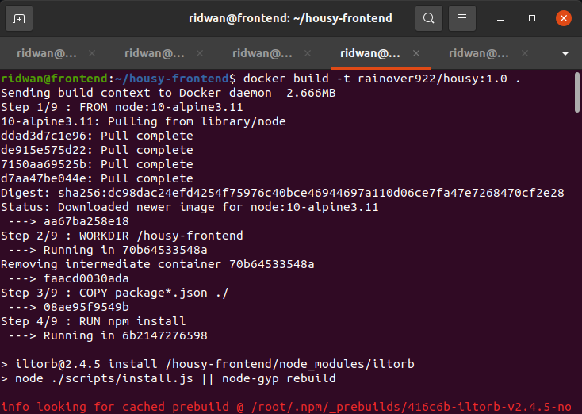
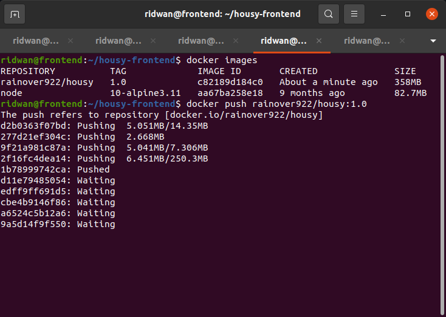
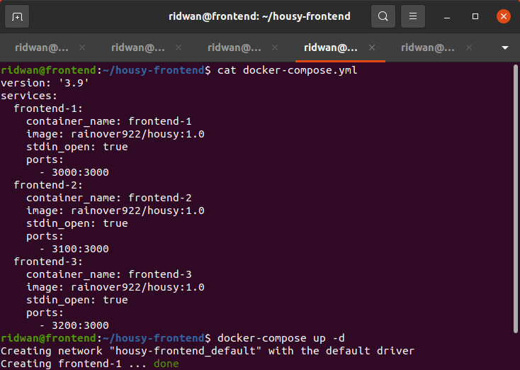
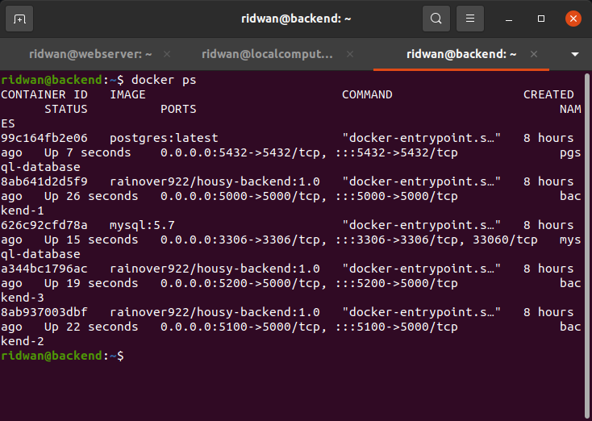
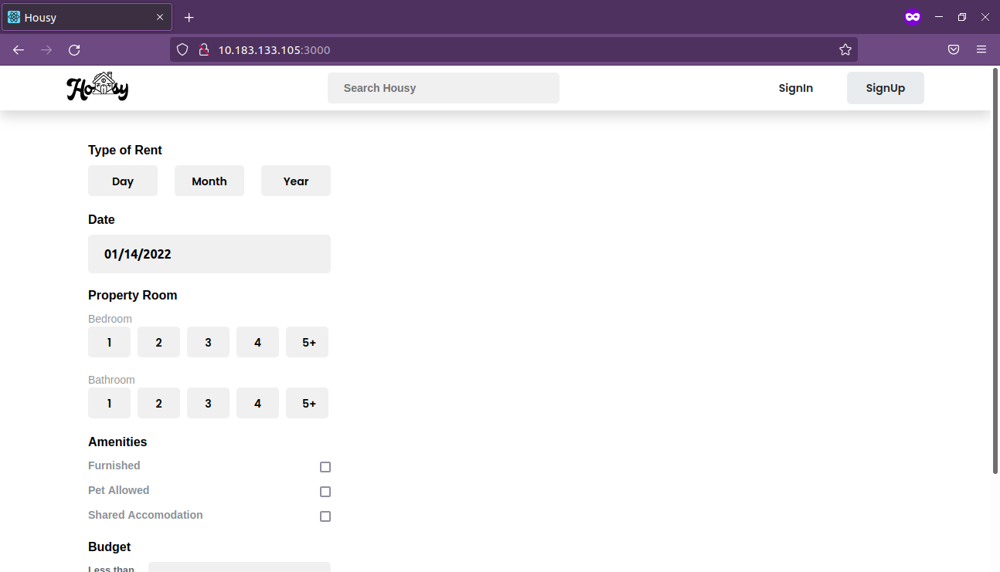
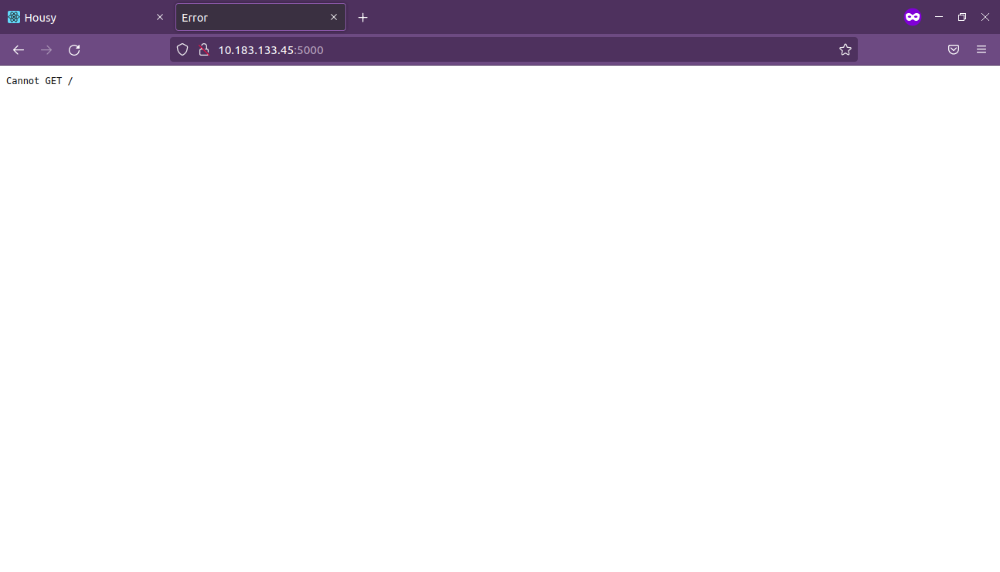

# **Deployment**
## **Clone repository frontend app**<br>
**1. Login ssh server app**<br>
**2. Clone app `git clone https://github.com/ridwan094/housy-frontend.git`**<br>
**3. Masuk ke dalam folde app**<br>
**4. Pull branch prodyuction `git pull origin production`**<br>
<br>

## **Clone repository backend app**<br>
**1. Login ssh server app**<br>
**2. Clone app `git clone https://github.com/ridwan094/housy-backend.git`**<br>
**3. Masuk ke dalam folder app**<br>
**4. Pull branch production `git pull origin production`**<br>
<br>

## **Run docker compose**<br>
**1. Masuk ke folder app frontend**<br>
**2. Docker compose yang telah dibuat:**<br>
```
 version: '3.9'
 services:
   frontend-1:
     container_name: frontend-1
     image: rainover922/housy:1.0
     stdin_open: true
     ports:
       - 3000:3000
   frontend-2:
     container_name: frontend-2
     image: rainover922/housy:1.0
     stdin_open: true
     ports:
       - 3100:3000
   frontend-3:
     container_name: frontend-3
     image: rainover922/housy:1.0
     stdin_open: true
     ports:
       - 3200:3000
```
<br>

<br>

<br>

**3. Run `docker compose up -d`**<br>
<br>

**4. Masuk ke dalam folder backend app**<br>
**5. Docker compose yang telah dibuat:**<br>
```
 version: '3.9'
 services:
   backend-1:
     container_name: backend-1
     image: rainover922/housy-backend:1.0
     ports:
       - 5000:5000
   backend-2:
     container_name: backend-2
     image: rainover922/housy-backend:1.0
     ports:
       - 5100:5000
   backend-3:
     container_name: backend-3
     image: rainover922/housy-backend:1.0
     ports:
       - 5200:5000
```
<br>

**6. Run `docker-compose up -d`**
<br>

<br>

<br>