# **CI/CD Jenkins**
## **Install Jenkins Docker**<br>
**1. Login ssh server jenkins**<br>
**2. Buat file `docker-compose.yml`**<br>
```
 version: '3.9'
 services:
   jenkins:
     image: jenkins/jenkins:lts-jdk11
     ports:
       - 8080:8080
       - 50000:50000
     privileged: true
     user: root
     container_name: ci-cd
     volumes:
       - ~/jenkins:/var/jenkins_home
       - /var/run/docker.sock:/var/run/docker.sock
       - /usr/local/bin/docker:/usr/local/bin/docker
```
<br>

**3. Run docker-compose up -d**<br>
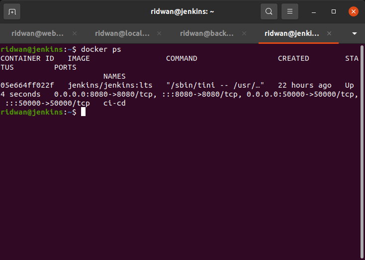<br>

## **Setup jenkins**<br>
**1. Install plugin publish over ssh dan slack notification (optional)**<br>
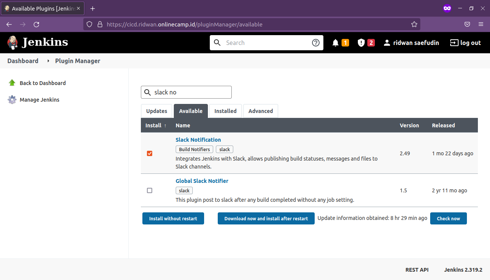<br>

**2. Setup Publish over ssh**<br>
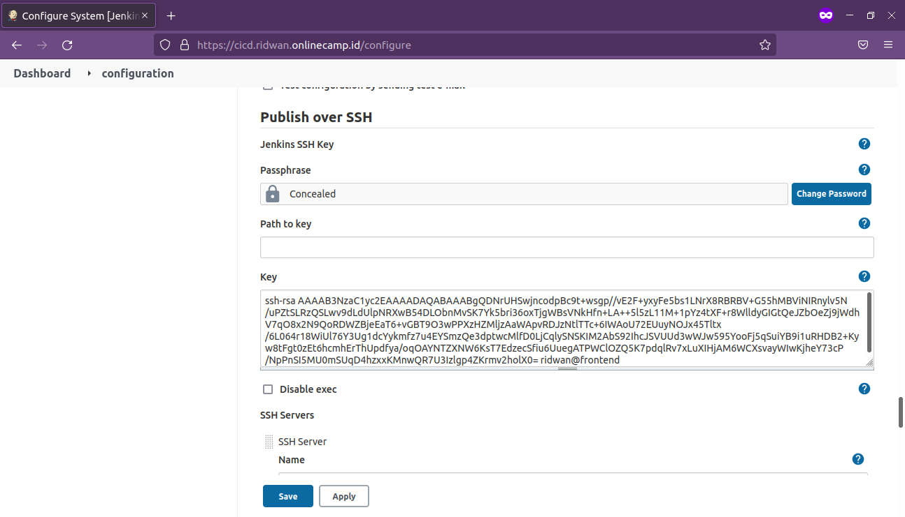<br>

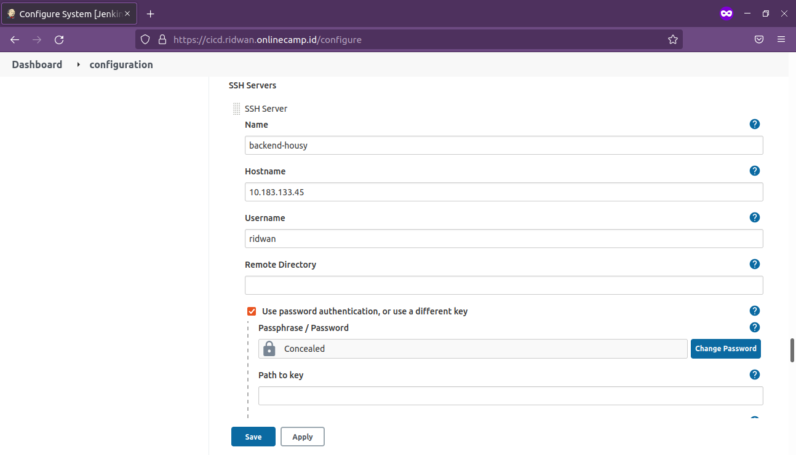<br>

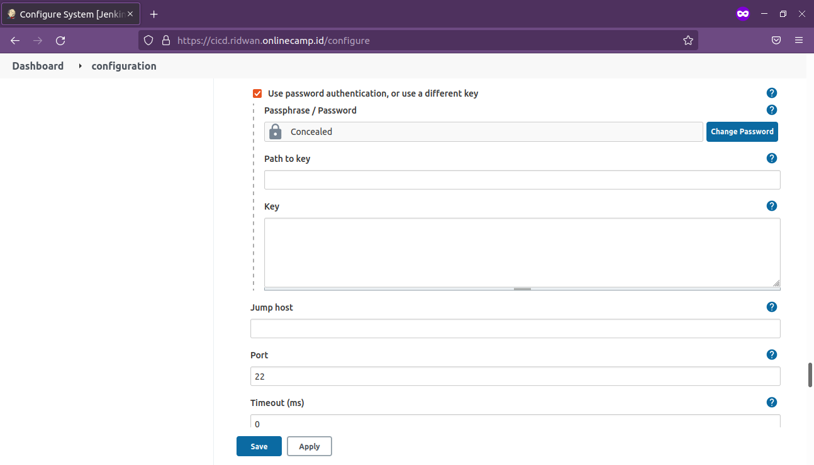<br>

## **Setup jenkins job frontend**<br>
**1. Buat freestyle project**<br>
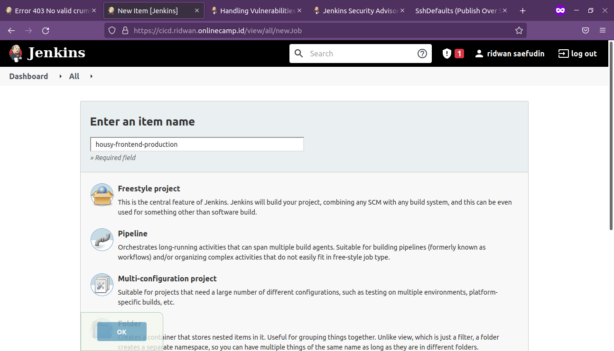<br>

**2. Configure, setup source code management**<br>
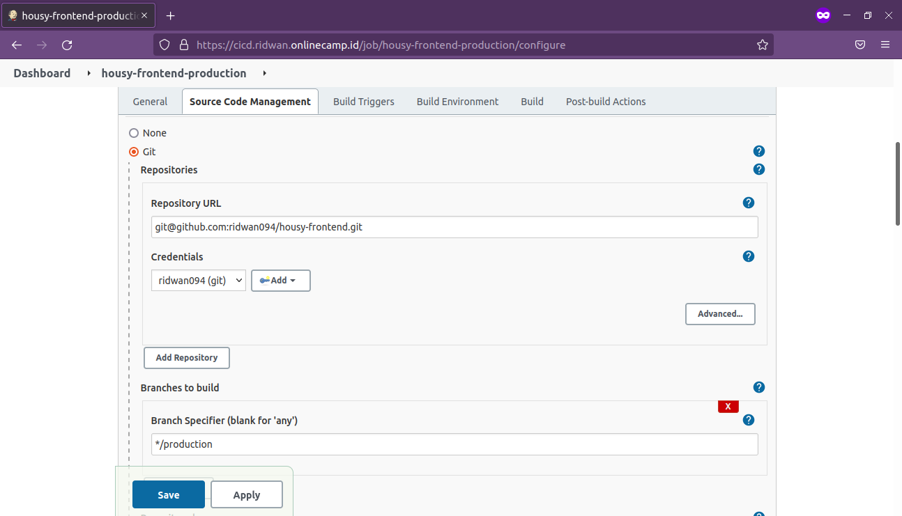<br>

**3. Setup build triggers**<br>
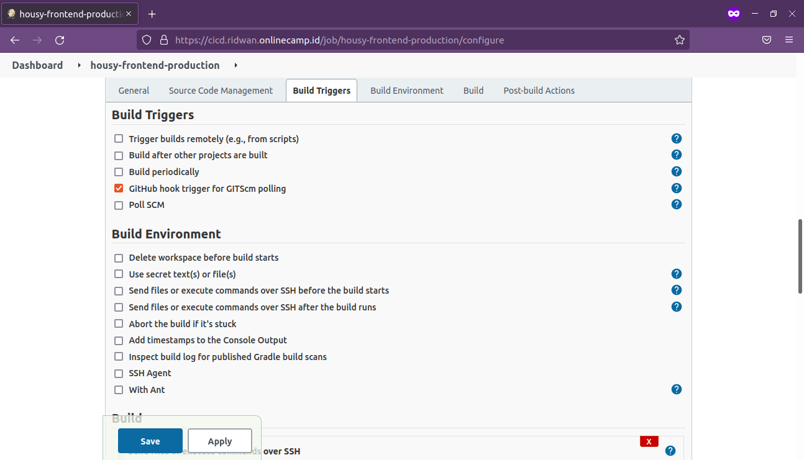<br>

**4. Setup build command**<br>
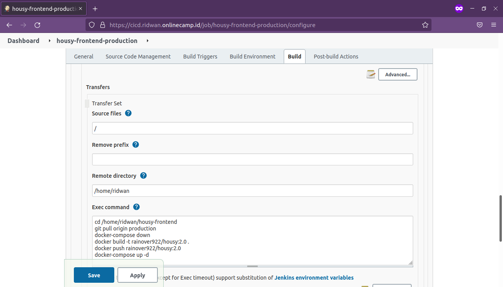<br>

**5. Save**<br>

## **Setup jenkins job backend**<br>
**1. Buat freestyle project**<br>
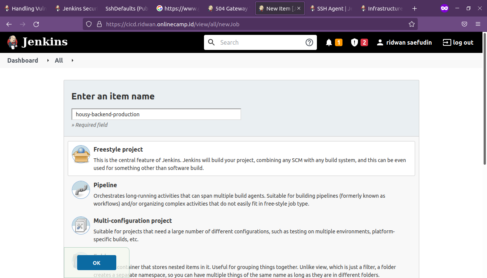<br>

**2. Configure, setup source code management**<br>
<br>

**3. Setup build triggers**<br>
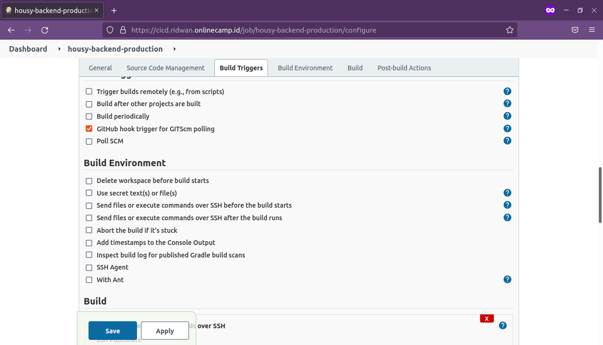<br>

**4. Setup build command**<br>
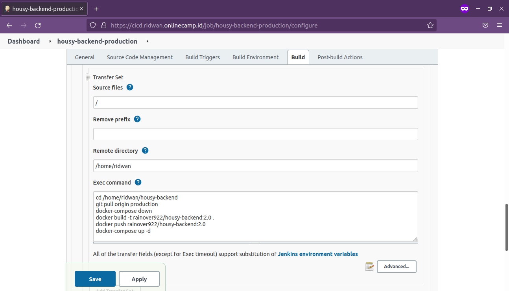<br>

**5. Save**<br>
**6. Test build**<br>
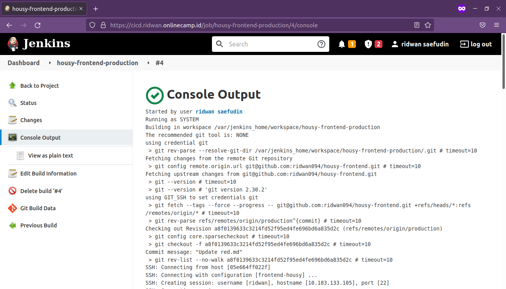<br>

<br>

## **Setup GitHub Webhook**<br>
**1. Login akun github**<br>
**2. Buka repository frontend app**<br>
**3. Settings**<br>
**4. Masuk ke `Webhook`**<br>
**5. Tambahkan `https://cicd.ridwan.onlinecamp.id/github-webhook/` di PayloadUrl**<br>
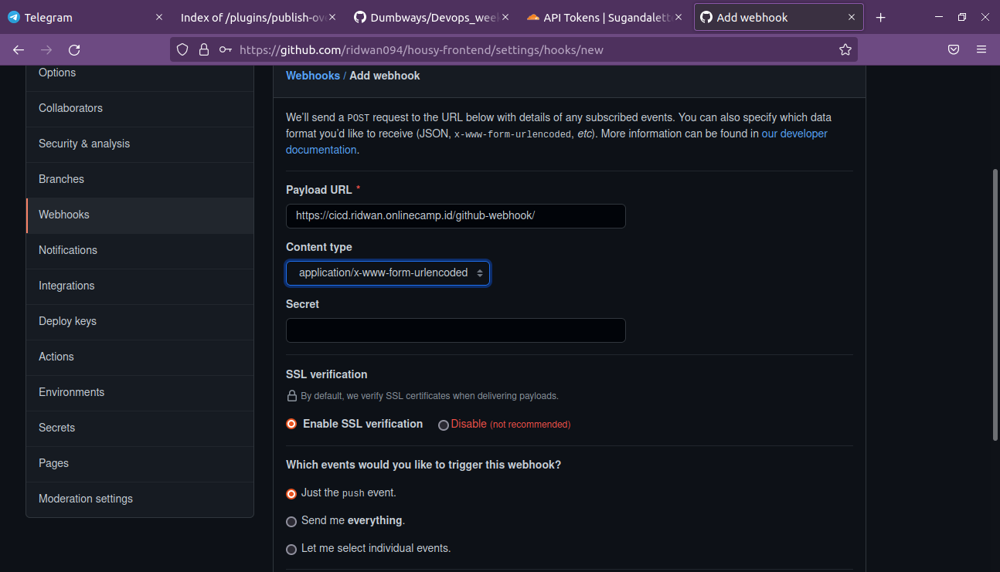<br>

**6. Simpan**<br>
**7. Lakukan hal yang sama pada repository backend app**<br>

## **Setup Slack Notification** <br>
**1. Buat workspace baru**<br>
**2. Integrasi app jenkins ci di channel**<br>
