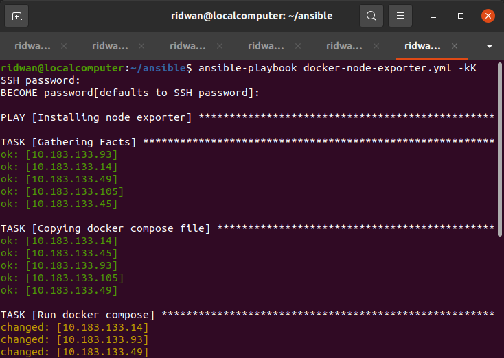
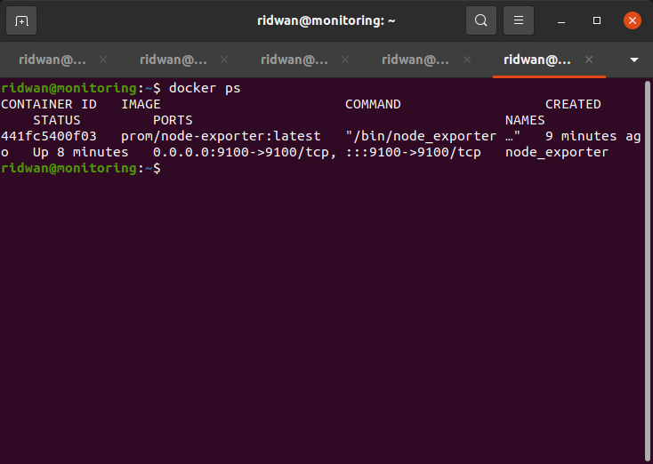
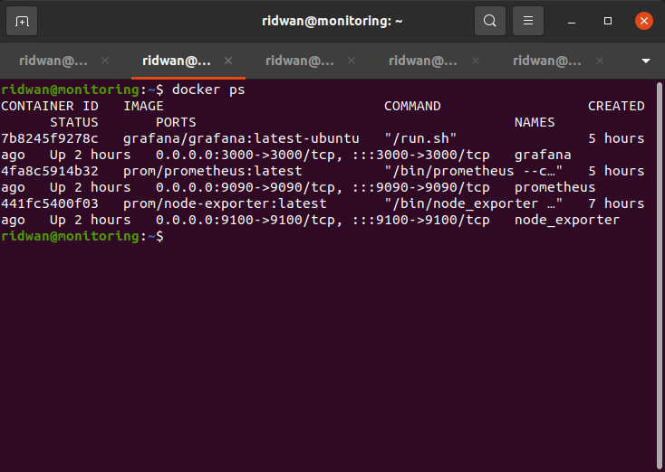
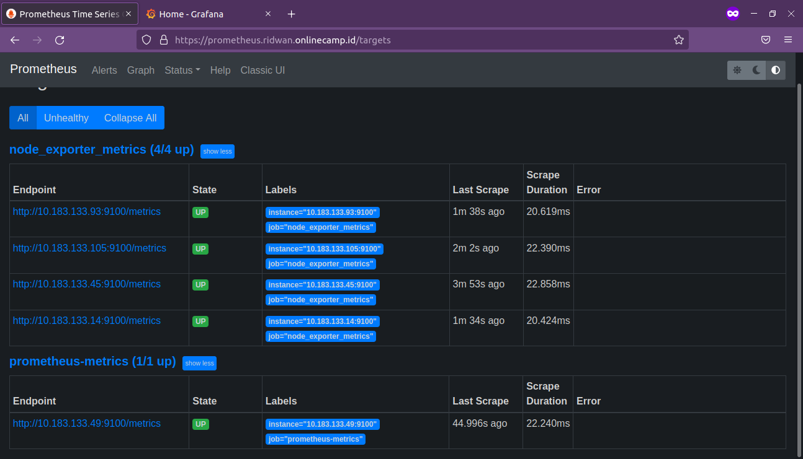
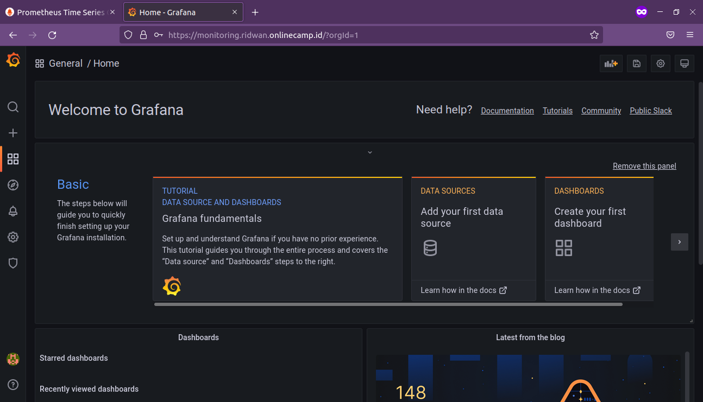
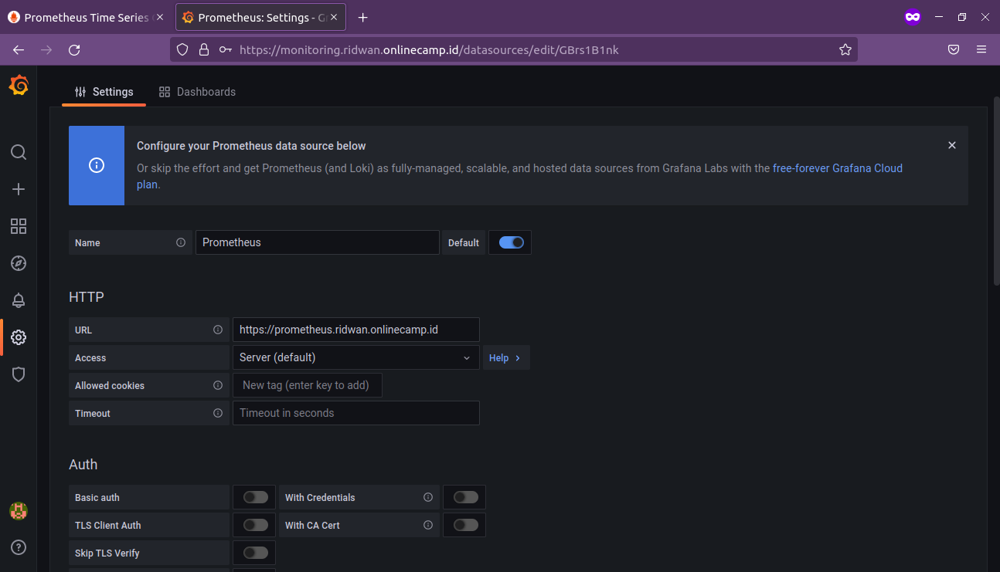

# **Monitoring Prometheus - Grafana**
## **Install Node Exporter (Docker)**<br>
**1. Buat docker-compose file**<br>
```
 ---
 version: '3.9'

 services:
   node_exporter:
     image: prom/node-exporter:latest
     container_name: node_exporter
     ports:
       - 9100:9100
     command:
       - '--path.procfs=/host/proc'
       - '--path.rootfs=/rootfs'
       - '--path.sysfs=/host/sys'
       - '--collector.filesystem.mount-points-exclude=^/(sys|proc|dev|host|etc)($$|/)'
     restart: unless-stopped
     volumes:
       - /proc:/host/proc:ro
       - /sys:/host/sys:ro
       - /:/rootfs:ro
```
<br>

**2. Buat yaml file untuk ansible**<br>
```
 ---
 - name: Installing node exporter
   hosts: all
   vars_files:
     - vars/create_user_vars.yml
   become: true
   tasks:
     - name: Copying docker compose file
       copy:
         src: docker-node-exporter
         dest: /home/{{username}}/

     - name: Run docker compose
       shell: 
         cmd: "docker-compose -f docker-compose.yml up -d"
         chdir: /home/{{username}}/docker-node-exporter/
```
<br>

**3. Run `ansible-playbook docker-node-exporter.yml -kK`**<br>
<br>

**4. Masukkan password sudo dan become**<br>
**5. Tunggu proses selesai**<br>
**6. Login salah satu remote server**<br>
**7. Cek docker container `docker ps`**<br>
<br>

## **Install Prometheus-Grafana (docker)**<br>
**1. Login ssh ke server monitoring**<br>
**2. Buat file docker compose**<br>
```
 version: '3.9'
 services:
   prometheus:
     image: prom/prometheus:latest
     container_name: prometheus
     restart: unless-stopped
     volumes:
       - /home/ridwan/prometheus.yml:/etc/prometheus/prometheus.yml
     command:
       - '--config.file=/etc/prometheus/prometheus.yml'
       - '--storage.tsdb.path=/prometheus'
       - '--web.console.libraries=/etc/prometheus/console_libraries'
       - '--web.console.templates=/etc/prometheus/consoles'
       - '--web.enable-lifecycle'
     ports:
       - 9090:9090

   grafana:
     image: grafana/grafana:latest-ubuntu
     container_name: grafana
     volumes:
       - /home/ridwan/grafana/data:/var/lib/grafana
     ports:
       - 3000:3000
     user: "1001"
     restart: unless-stopped
```
<br>

**3. Buat file `prometheus.yml` untuk setup server yang akan di monitoring**<br>
```
 ---
 global:
   scrape_interval: 10m

 scrape_configs:
   - job_name: "prometheus-metrics"
     scrape_interval: 5m
     static_configs:
       - targets: ['monitoring:9100']
   - job_name: "node_exporter_metrics"
     scrape_interval: 5m
     scrape_timeout: 1m
     static_configs:
       - targets: ['apps:9100','database:9100','jenkins:9100','webserver:9100']   
```
<br>

**4. Run `docker-compose up -d`**<br>
<br>

<br>

## **Setup Grafana**<br>
**1. Login ke Grafana monitoring.ridwan.onlinecamp.id**<br>
<br>

**2. Setup datasource prometheus**<br>
**3. Masuk ke configuration -> datasource**<br>
**4. Pilih prometheus**<br>
<br>

**5. Setup query**<br>
```
CPU
 (1 - avg(irate(node_cpu_seconds_total{mode="idle"}[10m])) by (instance)) * 100

Network
query1_receive:
rate(node_network_receive_bytes_total[10m])
query2_transmits:
rate(node_network_transmit_bytes_total[10m])

Memory Free
node_memory_MemFree_bytes

Storage
query_1_available:
node_filesystem_avail_bytes{mountpoint="/",fstype!="rootfs"}

query_2_total_size:
node_filesystem_size_bytes{mountpoint="/",fstype!="rootfs"}
```
<br>

<br>