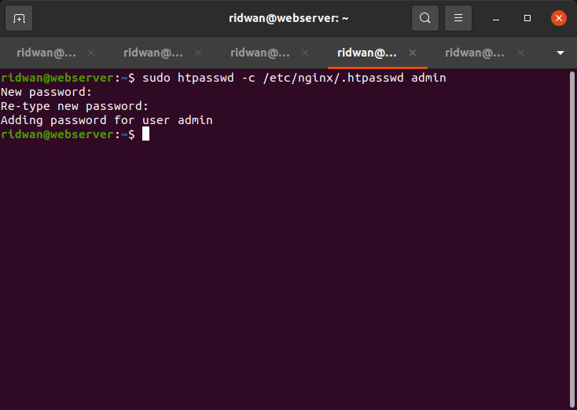
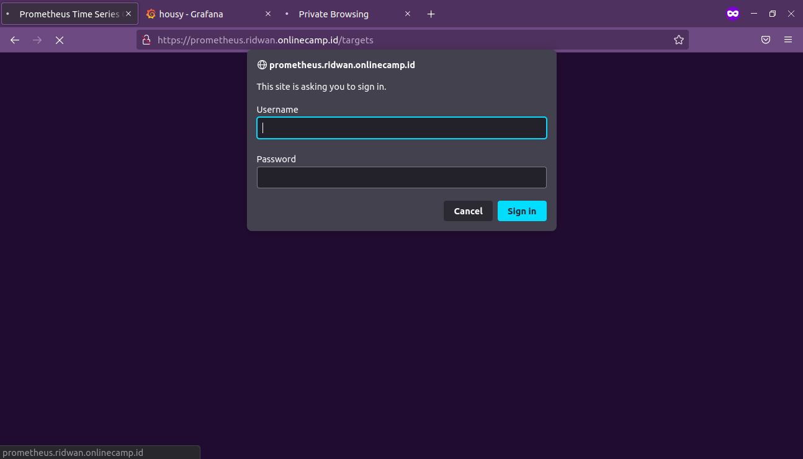
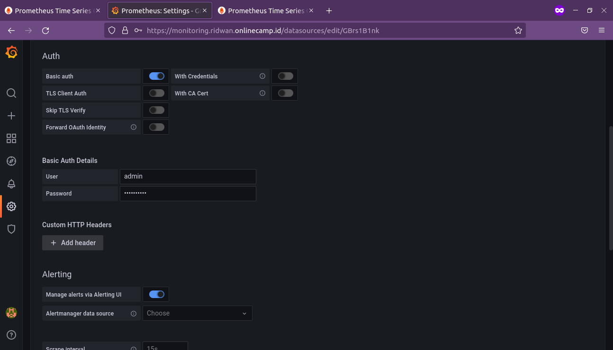

# **Auth Prometheus**
## **Basic Auth Prometheus**<br>
**1. Login web server melalui SSH**<br>
**2. Install apache2-utils `sudo apt install apache2-utils`**<br>
**3. Buat password file `htpasswd -c /etc/nginx/.htpasswd admin`**<br>
**4. Masukkan password**<br>
<br>

**5. Buka prometheus config file**<br>
**6. Edit**<br>
```
server {
       listen 80;
       server_name prometheus.ridwan.onlinecamp.id;

       #addition authentication properties
       auth_basic  "Protected Area";
       auth_basic_user_file /etc/nginx/.htpasswd;		

       location / {
         proxy_pass http:10.183.133.49//:9090;
       }
 }
```
<br>

**7. Test config `sudo nginx -t` restart nginx `sudo systemctl restart nginx`**<br>
**8. Buka prometheus website**<br>
<br>

## **Setup Auth Grafana**<br>
**1. Login ke website monitoring**<br>
**2. Buka Configuration - Data Source**<br>
**3. Edit Prometheus data source**<br>
**4. Pada bagian Auth, enable `basic Auth`**<br>
**5. Input user dan password prometheus auth**<br>
<br>

**6. Save dan Test**